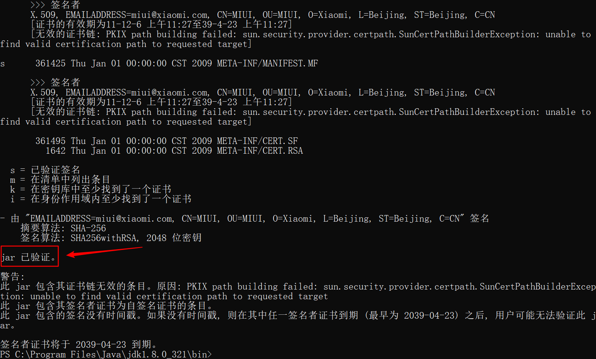
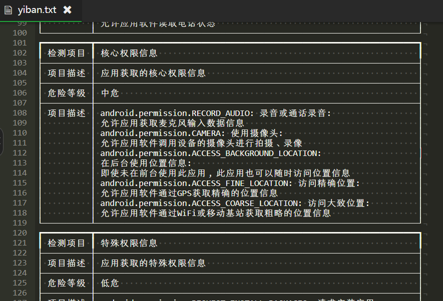

# APP测试

**什么是移动端**

狭义：手机和平板电脑

广义：pos机，扫码设备、点餐机等等

**移动端操作系统**

安卓（Android）9、10、11、12

iOS 12、13、14、15

**移动端应用**

狭义：原生APP（application）

广义：web APP（H5）

# 测试环境

1.  操作系统：安卓、iOS、鸿蒙、Microsoft mobile等

2.  网络：3G、4G、5G、不同带宽的WiFi等

3.  硬件：各种主流手机品牌、型号、配置等

4.  额外功能：GPS定位芯片、北斗、陀螺仪、重力感应、红外感应、振动系统等

android包名：

app\_v2.0.14.5\_debug.apk测试环境包

app\_v2.0.23.1\_releases.apk生产环境包

app\_v2.0.23.1\_releases\_vivo.apk、app\_v2.0.23.1\_releases\_xiaomi.apk渠道包

# 测试流程

*   所有软件的测试流程都一样，只不过PC端和移动端有不同的侧重点

*   移动端测试的特点

    *   较为完善的原型图

    *   开发周期较短，测试周期更短

    *   测试偏重于：功能方面（UI、兼容性、主要功能）；首要关注正向测试；其次才是反向功能的测试

    *   APP发布之前都是在测试环境中完成；正式版本也要进行测试，但是需要使用正确、科学、符合应用情景的内容进行

# 测试要点

安装卸载；UI；功能；性能；交叉事件；兼容；升级更新；用户体验；硬件环境；客户端数据库；安全

## 安装测试

*   从不同渠道获取的安装程序是否正常安装

    *   软件商店安装

    *   安装包安装，安卓为.apk文件，iOS为.ipa文件

*   在不同操作系统下是否正常安装（根据需求，Android 9\~12，iOS，不同手机厂商定制的安卓系统）

*   安装后能否正常运行

*   文件夹及文件是否写到了指定的目录里，有没有多余的目录结构和文件

*   安装过程是否可以取消，点击取消后，写入的文件是否如概要设计说明处理

*   安装过程中意外情况的处理是否符合需求（如死机、重启、断电）

*   安装空间不足是否有相应提示

*   对于需要联网安装的软件（如需要下载额外内容、更新验证、登录验证等），在断网情况下的处理是否符合需求

*   旧版本能否覆盖新版本安装

## 卸载测试

*   直接删除软件文件夹是否有提示信息

*   卸载程序的提示信息

*   卸载后是否保留一些文件，一般是用户信息、配置文件、用户创作的内容（如拍的照片、视频）等

*   卸载过程的意外情况的处理（如死机、重启、断电）

*   卸载是否支持取消

*   卸载后重新安装是否正常，卸载遗留的用户信息文件是否被使用上

## 导航测试

*   是否易于导航，导航是否直观

*   是否需要搜索引擎

*   导航与页面结构、菜单、连接页面的风格是否一致

## 图形测试

*   自适应窗口大小（不同手机尺寸；同一手机的横屏竖屏）

*   页面标签风格是否统一

*   图片质量高且图片尺寸在设计符合要求的情况下应尽量小

## 内容测试

*   输入框说明文字的内容与系统功能是否一致

*   文字长度是否加以限制

*   文字内容是否表意不明

*   是否有错别字

*   是否有敏感词汇、关键词，如涉及版权、专利、隐私等

## 运行APP

1.  APP安装完成后的试运行，可正常打开软件

2.  APP打开测试，是否有加载状态进度提示

3.  APP打开速度测试，是否符合要求

4.  APP页面间的切换是否流畅，逻辑是否正确

5.  注册

6.  登录

7.  注销

## 应用的前后台切换

前台：应用处于主界面，用户可以直接操作应用

后台：应用最小化了，但还在运行

注意和前端和后端进行区分

冷启动：APP从完全关闭到开启的过程

热启动：APP从后台到前台运行的过程

1.  APP切换到后台，再回到APP，检查是否停留在上一次操作界面，功能及应用状态是否正常

2.  APP在前台时，手机锁屏解锁后，检查APP是否会崩溃，功能状态是否正常

3.  APP使用过程中中断（有电话进来）后再切换到APP，功能状态是否正常

4.  杀掉APP进程后，APP能否正常启动

5.  出现必须处理的提示框后，切换到后台，再切换回来，检查提示框是否还存在

6.  有数据交换（如上传下载文件，更新数据）的页面，都需要检查前后台切换和锁屏解锁是否正常传输，是否会崩溃

## 免登陆

一般的APP都会有一定时间内免登陆（如微信、游戏）因为手机应用使用频繁且前后台切换频繁，没有免登录是及其不方便的

1.  版本更新后免登录是否失效

2.  无网络时能否免登录

3.  切换用户后，免登录是否对应切换，前一个用户的数据是否还在（因为有时用户数据缓存在本地）

4.  是否允许一个账户多端免登录或多个账户在同一设备免登录

5.  密码更换后，免登录是否失效，重新输入密码后重新开启免登录

## 离线浏览

1.  在无网络的情况是否可以浏览本地数据

2.  断网是否会有提示

## APP更新

1.  是否自动检查更新；是否能手动检查更新

2.  有更新时，是否有更新提示

3.  非强制更新，用户是否可以取消；下次启动APP是否仍然有提示

4.  强制更新，用户没有更新会退出应用，下次启动APP，是否仍然出现强制更新提示

5.  选择更新能否正常更新

6.  更新时的意外（如断网、关机等）对APP的影响

7.  增量包更新，

8.  旧版本存在时，能否覆盖更新

## 数据更新

1.  确定哪些地方需要提供手动刷新，哪些地方需要自动刷新，哪些地方需要手动+自动刷新

2.  哪些地方需要从后台切换回前台时进行数据更新

3.  哪些地方需要实时刷新，哪些地方需要定时更新

4.  是否有缓存，缓存是否定时清理，是否支持手动清理

## 定位、相机服务

1.  APP调用权限都需要用户许可

2.  在没有用户许可的情况下，不得私自调用响应的权限

3.  测试时不能通过模拟器，而要通过真机（涉及到硬件的测试都需要用真机）

## 时间测试

1.  对于可以自行设置手机时间的客户端，需要校验该设置对APP的影响

2.  不同时区对APP的影响

## 推送通知

推送通知也叫push消息。测试时可通过前台操作触发推送，也可在后台发送

1.  检查推送是否按照指定的业务规则发送

2.  用户能否关闭推送通知，关闭后检查是否会推送

3.  测试时不能通过模拟器，而要通过真机

4.  是否区分登录与未登录用户

# 极限测试

各种边界压力下，验证APP能否正确响应

*   储存不足时安装APP

*   内存满时运行APP

*   运行APP时断网

# 性能测试

APP的性能测试分为占用手机的性能和服务器的性能，服务器性能和web项目的性能测试一样。手机性能评估：典型用户应用场景下，系统资源使用情况，电量消耗，带宽消耗等

## 响应能力

*   安装、卸载的响应时间

*   各类功能性操作的响应时间

## 压力测试

*   反复进行安装、卸载，检查系统资源是否正常

*   其他功能反复进行操作，功能是否正常，系统资源是否正常

# 交叉事件测试

交叉事件又叫冲突测试或中断测试，是指一个功能正在执行过程中，同时另外一个事件或操作对该过程进行干扰的测试

1.  多个APP同时运行是否影响正常功能

2.  APP运行时拨打或接听电话

3.  APP运行时发送或接收信息

4.  APP运行时使用相机、计算机等手机自带设备

5.  权限调用的冲突是否正确处理，如多个音频播放软件同时播放，多个视频软件同时调用摄像头等

# 兼容测试

如果没有真机，可以用在线云测平台。如testin云测

1.  与本地及主流APP兼容

2.  不同操作系统

3.  不同手机品牌

4.  不同屏幕分辨率，刷新率

5.  不同网络兼容

# 易用性

1.  是否有合适的（不多不少）用户操作引导

2.  是否有点击反馈

3.  菜单层级是否太深

4.  交互流程分支是否太多

5.  相关选项是否离得很远

6.  一次是否载入太多数据

7.  可点击按钮的可点击范围是否适中

8.  标签页是否跟内容没有从属关系

9.  返回键的逻辑是否合适

10. 是否有横屏模式的设计

# 界面

1.  手势，左右滑、上下滑等

2.  横竖屏切换

3.  多点触控

# 安全

1.  Android安装包是否可以反编译代码

2.  Android安装包是否签名

3.  权限的设置是否安全

渗透测试：安全测试的一种，侧重于模拟黑客攻击，看看程序是否有漏洞

## apk签名验证

IOS不用考虑，因为APP Store会做校验。但Android没有此类权威检查，我们需要在发布前校验一下签名使用的key是否正确

在jdk/bin目录下，存在jarsigner.exe文件，可对apk包进行签名验证。执行如下指令：

```powershell
jarsigner -verify -verbose -certs apk包路径
```

若结果中存在“jar已验证”，说明签名校验成功



**完整性校验：**

为确保安装包不会在测试完成最终交付过程中因为问题发生文件损坏，需要对安装包进行完整性校验，通常做法是检查文件的md5值

## APP等保扫描

ApplicationScanner是一个快速稳定开源的App代码扫描工具，该工具基于Python3.7实现其主要功能，apk检测部分需要JDK 11的支持，因此具备较好的跨平台特性，目前支持在Linux和Mac系统上使用，暂不支持Windows

使用ApplicationScanner可以对ipa和apk文件进行扫描，快速发现存在风险的代码，检测项目与等保的检测项目进行了对齐，换句话说，如果ApplicationScanner没有扫到的问题，等保扫描时大概率也检测不到

下载地址：[https://github.com/paradiseduo/ApplicationScanner](https://github.com/paradiseduo/ApplicationScanner "https://github.com/paradiseduo/ApplicationScanner")

在Linux上使用，需要先配置Python3环境，将下载的压缩包解压后再含AppScanner.py的目录下运行以下命令：

```bash
python3 AppScanner.py -i xxx.apk > 文件名.txt
```

运行部分结果如下：



如果存在高危或较多中危漏洞，可能要建议开发对apk包进行加固

# 小程序测试

小程序测试要考虑功能、网络、兼容、易用性等

兼容除了要考虑手机内核Android和iOS，还要考虑微信版本，因为微信提供的api接口可能会变

# 手机知识

IMEI：国际移动设备识别码（International Mobile Equipment Identity），即通常所说的手机序列号、手机“串号”，用于在移动电话网络中识别每一部独立的手机等移动通信设备，相当于移动电话的身份证。通过在手机拨号键盘中输入\*#06#即可查询。双卡手机一般有两个

Android开发的四大组件

1.  活动（activity）：用于表现功能

2.  服务（service）：后台运行服务，不提供界面呈现

3.  广播接受者（Broadcast Receive）：用于接收广播，广播是一种广泛运用的在应用程序之间传输信息的机制。而广播接收器是对发送出来的广播进行过滤接受并响应的一类组件。可以使用广播接收器来让应用对一个外部事件做出响应

4.  内容提供者（Content Provider）：支持多个应用中存储和读取数据，相当于数据库。用于不同应用之间的通信
