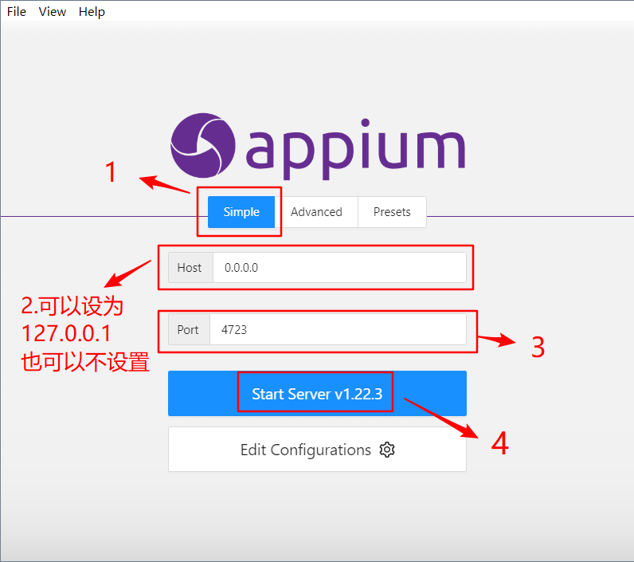
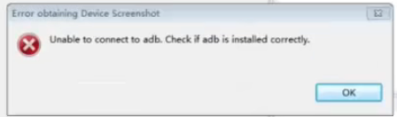

# Appium APP自动化

Appium是一个移动端的自动化框架，可用于测试原生应用，移动网页应用和混合型应用，且是跨平台（即针对不同的平台用一套api来编写测试脚本）的，可用于Android和iOS操作系统（但是测iOS必须在mac上）

# 环境搭建

1.  Appium Server客户端：运行exe安装程序

2.  Appium-Python库

关系：Python代码→Appium-Python库→Appium Server→手机

打开Appium Server后，进行如下设置：



## 简单的代码体验

```python
from appium import webdriver

desired_caps = {
    'platformName': 'Android',  # 被测手机是安卓，不区分大小写，但不能随便写
    'platformVersion': '9',  # 手机安卓版本，可以只写前面的（如8.4.3可以写8.4、8），但不能随便写
    'deviceName': 'yeshen',  # 设备名，安卓手机可以随意填写，但不能为空
    'appPackage': 'com.miui.calculator',  # 启动APP Package名称
    'appActivity': '.cal.CalculatorActivity',  # 启动Activity名称
    'unicodeKeyboard': True,  # 使用自带输入法，输入中文时填True
    'resetKeyboard': True,  # 执行完程序恢复原来输入法
    'noReset': True,  # 不要重置App
    'newCommandTimeout': 6000,
    'automationName': 'UiAutomator2'
    # 'app': r'd:\apk\bili.apk',
}

# 连接Appium Server，初始化自动化环境,wd/hub为固定写法
driver = webdriver.Remote('http://localhost:4723/wd/hub', desired_caps)

# 退出
driver.quit()
```

启动过程：

1.  Appium的启动实际上是在本机的使用了4723端口开启了一个服务

2.  Appium会将我们的driver对象调用的方法转化成post请求，提交给Appium服务器

3.  Appium通过接收到的post请求发送给手机，再由手机进行执行

# 获取应用和页面

应用和页面对应appPackage和appActivity的值

1.  如果你应用已经安装在手机上了，可以直接打开手机上该应用，**进入到你要操作的界面**，然后在cmd执行：

    ```powershell
    adb shell dumpsys activity recents | findstr "intent={"
    ```

    会显示最近的几个 activity 信息（越靠近命令的越近），部分结果如下：

    intent={act=android.intent.action.MAIN cat=\[android.intent.category.LAUNCHER] flg=0x10200000 cmp=com.miui.calculator/.cal.CalculatorActivity}

    其中第一行就是当前的应用，应用的package名称是 `tv.danmaku.bili`，启动Activity是 `.ui.splash.SplashActivity`

    findstr用不了的话，可以试试grep

2.  打开应用，进入要操作的界面，使用如下命令：

    ```powershell
    adb shell dumpsys window w | findstr name=
    # 部分结果： mSurface=Surface(name=com.miui.calculator/com.miui.calculator.cal.CalculatorActivity)/@0x84affea
    # 应用报名为 com.miui.calculator
    # 活动页面名为 .cal.CalculatorActivity（不需要前面的com.miui.calculator）
    ```

3.  如果有应用的apk包，可以在含aapt.exe（一般在sdk的build-tools中）的cmd上执行

    ```powershell
    aapt.exe dump badging apk路径 | findstr "package: name="
    # 得到 package: name='com.miui.calculator'

    aapt.exe dump badging apk路径 | findstr "launchable-activity"
    # 得到 launchable-activity: name='com.miui.calculator.cal.CalculatorActivity'  label='Calculator' icon=''
    # 只需取.cal.CalculatorActivity
    ```

# driver对象

| 方法                            | 作用                          |
| ----------------------------- | --------------------------- |
| start\_activity('应用包名','界面名') | 打开指定应用的指定界面                 |
| close\_app()                  | 关闭当前操作的app，不会关闭驱动对象         |
| quit()                        | 关闭驱动对象，同时关闭所有关联的app         |
| is\_app\_installed('包名')      | 判断应用是否安装，返回布尔值              |
| remove\_app('包名')             | 卸载应用                        |
| install\_app('apk路径')         | 安装应用                        |
| background\_app(5)            | 进入后台5秒，然后返回应用，事实上进入后台就是进入桌面 |

| 属性                | 描述                  |
| ----------------- | ------------------- |
| current\_package  | 当前打开应用的包名，注意桌面也是个应用 |
| current\_activity | 当前打开的活动界面名          |
|                   |                     |

# 定位元素

## Appium Inspector

## uiautomatorviewer

打开后点第二个图标

注意：自动打开的命令行窗口不要关，如果关了，整个工具也会关

常见异常：

1.  闪退

    jdk版本为1.9时可能会出现这个问题，可换成1.8

2.  点击第二个图标后报错

    

    解决方法：重启adb服务：

    adb kill-sever

    adb start-server

