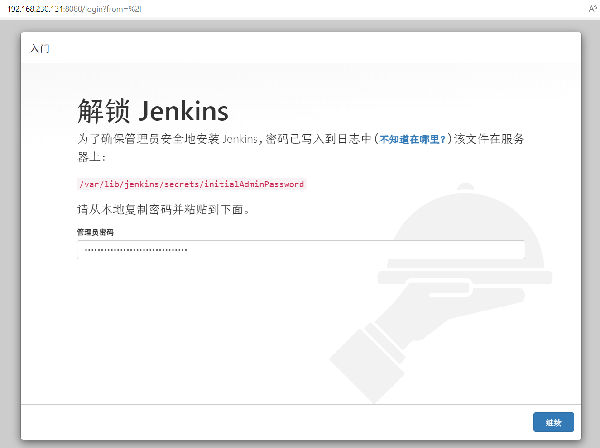
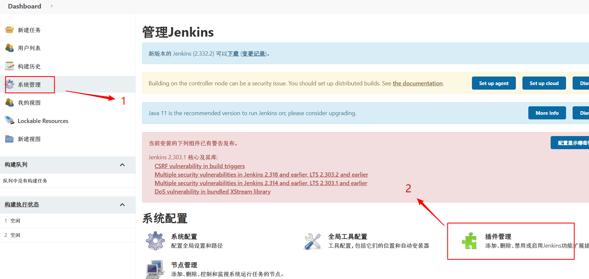
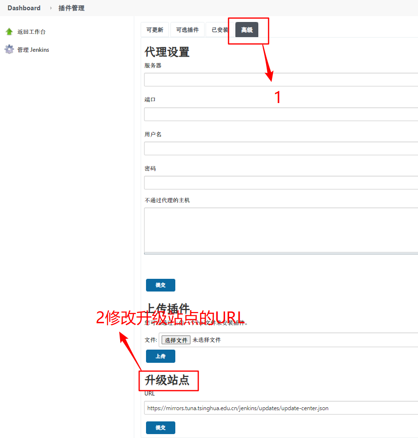
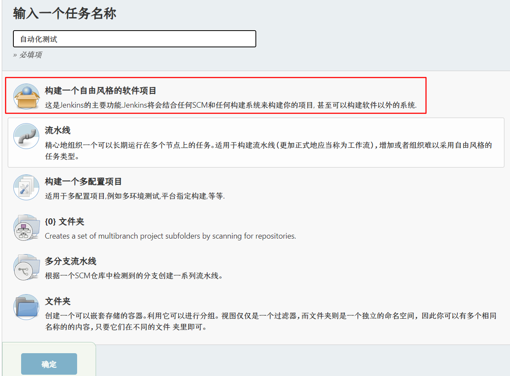
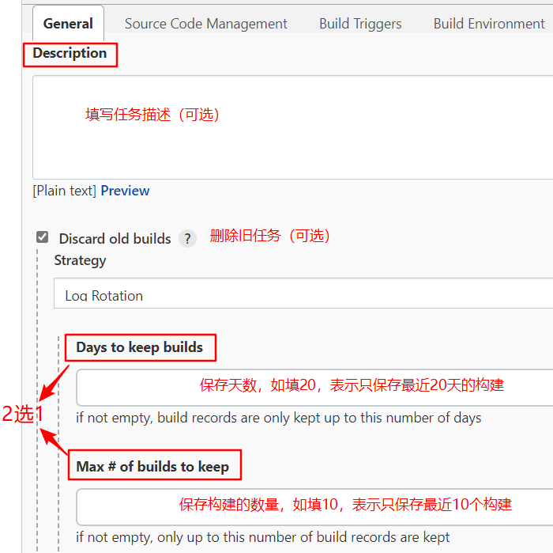
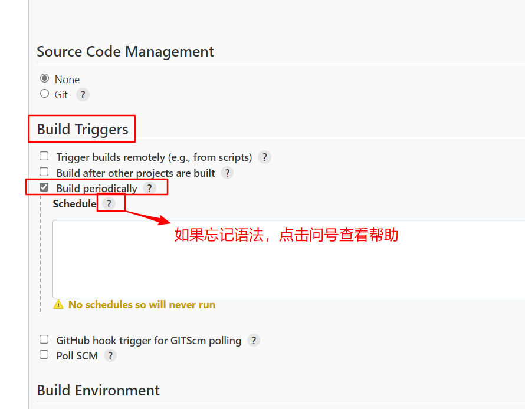
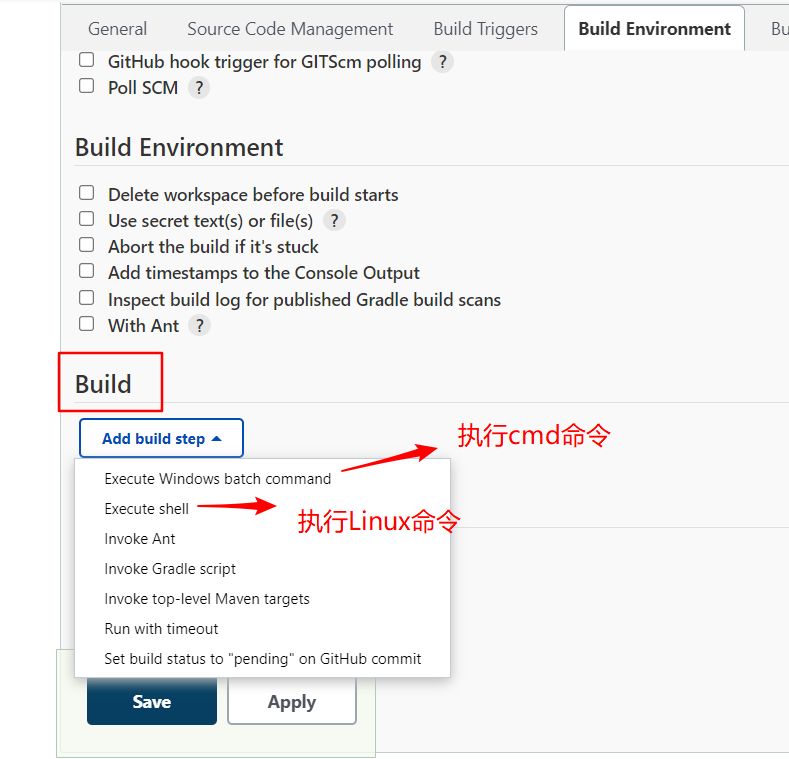

# Jenkins持续集成

Jenkins是一个可以拓展的持续集成和持续部署的平台，它只是一个平台，主要运行的都是插件

持续集成：（ci，Continuous integration）把软件生命周期中的所有工作实现自动化，以流水线的方式完成软件研发的过程

具体工作内容：

*   开发：编写代码并且进行源码管理，编译打包提供给测试人员测试

*   测试：部署测试环境进行功能测试，持续集成自动化测试

*   运维：部署线上环境

# Jenkins安装

Linux中安装Jenkins命令

```bash
yum install -y java-1.8.0-openjdk* -y && wget https://mirrors.cloud.tencent.com/jenkins/redhat-stable/jenkins-2.303.1-1.1.noarch.rpm && yum -y install daemonize && rpm -ivh jenkins-2.303.1-1.1.noarch.rpm && yum install jenkins && systemctl start jenkins
```

Windows中在官网下载安装包进行安装，

安装成功后，Linux访问Linux的IP地址:8080，Windows访问本机IP地址:8080或localhost:8080，出现以下页面（如果无法访问可关闭防火墙或放行8080端口）



之后可以下载推荐的插件，也可以暂时不下载插件，而是更换下载地址源后再下载，这样下载速度更快。

更换下载地址源方法：

（1）在Linux中输入命令

```bash
cd /var/lib/jenkins/updates && sed -i 's/http:\/\/updates.jenkins-ci.org\/download/https:\/\/mirrors.tuna.tsinghua.edu.cn\/jenkins/g' default.json && sed -i 's/http:\/\/www.google.com/https:\/\/www.baidu.com/g' default.json
```

（2）在插件管理中选择高级，将升级站点替换成国内的源，如[https://mirrors.tuna.tsinghua.edu.cn/jenkins/updates/update-center.json](https://mirrors.tuna.tsinghua.edu.cn/jenkins/updates/update-center.json "https://mirrors.tuna.tsinghua.edu.cn/jenkins/updates/update-center.json")





# 自由风格任务

1.  新建任务（New item），无论做什么工作（例如自动化测试），都是新建一个任务

2.  选择自由风格

    

3.  配置任务

    1.  描述和删除旧构建

        

    2.  定时设置

        

        示例：

        | H 20 \* \* \*    | 每天晚上8点执行一次，H表示hash，Jenkins推荐用H替代0 |
        | ---------------- | --------------------------------- |
        | H 20 \* \* 1,3,5 | 每周一，三，五晚上8点执行一次。分散的时间用英文逗号隔开      |
        | H 20 \* \* 1-5   | 每周一至周五晚上8点执行一次。连续的区间用起始-终止表示      |
        | H 20 \* \* \*/2  | 一周内每两天，晚上8点执行一次                   |

        Poll SCM：定时检查源码变更，如果有更新就checkout最新code下来，然后执行构建动作。如果没有更新就不会执行构建


        Build periodically：周期进行项目构建（源码是否发生变化没有关系）

    3.  要执行的脚本

        脚本的选择，要看手动执行的时候是如何执行的

        
