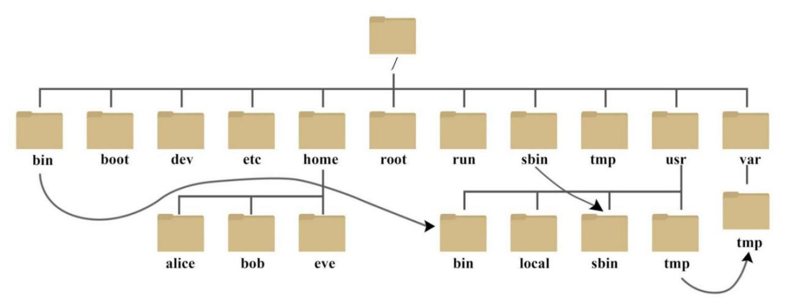
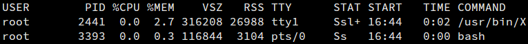
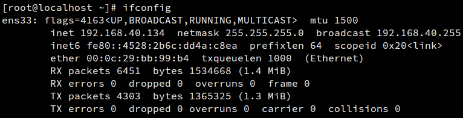
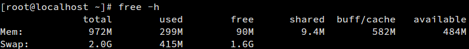
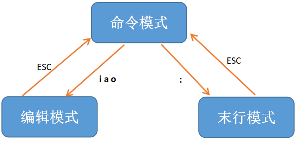
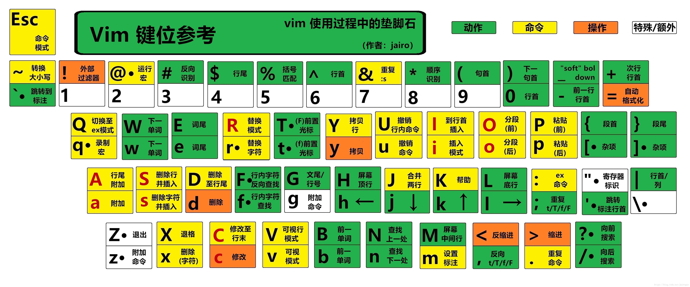

# Linux笔记

# 常用命令

命令的基本格式：

**命令名 \[选项] \[参数]**

## 注意

1.  命令名、选项、参数均区分大小写

2.  中括号(\[ ])内的内容可省略，没加中括号的不可省略

3.  命令名、选项、参数之间至少有一个空格（可以多个）

4.  **部分命令**的选项和参数的位置可以互换

## 速查表

| **常用命令**&#xA;           | **效果**&#xA;                                                                  |
| ----------------------- | ---------------------------------------------------------------------------- |
| **cd** 目录               | 切换到指定目录&#xA;                                                                 |
| **ls** \[选项] \[目录]      | 列出指定目录下的文件名，不写目录默认当前目录；以.开头的文件是隐藏文件，默认不会显示&#xA;                              |
| **pwd**                 | 显示当前所在目录的绝对路径&#xA;                                                           |
| **touch** 文件名           | 若文件不存在，则新建以此文件名命名的文件；若文件已存在，则改变文件的读取时间。&#xA;                                 |
| **mkdir** 目录名           | 创建一个空目录（即空文件夹）&#xA;                                                          |
| **cp** \[选项] 目录或文件1 目录2 | 复制目录或文件1到目录2中，复制目录时，必须使用 -r 或-R 。目录2必须已存在，否则会报错                              |
| cp \[选项] 文件1 文件2 &#xA;  | 将文件1的内容复制到文件2中，会提示是否覆盖文件2。文件2的文件名不会被改变。&#xA;                                 |
| **rm** \[选项] 目录或文件      | 删除指定目录或文件，删除目录时，必须使用 -r &#xA;                                                |
| rmdir \[选项] 目录&#xA;     | 删除指定目录，只能删除空目录。&#xA;                                                         |
| **mv** \[选项] 目录或文件1 目录2 | 移动目录或文件1到目录2中，默认会移动其子目录和其中的文件&#xA;                                           |
| mv \[选项] 文件1 文件2&#xA;   | 若文件2不存在，重命名文件1为文件2；若文件2存在，会提示是否覆盖文件2，覆盖后相当于cp \[选项] 文件1 文件2，加rm 文件1的组合。&#xA; |
| clear&#xA;              | 清屏&#xA;                                                                      |
| init 0&#xA;             | 系统级设为0级，实际上就是关机的效果&#xA;                                                      |
| 命令名 --help&#xA;         | 显示此命令的帮助信息&#xA;                                                              |
| **man** 命令名             | 显示此命令的使用手册                                                                   |

详细解释：

**cd**

| cd 目录&#xA; | 切换到指定目录 |
| ---------- | ------- |

目录（或叫路径）有绝对目录和相对目录之分，以 / 开头的必定为绝对目录，表示此目录从根目录开始；不以 / 开头的必为相对目录，表示此目录从当前目录开始。

如目录存在则会跳转到此目录，若不存在则不会有效果。

| **特殊参数**&#xA;  | **效果**&#xA;            |
| -------------- | ---------------------- |
| cd .&#xA;      | 切换到当前目录(相当于什么都没做)&#xA; |
| cd ..&#xA;     | 切换到上级目录&#xA;           |
| cd 或cd \~&#xA; | 切换到家目录（又称主目录）&#xA;     |
| cd /&#xA;      | 切换到根目录&#xA;            |
| cd -&#xA;      | 切换到上一次所在目录             |

&#x20;Linux 系统的命令行终端是纯字符界面，用户登录后，要有一个初始登录的位置，这个初始登录位置就称为用户的家。

超级用户的家目录：/root

普通用户的家目录：/home/用户名

| cd 软连接&#xA; | 切换到软连接所指向的目录，但提示的位置是软连接的名字&#xA; |
| ----------- | ------------------------------- |

点（ . ） 有用的例子：

*   以 - 开头的文件，例如 -help文件，如果想删除，需写为rm ./-help

*   cp 文件路径 . 表示复制文件到当前目录

**ls**

| ls \[选项] \[目录]&#xA; | 列出指定目录下的文件名，不写目录默认当前目录；以.开头的文件是隐藏文件，默认不会显示 |
| ------------------- | ------------------------------------------ |

| **ls选项**&#xA; | **效果**&#xA;                                 |
| ------------- | ------------------------------------------- |
| -a&#xA;       | 显示所有文件，包括 . 开头的文件                           |
| -l&#xA;       | 以列表的形式展示文件详情，包括文件类型、权限、拥有者、文件大小等            |
| -h&#xA;       | 文件大小的显示更加易读（人性化），不加默认的单位为字节                 |
| -d&#xA;       | 查看目录，而不是目录里的内容（一般与-l一起用，因为目录名不需要用ls查看）&#xA; |
| -S&#xA;       | 以文件大小进行排序                                   |

| ll&#xA; | ls -l 的别名 |
| ------- | --------- |

*   ll与ls一样后面可接选项和参数

*   total（总用量）的含义：该目录所用到的block（数据块，简称块）数

    每个文件系统都规定的一个块（block）的大小（可以通过命令getconf PAGESIZE 命令来查看块规定的大小，单位字节），一个块只可以容纳一个文件

文件详情各项含义说明，以 /boot 为例

| /boot文件的详细信息 | 解释                                                                       |
| ------------ | ------------------------------------------------------------------------ |
| dr-xr-xr-x   | 文件的类型和权限，d为目录，-为文件，l为软链接                                                 |
| 5            | 对于目录文件，表示它的第一级子目录的个数。注意此处的值包括了.(当前目录)，..(上级目录)&#xA;&#xA;对于普通文件，表示它硬链接的个数 |
| root         | 文件的所有者                                                                   |
| root         | 文件的所属组                                                                   |
| 4.0k         | 文件在磁盘中占用的大小，单位为kb                                                        |
| Jan 19 12:24 | 文件最后修改时间                                                                 |
| boot         | 文件名                                                                      |

**pwd**

print working directory

| pwd&#xA; | 显示当前所在目录的绝对路径&#xA; |
| -------- | ------------------ |

不需参数，即使后面跟路径也是显示当前的路径

**touch**

| touch 文件名&#xA; | 若文件不存在，则新建以此文件名命名的文件；若文件已存在，则改变文件的读取时间。 |
| -------------- | --------------------------------------- |

文件可以有后缀（如a.txt）也可以没有（如a）

文件名可以写成绝对路径或相对路径的形式，此时是在指定目录下创建文件

| touch 文件名1 文件名2 ···&#xA; | 一次性创建文件1，文件2，···&#xA; |
| ------------------------ | --------------------- |
| touch 文件名{6..20}&#xA;    | 一次性创建文件6，文件7，···，文件20 |

创建文件时，如文件名带有空格，会创建两个文件，要想创建带空格的文件，需要用双引号把文件名引起来

**mkdir**

| mkdir 目录名&#xA; | 创建一个空目录（即空文件夹）&#xA; |
| -------------- | ------------------- |

| 选项 | 效果                 |
| -- | ------------------ |
| -p | 递归创建，如中间文件夹不存在，则创建 |

文件夹一般没有后缀，但如果打上后缀，也是文件夹，不会变成文件。Linux系统中的文件后缀只是给用户看的，系统并不会通过后缀来判断文件类型

**cp**

| cp \[选项] 目录或文件1 目录2&#xA; | 复制目录或文件1到目录2中，复制目录时，必须使用 -r 或者 -R 。目录2必须已存在，否则会报错 |
| ------------------------ | ------------------------------------------------- |
| cp \[选项] 文件1 文件2 &#xA;   | 将文件1的内容复制到文件2中，会提示是否覆盖文件2。文件2的文件名不会被改变。           |
| \cp&#xA;                 | 覆盖已经存在的目标文件而不给出提示                                 |

*   复制文件的软连接时，会复制原始的文件内容，并成为一个普通文件，文件名为软连接名

*   复制目录的软连接时，会直接复制软连接

*   cp后接多个文件或目录名时，最后一个为目标文件或目录，之前的都是源文件或目录

| **cp选项**&#xA; | **效果**&#xA;                                               |
| ------------- | --------------------------------------------------------- |
| -r或 -R&#xA;   | 若给出的源文件是一个目录文件，此时将复制该目录下所有的子目录和文件。复制目录时必须使用，否则无法成功复制&#xA; |
| -d&#xA;       | 复制文件软连接时，只复制软链接，而不是复制原文件                                  |
| -p&#xA;       | 除复制文件的内容外，还把修改时间和访问权限也复制到新文件中。&#xA;                       |
| -a&#xA;       | 保留链接、文件属性，并复制目录下的所有内容。其作用等于dpr参数组合。                       |
| -i&#xA;       | 在覆盖目标文件之前给出提示，要求用户确认是否覆盖，回答 y 时目标文件将被覆盖。                  |

**rm**

| rm \[选项] 目录或文件&#xA; | 删除指定目录或文件，删除目录时，必须使用 -r  |
| ------------------- | ------------------------ |

| **选项**&#xA; | **效果**&#xA;                 |
| ----------- | --------------------------- |
| -r&#xA;     | 递归地删除目录下的内容，删除文件夹时必须使用&#xA; |
| -f&#xA;     | 强制删除，忽略不存在的文件，无需提示&#xA;     |
| -i&#xA;     | 以进行交互式方式执行                  |

rm -rf 能快速删除任何目录或文件，因此是常用的。

**rmdir**

| rmdir \[选项] 目录&#xA; | 删除指定目录，只能删除空目录。 |
| ------------------- | --------------- |

| **选项**&#xA; | **效果**&#xA;                                   |
| ----------- | --------------------------------------------- |
| -p&#xA;     | 当子目录被删除后使它也成为空目录的话，则顺便一并删除。前提：用户不处于要被一并删除的目录下 |

例子：rmdir -p BBB/Test

在工作目录下的 BBB 目录中，删除名为 Test 的子目录。若 Test 删除后，BBB 目录成为空目录，则 BBB 亦予删除。

**mv**

| mv \[选项] 文件 目录（目录必须存在）        | 移动文件到目录中                                                                                                |
| ----------------------------- | ------------------------------------------------------------------------------------------------------- |
| mv \[选项] 目录1 目录2（目录1和目录2必须存在） | 移动目录1到目录2中，默认递归移动，不会提示。覆盖目录时不会提示，只有覆盖文件时才会提示                                                            |
| mv \[选项] 目录1 同级目录2（目录2必须不存在）  | 重命名目录1 的名称为目录2                                                                                          |
| mv \[选项] 文件1 文件2              | 若文件2不存在，重命名文件1为文件2（若文件1和文件2不在同一目录下，则移动文件1并重命名为文件2）；若文件2存在，会提示是否覆盖文件2，覆盖后相当于cp \[选项] 文件1 文件2，加rm 文件1的组合。 |

*   mv后如果有多个文件或目录，则最后一个是目标文件或目录，之前的都是源文件或目录

| **mv选项**&#xA; | **效果**&#xA;                  |
| ------------- | ---------------------------- |
| -f&#xA;       | 禁止交互式操作，如有覆盖也不会给出提示&#xA;     |
| -i            | 以交互方式操作，如有覆盖，系统会询问是否覆盖       |
| -v&#xA;       | 显示移动进度&#xA;                  |
| -b            | 当目标文件或目录存在时，在执行覆盖前，会为其创建一个备份 |
| -n            | 不要覆盖任何已存在的文件或目录              |
| -u            | 当源文件比目标文件新或者目标文件不存在时，才执行移动操作 |

**man**

| man 命令名&#xA; | 显示此命令的使用手册&#xA; |
| ------------ | --------------- |

| 操作键 | 说明      |
| --- | ------- |
| 空格  | 显示下一屏信息 |
| 回车  | 显示下一行信息 |
| b   | 显示上一屏信息 |
| f   | 显示下一屏信息 |
| q   | 退出      |

# Linux知识

## 长短选项

Linux 的选项又分为短格式选项（如-l）和长格式选项（如--all）。短格式选英文的简写，用一个减号调用，而长格式选项是英文完整单词，一般用两个减号调用。

## 文件

Linux中，一切皆文件。以文件的形式管理设备。

### 文件属性

| **开头**&#xA; | **文件类型**&#xA;                   |
| ----------- | ------------------------------- |
| d&#xA;      | 目录&#xA;                         |
| -&#xA;      | 文件&#xA;                         |
| l&#xA;      | 软链接文档                           |
| b&#xA;      | 装置文件里面的可供储存的接口设备(可随机存取装置)&#xA;  |
| c&#xA;      | 装置文件里面的串行端口设备，例如键盘、鼠标(一次性读取装置)。 |

### 目录结构

**主要目录说明:**

/：根目录

/bin： Binaries (二进制文件) 的缩写，可执行二进制文件的目录

/etc： Etcetera(等等) 的缩写，系统配置文件存放的目录

/home：用户家目录

/var： variable(变量) 的缩写，习惯将那些经常被修改的文件和目录放在这个目录下。包括各种日志文件

## 组合命令

**管道 |**

表示将前一个命令的输出作为后一个命令的输入

管道仅能处理standard output，对于standard error output会予以忽略。
less，more，head，tail...都是可以接受standard input的命令，所以他们是管道命令
ls，cp，mv并不会接受standard input的命令，所以他们就不是管道命令了。

**&&**

命令1 && 命令2

&#x20; 表示命令1执行成功时，执行命令2 。适用于不知道命令何时执行完，或命令1执行时间长的情况。当命令1执行失败时，不会执行命令2

**||**

命令1 || 命令2

&#x20; 表示命令1执行失败时，执行命令2 。当命令1执行成功时，不会执行命令2 。

**;**

命令1;命令2;命令3;······

&#x20; 表示顺序执行多条命令。无论成功失败都会执行完毕。

**xargs**

&#x20; 管道 | 输出的结果是文本形式，不能直接作为ls 、cp 等命令的参数。这时就需要用到 | xargs 。常用于与find搭配

&#x20; 默认情况下，xargs 从标准输入读取命令参数时，会以空格作为分隔符来识别多个参数。

| 选项 | 作用                                       |
| -- | ---------------------------------------- |
| -0 | 指定 xargs 在读取标准输入时使用 null 作为分隔符           |
| -t | 把 xargs 拼接后执行的命令打印到终端窗口中。方便对脚本进行调试。&#xD; |
| -p | 把 xargs 拼接后执行的命令打印出来，并等待用户进行确认。          |

## 输出重定向 > 和 >>

| 命令 > 文件名&#xA;  | 将命令的输出写入到文件中。若文件已存在则覆盖文件内容；若文件不存在则创建文件&#xA; |
| -------------- | ------------------------------------------- |
| 命令 >> 文件名&#xA; | 将命令的输出写入到文件中。若文件已存在则将内容追加到文件尾部；若文件不存在则创建文件  |

例子：

| ls -l > a.txt，细节：如果a.txt不存在，会先创建文件，再使用ls命令读取文件信息，最后写入a.txt中，所以最终a.txt中会有a.txt的信息 |
| -------------------------------------------------------------------------------- |
| ls -l >> a.txt&#xA;                                                              |
| cat 文件1 > 文件2&#xA;                                                               |
| echo 内容 >> a.txt                                                                 |

## 软链接和硬链接

| ln 源文件 硬链接名       | 创建文件的硬链接    |
| ----------------- | ----------- |
| ln -s 源文件或目录 软链接名 | 创建文件或目录的软链接 |

*   源文件或目录的路径最好写成绝对路径，因为写相对路径只在同一目录下有效

| 软连接&#xA; | 又叫符号链接，指向源文件的路径的链接，相当于Windows中的快捷方式。当源文件被删除、改名或移动时，软链接将无法访问源文件；如果恢复源文件，软连接也会恢复效果。软链接的文件属性为l                                                             |
| -------- | ------------------------------------------------------------------------------------------------------------------------------------------------------- |
| 硬链接&#xA; | 指向源文件实际储存位置的链接，与源文件的地位是一样的（也就是说源文件也可以看成是指向它自己实际储存位置的硬链接），只有所有硬链接（包括源文件）被删除时文件才算被真正删除。**只能给文件创建硬链接，而无法给目录创建**。给文件创建硬链接时效果相当于复制文件，但不会占用实际储存空间。硬链接的文件属性为 - |

| **选项**&#xA; | **作用**&#xA;             |
| ----------- | ----------------------- |
| -s&#xA;     | 软链接(符号链接)&#xA;          |
| -b&#xA;     | 删除，覆盖以前建立的链接&#xA;       |
| -d&#xA;     | 允许超级用户制作目录的硬链接&#xA;     |
| -f&#xA;     | 强制执行&#xA;               |
| -i&#xA;     | 交互模式，文件存在则提示用户是否覆盖&#xA; |
| -n&#xA;     | 把软链接视为一般目录              |
| -v&#xA;     | 显示详细的处理过程               |

## 通配符

基本上参数都能用，如**find、ls、mv、cp**等，这里需要注意只有**find**命令使用通配符需要加上引号

| 通配符    | 说明          |
| ------ | ----------- |
| \*     | 代表0个或多个任意字符 |
| ?      | 代表任意一个字符    |
| \[abc] | a或b或c       |
| \[a-f] | a到f之间的任意一个  |
| \[0-9] | 0到9之间的任意一个  |

反斜杠为转义字符，将“\”放到特殊字符前面，shell就忽略这些特殊字符的原有含义，把它们当作普通字符对待

## 定时任务调度

crontab \[选项]

| **选项**&#xA; | **效果**&#xA;                                                                                  |
| ----------- | -------------------------------------------------------------------------------------------- |
| -e&#xA;     | 执行文字编辑器来设定时程表，内定的文字编辑器是 vi，如果你想用别的文字编辑器，则请先设定 VISUAL 环境变数来指定使用那个文字编辑器(比如说 setenv VISUAL joe) |
| -r&#xA;     | 删除目前的时程表&#xA;                                                                                |
| -l&#xA;     | 列出目前的时程表                                                                                     |

时间格式如下：

f1 f2 f3 f4 f5 program

其中 f1 是表示分钟，f2 表示小时，f3 表示一个月份中的第几日，f4 表示月份，f5 表示一个星期中的第几天。program 表示要执行的程序。

当 f1 为 \* 时表示每分钟都要执行 program，f2 为 \* 时表示每小时都要执行程序，其馀类推

当 f1 为 a-b 时表示从第 a 分钟到第 b 分钟这段时间内要执行，f2 为 a-b 时表示从第 a 到第 b 小时都要执行，其馀类推

当 f1 为 \*/n 时表示每 n 分钟个时间间隔执行一次，f2 为 \*/n 表示每 n 小时个时间间隔执行一次，其馀类推

当 f1 为 a, b, c,... 时表示第 a, b, c,... 分钟要执行，f2 为 a, b, c,... 时表示第 a, b, c...个小时要执行，其馀类推

\*    \*    \*    \*    \*

\-    -    -    -    -

\|    |    |    |    |

\|    |    |    |    +----- 星期中星期几 (0 - 6) (星期天 为0)

\|    |    |    +---------- 月份 (1 - 12)&#x20;

\|    |    +--------------- 一个月中的第几天 (1 - 31)

\|    +-------------------- 小时 (0 - 23)

\+------------------------- 分钟 (0 - 59)

## yum

yum（ Yellow dog Updater, Modified）是一个在 Fedora 和 RedHat 以及 SUSE 中的 Shell 前端软件包管理器。

基于 RPM 包（一种用于互联网下载包的打包及安装工具）管理，能够从指定的服务器自动下载 RPM 包(需要联网)并且安装，可以自动处理依赖性关系，并且一次安装所有依赖的软件包，无须繁琐地一次次下载、安装。

| 选项 | 效果                 |
| -- | ------------------ |
| -y | 当安装过程提示选择全部为 "yes" |
| -q | 不显示安装的过程           |

CentOS7未安装图形界面时常用的需要安装的命令

| 图形化界面    |                          |
| -------- | ------------------------ |
| 树形图      | yum install tree         |
| ifconfig | yum install -y net-tools |

| 命令                 | 作用              |
| ------------------ | --------------- |
| yum remove 命令安装包名  | 卸载命令            |
| yum info 命令安装包名    | 显示软件包的描述信息和概要信息 |
| yum deplist 命令安装包名 | 列出软件包的依赖        |

## 命令提示符的含义

例子：\[root\@localhost \~]#&#x20;

root：当前登录用户名 &#x20;
localhost：当前主机名 &#x20;
\~：当前所在目录，不带路径 &#x20;
\#：#表示管理员，\$表示普通用户

# 技巧和快捷键

## 自动补全

在敲出 文件 ／ 目录 ／ 命令 的前几个字母之后，按下 tab 键如果输入的没有歧义，系统会自动补全，如果还存在其他 文件 ／ 目录 ／ 命令 ，再按一下 tab 键，系统会提示可能存在的命令。

## 调用历史命令

有四种方法：

1.  按 上 ／ 下 键可以在曾经使用过的命令之间来回切换

2.  ctrl+r，输入命令的关键字，右光标键确认

3.  ！数字N：执行历史命令中的第N条命令

4.  ！字符串：搜索历史命令中最近一条以此字符串为开头的命令

## 取消执行

如果不想执行当前输入的命令，可以按 ctrl + c

快速删除

| ctrl + u  | 删除光标之前的内容 |
| --------- | --------- |
| ctrl + k  | 删除光标之后的内容 |

## 清屏

clear命令或ctrl+l快捷键

## 给root设置密码

若安装时没有给root设置密码，是不能直接切换到root用户的。需用sudo passwd命令设置密码。流程为：

1.  在用户1下输入sudo passwd，回车

2.  输入用户1的密码，回车

3.  为root设置密码，回车

# VMware虚拟机

## 网络模式的选择

Bridged（桥接模式）

*   虚拟交换机：VMnet0

*   IP地址与主机在同一子网下

*   主机和局域网其他网络设备可以连接到虚拟机中的操作系统，也可以在虚拟机的操作系统中访问外网和主机

NAT（网络地址转换模式）

*   虚拟交换机:VMnet8

*   IP地址与主机不在同一子网下

*   可以实现在虚拟系统里访问互联网，但前提是主机可以访问互联网

*   主机，局域网其他网络设备，虚拟机，三者中主机和虚拟机可互相访问，但是局域网其他网络设备和虚拟机不能互访。

Host-only（仅主机模式）

*   虚拟交换机：VMnet1

*   虚拟网络是一个全封闭的网络，它唯一能够访问的就是主机

*   如果想要虚拟机上外网则需要主机联网并且网络共享

## VM Tools

安装后可设置共享文件夹，在设置->选项->共享文件夹中设置。

共享文件夹在Linux中的位置为：/mnt/hgfs

# 命令汇总

重要命令用蓝色字体显示

## 系统级

| shutdown -h now         | 立即关机                                     |
| ----------------------- | ---------------------------------------- |
| halt                    | 关机                                       |
| reboot                  | 重启                                       |
| poweroff                | 关闭电源，强制关机                                |
| sync                    | 把内存的数据同步到磁盘，关机之前使用，可防止内存数据丢失             |
| date                    | 显示当前时间（年月日，星期，时分秒）                       |
| date “+%F”              | 只显示当前年月日                                 |
| date -s 时间              | 修改系统时间                                   |
| cal                     | 显示本月日历                                   |
| echo \$PATH             | 输出当前环境变量的路径                              |
| crontab                 | 调用脚本                                     |
| df -lh                  | 以列表方式查询磁盘情况                              |
| du -h 文件或目录             | 查询指定文件或目录的磁盘占用情况，不加参数查看当前目录下所有文件和目录      |
| **ps**                  | 查看正在执行的进程                                |
| kill \[选项] 进程号          | 通过进程号来停止进程，-9强制停止                        |
| killall 进程名             | 通过进程名来停止进程，支持通配符                         |
| top                     | 动态显示进程信息， P按cpu排序  M按memory排序，q或ctrl+c退出 |
| **netstat** \[选项]       | 查看系统网络情况                                 |
| chkconfig               | 给每个服务的各个运行级别设置自启动或关闭                     |
| cat /etc/redhat-release | 查看centos版本                               |
| uname -m                | 显示机器的cpu架构                               |
| uname -a                | 显示正在使用的内核版本                              |
| hostname                | 显示主机名称                                   |
| reset                   | 重新初始化终端                                  |
| **free**                | 显示系统使用和空闲的内存情况，默认单位KB，-h以适合人类阅读的方式添加单位   |
| route -n                | 查询默认网关                                   |

### 开机默认进入界面

| systemctl get-default                   | 查看当前启动模式        |
| --------------------------------------- | --------------- |
| systemctl set-default graphical.target  | 由命令行模式更改为图形界面模式 |
| systemctl set-default multi-user.target | 由图形界面模式更改为命令行模式 |

**ps**

\-aux输出格式 :

USER PID %CPU %MEM VSZ RSS TTY STAT START TIME COMMAND

USER: 进程的发起者

PID: process id进程号

%CPU: 占用的 CPU 使用率

%MEM: 占用的内存使用率

VSZ: 占用的虚拟内存大小

RSS: 占用的内存大小

TTY: 该进程是在哪个终端运行的

STAT: 该行程的状态:

*   D：不可被唤醒的睡眠状态，通常用于 I/O 情况

*   R：该进程正在运行

*   S：该进程处于睡眠状态，可被唤醒

START: 该进程的启动时间

TIME: 该进程占用 CPU 的运算时间

COMMAND：产生此进程的命令名

| 选项 | 作用                   |
| -- | -------------------- |
| -e | 显示所有进程               |
| -f | 全格式                  |
| a  | 显示终端上的所有进程，包括其他用户的进程 |
| u  | 显示开启进程的用户            |
| x  | 显示没有控制终端的进程          |
| r  | 只显示正在运行的进程           |

查看指定进程：ps -ef | grep '进程名'

### ip a

注意不是 -a，显示的信息较少，主要用于查看IP地址

### ifconfig

configure a network interface（网络配置界面），用于查看网卡信息。

如果提示没有此命令，可用 yum install net-tools 安装

| ifconfig 网卡名      | 查询指定网卡的信息，不写网卡名默认查询所有网卡 |
| ----------------- | ----------------------- |
| ifconfig 网卡名 up   | 启用指定网卡                  |
| ifconfig 网卡名 down | 禁用指定网卡                  |

示例

| ens33     | 网卡名，其中en为ether net（以太网）的缩写。如果是lo表示本地回环                                                                      |
| --------- | ----------------------------------------------------------------------------------------------------------- |
| flags     | 网口状态。&#xA;&#xA; UP：表示“接口已启用”  &#xA; BROADCAST ：表示“主机支持广播”&#xA; RUNNING：表示“接口在工作中”&#xA; MULTICAST：表示“主机支持多播” |
| mtu       | 最大传输单元，以字节为单位                                                                                               |
| inet      | 网卡的ipv4地址                                                                                                   |
| netmask   | 网络掩码                                                                                                        |
| broadcast | 广播地址                                                                                                        |
| inet6     | ipv6地址                                                                                                      |
| ether     | 链接方式为以太网，后面为硬件mac地址                                                                                         |

**free**

例子

| 词头         | 含义                                                       |
| ---------- | -------------------------------------------------------- |
| total      | 总量                                                       |
| used       | 使用量                                                      |
| free       | 空闲量                                                      |
| shared     | 共享量                                                      |
| buff/cache | 缓存占用量，并非buff与cache的比，而是buff+cache                        |
| available  | 可用量，因为被cache和buffer占用的内存很多可以被快速回收，系统会认为这些是可用量，所以可用量比空闲量大 |
| Mem        | 内存                                                       |
| Swap       | 交换内存，将磁盘空间划分一部分给内存，相当于Windows下的虚拟内存                      |

| 选项                      | 效果                                     |
| ----------------------- | -------------------------------------- |
| -b&#xA;-k&#xA;-m&#xA;-g | 分别是以B、KB、MB、GB为单位。只会显示整数，单位大时不准确，不建议使用 |
| -h                      | 以适合人类阅读的方式添加单位，保留一位小数                  |
| -t                      | 显示总计，会增加一行total                        |
| -s 数字N                  | 每隔N秒显示一次N，ctrl+c退出                     |
| -c 数字N                  | 以较短的时间间隔显示N次后退出                        |

**netstat**

| 参数 | 含义                     |
| -- | ---------------------- |
| -a | 显示所有socket连接           |
| -n | 直接使用ip地址，而不通过域名服务器     |
| -p | 显示正在使用socket的程序的pid和名称 |

1.  查看网络状态 netstat -an

2.  查看8080端口连接情况 netstat -anp | grep 80

3.  统计80端口连接数 netstat -nat | grep -i "80" | wc -l

4.  统计httpd协议连接数 ps -ef | grep httpd | wc -l

## 用户和组

| logout            | 当前用户退出登录，在图形界面无效                                            |
| ----------------- | ----------------------------------------------------------- |
| useradd \[选项] 用户名 | 添加用户，会自动再/home目录下创建同名文件夹                                    |
| passwd 用户名        | 给用户创建或修改密码（需要权限），回车后再输入密码，不指定默认改当前用户的                       |
| userdel 用户名       | 删除用户                                                        |
| id 用户名            | 查询用户信息                                                      |
| su 用户名            | 切换到某用户，从权限低的用户切换到高的时需要输入密码，反之则不需要。**不写用户名默认切换到超级管理员（root）** |
| exit              | 退出被切换到的用户                                                   |
| whoami或who am i   | 查看当前是什么用户                                                   |
| groupadd 组名       | 增加组                                                         |
| groupdel 组名       | 删除组                                                         |
| useradd -g 组名 用户名 | 创建用户并添加到指定组，若用户已存在，则表示修改用户到指定的组。（需要存在所指定的组）                 |
| usermod -g 组名 用户名 | 修改用户到指定的组                                                   |
| chown 用户 文件       | 改变文件的所有者为指定用户                                               |
| chgrp 组名 文件       | 改变文件的所属组为指定组                                                |

## 文件目录类

| file 文件或目录名          | 显示文件或目录类型                               |
| -------------------- | --------------------------------------- |
| state 文件或目录名         | 显示文件或目录属性                               |
| cat 文件名              | 显示文件内容                                  |
| find 路径 选项 搜索        | 在指定路径以指定方法搜索文件和目录                       |
| ln 文件 硬链接名           | 给文件创建硬连接（目录无法创建硬链接）                     |
| ln -s 文件或目录 软连接名     | 给文件或目录创建软连接                             |
| updatedb             | 在目录下查找文件                                |
| updatedb             | 创建locate数据库                             |
| locate 目录 文件         | 快速查找文件，需要先创建locate数据库                   |
| grep \[选项] 查找内容 文件   | 在文件中查找指定内容                              |
| gzip 文件              | 压缩单个文件为gz格式，原文件不保留，文件名自动命名为原文件名.gz      |
| gunzip 文件            | 解压文件，压缩包不保留                             |
| zip 文件               | 压缩文件为zip格式，原文件保留                        |
| unzip 文件             | 解压文件，压缩包保留                              |
| tar                  | 打包                                      |
| chmod 文件或目录          | 修改文件或目录权限                               |
| wc 文件名               | 给出指定文件的行数、字数，以及字节数（给出的三个数分别对应行数、字数、字节数） |
| awk                  | 按列分析文本                                  |
| wget URL -O filename | 从指定的URL下载文件并重命名                         |
| scp                  | 安全远程复制文件命令                              |

### find

| find 路径 选项 搜索 | 在指定路径以指定方法搜索文件和目录 |
| ------------- | ----------------- |

*   不写路径默认当前路径

*   可以写多个路径，会同时在这些路径中查找

| -name  | 以文件名搜索       |
| ------ | ------------ |
| -iname | 以文件名搜索，忽略大小写 |
| -size  | 以文件大小搜索      |
| -type  | 以文件类型搜索      |

### tar

| 选项 | 说明                 |
| -- | ------------------ |
| -z | 压缩或解压缩(.gz)        |
| -j | 压缩或解压缩(.bz2)       |
| -c | 创建打包文件             |
| -x | 解包                 |
| -t | 查看压缩包中的内容          |
| -v | 显示打包或者解包的详细信息      |
| -f | 指定文件名称, 必须放到所有选项后面 |
| -C | 解压缩到指定目录，默认当前目录    |

**.gz格式**：

压缩 tar -zcvf 包名 要压缩文件（可以多个，空格隔开）

解压 tar -zxvf 包名 -C 解压到的目录（目录必须存在）

**.bz2格式**：

压缩tar -jcvf 包名 要压缩文件（可以多个，空格隔开）

解压 tar -jxvf 包名 -C 解压到的目录（目录必须存在）

### zip与unzip

格式：

zip -r 包名 要压缩的文件（可以多个，空格隔开）

unzip 包名 -d 解压到的目录

### scp

1.  在cmd中运行，把本机（Windows）的源文件复制到远程网络设备（Linux）

    scp \[-P 端口号] 源文件 目标用户名@地址:目标路径

2.  把远程网络设备下的源文件复制到本机

    scp \[-P 端口号] 源文件用户名@地址:源文件路径 目标路径

*   地址可用IP地址、域名或自己设置的别名

*   注意是用大写的P指定端口号，不指定默认22号

*   复制目录时，需使用 -r 进行递归复制

### chmod

| chmod 权限设置 文件或目录&#xA; | 修改文件或目录权限&#xA; |
| --------------------- | -------------- |

修改软链接权限时，修改的是源文件或源目录的权限，软链接永远显示全权限。

权限设置格式：

u 表示该文件的拥有者，g 表示与该文件的所属组(group)，o 表示其他以外的人，a 表示这三者皆是。

\+ 表示增加权限、- 表示取消权限、= 表示唯一设定权限。

r 表示可读取，w 表示可写入，x 表示可执行，X 表示只有当该文件是个子目录或者该文件已经被设定过为可执行。

| 赋予数字&#xA; | 权限&#xA;         | 字母表示&#xA; | 二进制&#xA; |
| --------- | --------------- | --------- | -------- |
| 7&#xA;    | 读 + 写 + 执行&#xA; | rwx&#xA;  | 111&#xA; |
| 6&#xA;    | 读 + 写&#xA;      | rw-&#xA;  | 110&#xA; |
| 5&#xA;    | 读 + 执行&#xA;     | r-x&#xA;  | 101&#xA; |
| 4&#xA;    | 只读&#xA;         | r--&#xA;  | 100&#xA; |
| 3&#xA;    | 写 + 执行&#xA;     | -wx&#xA;  | 011&#xA; |
| 2&#xA;    | 只写&#xA;         | -w-&#xA;  | 010&#xA; |
| 1&#xA;    | 只执行&#xA;        | --x&#xA;  | 001&#xA; |
| 0&#xA;    | 无&#xA;          | ---&#xA;  | 000      |

例子：

1.将文件 file1.txt 设为所有人皆可读取 :

chmod ugo+r file1.txt

chmod a+r file1.txt

chmod u+r,g+r,o+r file1.txt

2.将文件 file1.txt 设为所有人只可读取 :

chmod ugo=r file1.txt

chmod ugo=r-- file1.txt

chmod a=r file1.txt

chmod 444 file1.txt

## 文本编辑和搜索

| grep            | 文本搜索                           |
| --------------- | ------------------------------ |
| more 文件名        | 分屏查看文件内容                       |
| less 文件名        | 分屏查看文件内容，只会加载要查看的部分，对大文件有较高的效率 |
| head -n 数字 文件名  | 显示文件前X行的内容（不加选项默认显示前10行）       |
| tail -n 数字 文件名  | 显示文件后X行的内容（不加选项默认显示后10行）       |
| **tail -f 文件名** | **实时追踪该文件的所有更新**               |
| awk             | 文本分析                           |

### more和less

more的操作键

| Ctrl+F  | 向下滚动一屏  |
| ------- | ------- |
| Ctrl+B  | 返回上一屏   |
| 空格键     | 向下滚动一屏  |
| v       | 调用vi编辑器 |
| q       | 退出      |

less的操作键

| 操作键 | 说明         |
| --- | ---------- |
| 空格  | 显示下一屏信息    |
| 回车  | 显示下一行信息    |
| b   | 显示上一屏信息    |
| f   | 显示下一屏信息    |
| q   | 退出         |
| v   | 调用默认的文本编辑器 |

### vi和vim编辑器

### grep

| grep '字符' 文件路径 | 文本搜索 |
| -------------- | ---- |

| 选项 | 说明            |
| -- | ------------- |
| -i | 忽略大小写         |
| -n | 显示匹配行号        |
| -v | 显示不包含匹配文本的所有行 |

### grep正则表达式

| 正则表达式 | 说明                              |
| ----- | ------------------------------- |
| ^字符   | 以指定字符串开头（每一行的第一个字符，空格不会跳过）      |
| 字符\$  | 以指定字符串结尾（每一行的最后一个字符，空格不会跳过）     |
| 字符.字符 | 匹配一个非换行符的字符（包括空格），. 可以放最前也可以放最后 |

### awk

awk \[-F|-f|-v] ‘BEGIN{} //{command1; command2} END{}’ file

\[-F|-f|-v]   大参数，-F指定分隔符（默认的分隔符为空格），-f调用脚本，-v定义变量 var=value

'  '          引用代码块

BEGIN   初始化代码块，在对每一行进行处理之前，初始化代码，主要是引用全局变量，设置FS分隔符

//           匹配代码块，可以是字符串或正则表达式

{}           命令代码块，包含一条或多条命令

；          多条命令使用分号分隔

END      结尾代码块，在对每一行进行处理之后再执行的代码块，主要是进行最终计算或输出结尾摘要信息

|  **内置变量** | 含义                   |
| --------- | -------------------- |
| ARGC      | 命令行参数个数              |
| ARGV      | 命令行参数排列              |
| ENVIRON   | 支持队列中系统环境变量的使用       |
| FILENAME  | awk浏览的文件名            |
| FNR       | 浏览文件的记录数             |
| FS        | 设置输入域分隔符，等价于命令行 -F选项 |
| NF        | 浏览记录的域的个数            |
| NR        | 行数                   |
| OFS       | 输出域分隔符               |
| ORS       | 输出记录分隔符              |
| RS        | 控制记录分隔符              |

awk工作流程是这样的：读入有分隔符的一条记录，然后将记录按指定的域分隔符划分域，填充域，\$0则表示所有域，1表示第1个域，n表示第n个域。

## 命令管理

| type 命令名          | 查看命令类型                  |
| ----------------- | ----------------------- |
| alias 自定义命令名='命令' | 定义命令的别名，重启后失效           |
| unalias 自定义命令名    | 删除自定义命令名                |
| history           | 查看所有输入过的命令的历史           |
| history -c        | 清除此次终端的历史命令             |
| history 数字        | 查看最后输入的X条命令             |
| ！数字               | 执行编号为X的命令（history可查看编号） |

# 综合应用

统计指定目录下的普通文件个数

ll 目录 | grep "^-" | wc -l

快速清空一个文件

echo '' > 文件名 （echo后面为一个空格，两个单引号）

多个文件的合并

cat 文件1 文件2 ··· > 文件X

将一个文件复制到不同的目录中

echo 目录1 目录2 目录3 ··· |  xargs -n 1 cp -v 源文件

*   \-n 1 表示每一命令行只能有一个参数，并传给cp命令

*   \-v 启用详细模式来显示更多复制细节

打印九九乘法表

seq 9 | sed 'H;g' | awk -v RS='' '{for(i=1;i<=NF;i++)printf("%dx%d=%d%s",i,NR,i\*NR,i==NR?"\n":"\t")}'

# 远程链接

安装有ssh服务的客户端会有ssh命令，可以远程链接至Linux

格式

ssh \[-p 端口号] 用户名@地址

*   端口号不指定时默认为22

*   地址可以是IP地址、域名或自己设置的别名

*   执行命令后需要输入用户的密码才能最终链接

*   Windows下的cmd和Linux中均可使用
