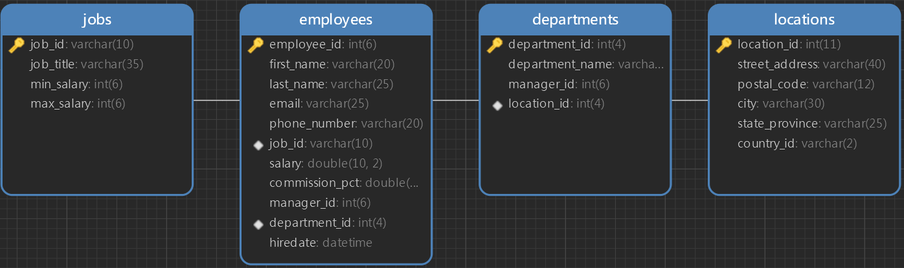

# MySQL练习题

# 增加

## 增加数据库

1.  查询所有数据库名，确保没有名为tmp的数据库，有则删除。

    *   参考答案

        ```sql
        show databases like 'tmp';
        ```

2.  增加一个名为tmp的数据库，字符集utf-8 。

    *   参考答案

        ```sql
        create database tmp character set utf8;
        ```

3.  查询此表信息已验证是否添加成功。

    *   参考答案

        ```sql
        show create database tmp;
        ```

## 增加表

1.  使用tmp数据库

    *   参考答案

        ```sql
        use tmp;

        ```

2.  查看当前数据库下的所有表，确保没有名为empinfo的表，有则删除

    *   参考答案

        ```sql
        show tables like 'empinfo';
        ```

3.  在tmp中新建一个名为empinfo的表，设定主键id，整数无符号类型，自动递增；name，可变字符类型20长度，非空，不能重复；gender，有“男”、“女”、“保密”三个选项，默认为保密；

    *   参考答案

        ```sql
        create table empinfo(

        id int unsigned primary key auto_increment,
        name varchar(20) not null unique,
        gender enum('保密','男','女') default '保密'

        );
        ```

4.  查看表结构以验证是否新建成功

    *   参考答案

        ```sql
        desc empinfo;
        ```

## 增加表中字段

1.  在tmp数据库下empinfo表的末尾添加height字段，单精度浮点数类型，长度为5，2个小数点

    *   参考答案

        ```sql
        alter table empinfo add height float(5,2);
        ```

2.  在tmp数据库下empinfo表的开头添加date字段，时间戳类型，默认值为当前时间

    *   参考答案

        ```sql
        alter table empinfo add date timestamp default current_timestamp first;
        ```

3.  在tmp数据库下empinfo表的name之后添加age字段，整数类型长度为3，默认值为18

    *   参考答案

        ```sql
        alter table empinfo add age int(3) default 18 after name;
        ```

## 增加数据

1.  用set方法在tmp数据库下empinfo表中增加gender=女，height=1.66，name=小乔，其余字段为默认的数据

    *   参考答案

        ```sql
        insert into empinfo set gender='女',height=1.66,name='小乔';
        ```

2.  用values方法在tmp数据库下empinfo表中增加以下两条数据：

    name=大乔，age=19，其余字段为默认

    name=貂蝉，age=22，其余字段为默认

    *   参考答案

        ```sql
        insert into empinfo(name,age) values('大乔',19),('貂蝉',22); 
        ```

3.  在tmp数据库下empinfo表中增加以下数据

    | date       | id | name | age | gender | height |
    | ---------- | -- | ---- | --- | ------ | ------ |
    | 默认         | 默认 | 陈鱼   | 20  | 女      | 1.6    |
    | 2022-1-30  | 默认 | 洛雁   | 默认  | 保密     | 为空     |
    | 为空         | 默认 | 毕月   | 19  | 女      | 1.88   |
    | 2021-12-28 | 默认 | 修花   | 22  | 保密     | 1.76   |

    *   参考答案

        ```sql
        insert into empinfo values
        (default,default,'陈鱼',20,'女',1.6),
        ('2022-01-30 17:18:30',default,'洛雁',default,'保密',null),
        (null,default,'毕月',19,'女',1.88),
        ('2021-12-28 13:14:20',default,'秀花',22,'保密',1.76);
        ```

# 修改

## 修改数据库属性

1.  查看当前系统支持的字符集和对应的默认校对规则

    *   参考答案

        ```sql
        show char set;
        ```

2.  修改tmp数据库的字符集为gbk，校对规则为gbk\_chinese\_ci

    *   参考答案

        ```sql
        alter database tmp character set gbk collate gbk_chinese_ci;
        ```

## 修改表属性

1.  修改empinfo表名为beauty

    *   参考答案

        ```sql
        alter table empinfo rename beauty;
        ```

2.  修改表的字符集为gbk，校对规则为gbk\_chinese\_ci

    *   参考答案

        ```sql
        alter table beauty character set gbk collate gbk_chinese_ci;
        ```

## 修改表中字段

1.  修改beauty表中的date字段名为register date，字段类型仍为timestamp

    *   参考答案

        ```sql
        alter table beauty change date `register date` timestamp;
        ```

2.  修改height的属性为decimal，长度为3，2位无符号小数，默认值为1.60，非空

    *   参考答案

        ```sql
        alter table beauty modify height decimal(3,2) unsigned default 1.60 not null;
        ```

## 修改数据

1.  将id=2 的数据修改为id=10（在不冲突的情况下），age=21，gender=保密，height=1.78，其他值不修改

    *   参考答案

        ```sql
        update beauty set id=10,age=21,gender='保密',height=1.78 where id=2;
        ```

2.  将id=1的数据修改为name=杨玉环，age=22，height=1.80，其他值不修改

    *   参考答案

        ```sql
        update beauty set name='杨玉环',age=22,height=1.80 where id=1;
        ```

3.  将所有数据的age字段值在原来的基础上增加2

    *   参考答案

        ```sql
        update beauty set age=age+2;
        ```

# 删除

## 删除数据

1.  删除age=24的数据（如果存在）

    *   参考答案

        ```sql
        delete from beauty where age=24;
        ```

## 删除字段

1.  删除height字段（如果存在）

    *   参考答案

        ```sql
        alter table beauty drop height;
        ```

## 删除表

1.  删除tmp数据库下名为beauty的表（如果存在）

    *   参考答案

        ```sql
        drop table if exists beauty;
        ```

## 删除数据库

1.  删除名为tmp的数据库（如果存在）

    *   参考答案

        ```sql
        drop database if exists tmp;
        ```

# 查询

## 查询数据库信息

1.  查询当前的所有数据库名称

    *   参考答案

        ```sql
        show databases;
        ```

## 查询表信息

1.  进入myemployees数据库并查看其中所有表名

    *   参考答案

        ```sql
        use myemployees;

        show tables;
        ```

2.  查看表employees的字符集

    *   参考答案

        ```sql
        show create table employees;
        ```

## 查询字段信息

1.  查询表employees的结构

    *   参考答案

        ```sql
        desc employees;
        ```

## 查询数据

### 基础

1.  查询表employees中的所有数据

    *   参考答案

        ```sql
        select * from employees;
        ```

### 去重

1.  不重复地显示出表 employees 中的全部 job\_id

    *   参考答案

        ```sql
        select distinct job_id from employees;
        ```

### 组合查询

1.  组合显示出表employees的first\_name，job\_id，commission\_pct，各个列之间用逗号连接，列头显示成out put

    *   参考答案

        ```sql
        select concat(first_name,',',job_id,',',ifnull(commission_pct,0)) 'out put' from employees;

        # 别名有特殊字符，用用 ` ` 、' ' 或 " " 均可
        ```

### 排序查询

1.  查询表employees中员工的last\_name，department\_id和年薪，按年薪降序 按last\_name升序。年薪=salary\*12\*（1+commission\_pct）

    *   参考答案

        ```sql
        # 年薪=工资*12*（1+奖金率）
        SELECT last_name,department_id,salary*12*(1+IFNULL(commission_pct,0)) 年薪
        FROM employees
        ORDER BY 年薪 DESC,last_name ASC;
        ```

2.  查询表employees中工资不在8000到17000的员工的last\_name和salary，按salary降序

    *   参考答案

        ```sql
        select last_name,salary from employees where salary not between 8000 and 17000  order by salary desc;
        ```

3.  查询表employees中的email中包含e（不分大小写）的员工信息，并先按邮箱的字节数降序，再按department\_id升序

    *   参考答案

        ```sql
        select *,length(email) from employees where email like "%e%" order by length(email) desc,department_id asc;
        ```

### 单行函数

1.  显示系统日期和时间

    *   参考答案

        ```sql
        select now();
        ```

2.  查询表employees中employee\_id，salary，以及salary提高百分之20%后的结果（别名为new salary）

    *   参考答案

        ```sql
        select employee_id,salary,salary*1.2 "new salary" from employees;
        ```

3.  将员工的姓名按首字母排序（升序），并写出姓名的长度

    *   参考答案

        ```sql
        select last_name,length(last_name) from employees order by last_name;
        ```

4.  做一个查询，产生如下结果：\<last\_name> earns \<salary> monthly, but wants \<salary\*3>

    *   参考答案

        ```sql
        select concat(last_name,' earns ',salary,' month, but wants ',salary*3) from employees;
        ```

5.  查看当前数据库版本

    *   参考答案

        ```sql
        select version();
        ```

6.  查看当前使用的数据库名称

    *   参考答案

        ```sql
        select database();
        ```

7.  查看当前用户

    *   参考答案

        ```sql
        select user();
        ```

### 流程控制函数

1.  查询员工名以及员工是否有奖金，如果有，显示“有”，否则显示“无”

    *   参考答案

        ```sql
        select last_name,if(commission_pct is null,'无','有') 是否有奖金 from employees;
        ```

2.  使用case-when，按照下面的条件输出

    | job\_id   | grade |
    | --------- | ----- |
    | AD\_PRES  | A     |
    | ST\_MAN   | B     |
    | IT\_PROG  | C     |
    | SA\_REP   | D     |
    | ST\_CLERK | E     |

    *   参考答案

        ```sql
        select last_name,job_id, 
        # 整个case-end语句地位相当于要查询的字段，grade是它的别名
        case job_id
        when 'ad_pres' then 'A'
        when 'st_man' then 'B'
        when 'it_prog' then 'C'
        when 'sa_rep' then 'D'
        when 'st_clerk' then 'E'
        end as grade
        from employees;
        ```

### 聚合函数

1.  查询员工工资的最大值，最小值，平均值，总和，保留两位小数

    *   参考答案

        ```sql
        select max(salary),min(salary),round(avg(salary),2),sum(salary) from employees;
        ```

2.  查询员工表中的最大入职时间（hiredate）和最小入职时间和他们的相差天数

    *   参考答案

        ```sql

        select max(hiredate),min(hiredate),datediff(max(hiredate),min(hiredate)) difference from employees;
        ```

3.  查询部门编号（department\_id）为90的员工个数

    *   参考答案

        ```sql
        select count(*) from employees where department_id=90;
        ```

### 分组查询

1.  查询各job\_id的员工工资的最大值，最小值，平均值，总和，并按job\_id升序

    *   参考答案

        ```sql
        select job_id j,max(salary),min(salary),avg(salary),sum(salary) from employees group by j order by j asc;
        ```

2.  查询各个管理者（manager\_id）手下员工的最低工资，其中最低工资不能低于6000，没有管理者的员工不计算在内

    *   参考答案

        ```sql
        select min(salary),manager_id from employees where manager_id is not null group by manager_id having min(salary)>=6000;
        ```

3.  查询所有部门的编号，员工数量和工资平均值,并按平均工资降序

    *   参考答案

        ```sql
        select department_id,count(*),avg(salary) from employees group by department_id order by avg(salary) desc;
        ```

4.  查询具有各个job\_id的员工人数，按人数从高到低排列，人数小于2的不包括在内

    *   参考答案

        ```sql
        select job_id,count(*) from employees group by job_id having count(*)>=2 order by count(*)desc;
        ```


**简写说明**

字段名（e）表示此字段在表employees中

字段名（d）表示此字段在表departments中

字段名（j）表示此字段在表jobs中

字段名（l）表示此字段在表locations中



### 内连接查询

1.  查询所有员工的姓名，部门号和部门名称，无部门号的员工不显示（last\_name（employees），department\_name（departments），department\_id（e和d））

    *   参考答案

        ```sql
        select last_name,d.department_id,department_name from employees e,departments d where d.department_id=e.department_id;
        ```

2.  查询部门编号为90（e和d）的员工的job\_id（e）和该部门的location\_id（d）

    *   参考答案

        ```sql
        select job_id,location_id from employees e,departments d where e.department_id=d.department_id and e.department_id=90;
        ```

3.  查询所有有奖金的员工的
    last\_name（e） , department\_name（d） , location\_id （d和l）, city（l）

    *   参考答案

        ```sql
        # 方法一，两表以上的内连接推荐用此方法
        select last_name,department_name,d.location_id,city from employees e,departments d,locations l where e.department_id=d.department_id and d.location_id=l.location_id and commssion_pct is not null;

        # 方式二，不加括号也可以
        select last_name,department_name,d.location_id,city from (employees e inner join departments d on e.department_id=d.department_id) inner join locations l on d.location_id=l.location_id where commission_pct is not null;

        ```

4.  查询city（l）在Toronto工作的员工的
    last\_name（e） , job\_id （e）, department\_id（e和d） , department\_name （d）

    *   参考答案

        ```sql
        select last_name,job_id,d.department_id,department_name from employees e,departments d,locations l where e.department_id=d.department_id and d.location_id = l.location_id and city='Toronto';
        ```

5.  查询每个工种（job\_id（j））、每个部门的部门名（d）、工种名（job\_title（j））和最低工资（e），按最低工资降序

    *   参考答案

        ```sql
        select department_name,job_title,min(salary) from employees e,departments d,jobs j where e.department_id=d.department_id and e.job_id=j.job_id group by e.department_id,e.job_id order by min(salary) desc;
        ```

6.  查询每个国家下的部门个数大于2的国家编号（country\_id（l））

    *   参考答案

        ```sql
        select count(*) 部门个数,country_id from departments d,locations l where d.location_id=l.location_id group by country_id having count(*)>2;
        ```

7.  已知manager\_id（e）就是管理者的employee\_id（e），查询last\_name为kochhar的员工的employee\_id，以及他的管理者的last\_name（e）和employee\_id

    *   参考答案

        ```sql
        select e.employee_id 员工号,m.last_name 管理者,m.employee_id 管理者员工号 from employees e,employees m where e.manager_id=m.employee_id and e.last_name='kochhar';
        ```

### 外连接查询

1.  用左连接查询哪个城市（l）没有部门（d）

    *   参考答案

        ```sql
        select city from locations l left outer join departments d on l.location_id=d.location_id where department_id is null;
        ```

2.  用右连接查询部门名（d）为SAL或IT的员工信息（e）

    *   参考答案

        ```sql
        select department_name,e.* from employees e right outer join departments d on e.department_id=d.department_id where department_name in('sal','it');
        ```

### 子查询

1.  查询和Zlotkey相同部门的员工姓名和工资

    *   参考答案

        ```sql
        select last_name,salary from employees where department_id=(select department_id from employees where last_name='zlotkey');
        ```

2.  查询工资比公司平均工资高的员工的员工号，姓名和工资

    *   参考答案

        ```sql
        select employee_id,last_name,salary from employees where salary > (select avg(salary) from employees);
        ```

3.  查询各部门中工资比本部门平均工资高的员工的员工号, 姓名和工资

    *   参考答案

        ```sql
        # 此处用内连接和外连接（包括左右）都可以
        # 此处的 avg(salary) 必须取别名，因为此处 where 语句中与部门平均工资的比较必须使用别名来进行
        select employee_id,last_name,salary from employees e inner join (select avg(salary) avg_s,department_id from employees group by department_id ) a on e.department_id=a.department_id where salary > a.avg_s;
        ```

4.  查询和姓名中包含字母u的员工在相同部门的员工的员工号和姓名

    *   参考答案

        ```sql
        select employee_id,last_name from employees where department_id in (select distinct department_id from employees where last_name like '%u%');
        ```

5.  查询在部门的location\_id（d）为1700的部门工作的员工的员工号

    *   参考答案

        ```sql
        # =any()与in()等价
        select employee_id from employees where department_id =any(select department_id from departments where location_id=1700);
        ```

6.  查询管理者是K\_ing的员工姓名和工资

    *   参考答案

        ```sql
        select last_name,salary from employees where manager_id in(select employee_id from employees where last_name='K_ing');
        ```

7.  查询工资最高的员工的姓名，要求first\_name和last\_name显示为一列，列名为 姓.名

    *   参考答案

        ```sql
        select concat(first_name ,last_name) '姓.名' from employees where salary=(select max(salary) from employees);
        ```

### 分页查询

1.  查询前五条员工信息

    *   参考答案

        ```sql
        select * from employees limit 5;
        ```

2.  查询第11条——第25条员工信息

    *   参考答案

        ```sql
        select * from employees limit 10,15;
        ```

3.  查询有奖金的并且工资较高的前10名的员工信息

    *   参考答案

        ```sql
        select * from employees where commission_pct is not null order by salary desc limit 10;
        ```

# 视图

1.  创建视图emp\_v1，要求查询电话号码（phone\_number）以‘011’开头的员工姓名和工资、邮箱

    *   参考答案

        ```sql
        create or replace view emp_v1 as select last_name,salary,email from employees where phone_number like '011%';

        select * from emp_v1;
        ```

2.  创建视图emp\_v2，要求查询部门的最高工资高于12000的部门信息

    *   参考答案

        ```sql
        # 注意视图不能包含子查询
        create or replace view emp_v2 as
        select department_id from employees group by department_id having max(salary) > 12000;

        select d.* from departments d right outer join emp_v2 e on e.department_id=d.department_id;
        ```

3.  查询视图emp\_v1的结构

    *   参考答案

        ```sql
        desc emp_v1;
        ```

4.  查询视图emp\_v1的信息

    *   参考答案

        ```sql
        show create view emp_v1;
        ```

5.  删除视图emp\_v1和emp\_v2

    *   参考答案

        ```sql
        drop view emp_v1,emp_v2;
        ```

# 存储过程

1.  创建名为pro\_in的无参数存储过程，调用后向employees表中插入如下数据

    | last\_name | salary |
    | ---------- | ------ |
    | jack       | 10000  |
    | tom        | 12000  |

    *   参考答案

        ```sql
        # 在命令行中使用以下语句，在 navicat 在创建存储过程有所不同
        delimiter $
        create procedure pro_in() 
        begin 
          insert into employees(last_name,salary) values('jack',10000),('tom',12000); 
        end$
        delimiter ;

        call pro_in();

        # 在 navicat 中，直接新建函数和过程，函数和过程中的语句以正常的分号结尾。保存文件后函数和过程即创建成功
        ```

2.  创建名为pro\_de的存储过程，有两个整数型参数start和end 。调用并传入参数后，将表employees中employee\_id从start到end的数据删除。调用并传入207和208两个参数。

    *   参考答案

        ```sql
        delimiter $
        create procedure pro_de() 
        begin 
          delete from employees where employee_id between `start` and `end`;
        end$
        delimiter ;

        call pro_de(207,208);
        ```

3.  创建名为pro\_bu的存储过程，根据员工last\_name能返回其部门名。调用此函数查询Lorentz的部门名

    *   参考答案

        ```sql
        delimiter $
        CREATE PROCEDURE `pro_bu`(IN `name` varchar(50),OUT `de_name` varchar(50))
        BEGIN
          select d.department_name into de_name from departments d right outer join employees e on e.department_id=d.department_id where e.last_name=`name`;
        END$
        delimiter ;

        # 调用
        call pro_bu('Lorentz',@dep_name);
        select @dep_name;

        ```

4.  删除存储过程pro\_in，pro\_de和pro\_bu 。提示：一次只能删一个

    *   参考答案

        ```sql
        drop procedure pro_in;

        drop procedure pro_de;

        drop procedure pro_bu;

        ```

# 函数

1.  创建名为myf1的函数，无输入参数，调用后返回员工总数

    *   参考答案

        ```sql
        # 如果函数不能保存，显示1418错误，则先在查询中运行以下语句
        set global log_bin_trust_function_creators=1;

        # 创建函数
        CREATE FUNCTION `myf1`() RETURNS int(11)
        BEGIN

          declare c int default 0;
          select count(*) into c from employees;
          RETURN c;

        END

        # 调用函数
        select myf1();
        ```

2.  创建名为myf2的函数，根据员工名，返回它的工资。调用函数传入'Lorentz'

    *   参考答案

        ```sql
        # 创建函数
        create function myf2(na varchar(10)) returns double
        begin

        declare sa double(7,2) default 0;
        select salary into sa from employees where last_name=na;
        return sa;

        end;

        # 调用函数
        select myf2('lorentz');
        ```

3.  创建名为myf3的函数，根据部门名，返回该部门的平均工资。调用函数传入'sal'

    *   参考答案

        ```sql
        # 创建函数
        create function myf3(dena varchar(10)) returns double(7,2)
        begin
        declare avg_s double(7,2) default 0;
        select avg(salary) into avg_s from employees where department_id = (select department_id from departments where department_name=dena) group by department_id;
        return avg_s;
        end;

        # 调用函数
        select myf3('sal');
        ```

4.  创建名为myf4的函数，实现传入两个float类型的数，返回二者之和，保留两位小数。调用函数传入1.2 和3.4

    *   参考答案

        ```sql
        # 创建函数
        create function myf4(a float,b float) returns float(7,2)
        begin

        declare c float(7,2) default 0;
        set c=a+b;
        return c;

        end;

        # 调用函数
        select myf4(1.2,3.4);
        ```

5.  查看名为myf1的函数信息

    *   参考答案

        ```sql
        show create function myf1;
        ```

6.  删除函数myf1，myf2，myf3，myf4（提示：一次只能删除一个）

    *   参考答案

        ```sql
        drop function myf1;
        drop function myf2;
        drop function myf3;
        drop function myf4;
        ```


