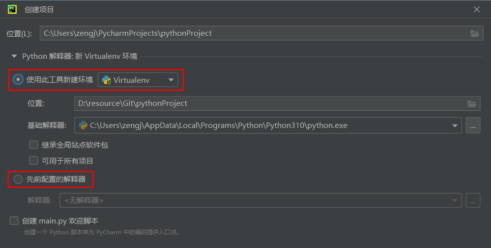
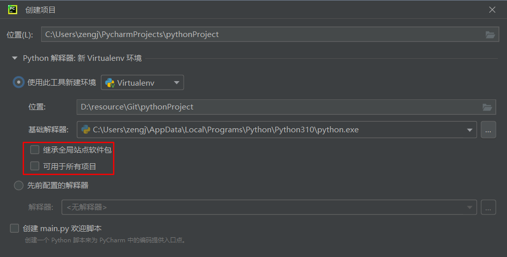

# Python基础

# 基础

编译型语言：程序在用编译型语言写完之后需要一个专门的编译过程，使用编译器把高级语言编译成为机器语言的文件，运行时不需要重新翻译。程序执行效率高，但跨平台性差。

解释型语言：解释型语言编写的程序不进行预先编译，以文本方式存储程序代码。在运行的时候，必须通过解释器先解释再执行，效率比编译程序低。由于可在不同平台安装对应的解释器，因此跨平台性强。

**设计目标**

1.  简单直观并且功能强大

2.  开源

3.  代码像纯英语一样容易理解

4.  适用于短期开发的日常任务

**特点**

*   Python是完全面向对象的语言

    *   函数、模块、数字、字符串都是对象，在Python中一切皆对象

    *   完全支持继承、重载、多重继承

    *   支持重载运算符，也支持泛型设计

*   每行代码完成一个任务

*   格式非常严格，不忽略空格

**集成开发环境**

（IDE，Integrated Development Environment ）集成了开发软件需要的所有工具，一般包括以下工具：

*   图形用户界面

*   代码编辑器（支持代码补全、自动缩进）

*   编译器/解释器

*   调试器（断点、单步执行）

## 常用快捷键

pycharm的常用快捷键

| `Ctrl`+`r`               | 在此文件中查找和替换               |
| ------------------------ | ------------------------ |
| `Ctrl`+`/`               | 注释或取消注释当前行或选中行           |
| `Ctrl`+`Enter`           | 回车但光标不跟随移动               |
| `Shift`+`Tab`            | 取消缩进                     |
| `Ctrl`+`w`               | 依据光标位置选择代码，多次按下会有扩大选择区   |
| `Ctrl`+`Shift`+`w`       | 缩小选择区                    |
| `Ctrl`+`D`               | 复制当前行                    |
| `Alt`+`Shift`+`上光标/下光标`  | 将当前行上移/下移                |
| `Ctrl`+`Shift`+`上光标/下光标` | 将当前代码块（函数、if、for语句）上移/下移 |
| `Ctrl`+`-`               | 收起当前代码块                  |
| `Ctrl`+`=`               | 展开当前代码块                  |
| `Ctrl`+`Shift`+`-`       | 收起所有代码块                  |
| `Ctrl`+`Shift`+`=`       | 展开所有代码块                  |
| `Ctrl`+`Alt`+`t`         | 使用一些模板环绕（if、try等）所选代码块   |
| `Ctrl`+`Shift`+`del`     | 解开环绕模板操作返回之前的状态          |
| `Ctrl`+`空格`              | 显示补全                     |
| `Ctrl`+`Shift`+`空格`      | 显示智能补全                   |

按住 `Ctrl` ，点击左键可以查看内置和自定义函数的定义。如果跳转到的地方仅仅是一堆解释说明，函数体是pass，这表明该函数是基于C语言实现的

自动补全时，按Tab有时会替换一些东西，按Enter则是插入，不会替换

## 注释

```python
# 单行注释，为保证可读性，建议在#后添加一个空格
```

```python
“”“
多行注释，
三对单引号也可以。
实际上，
三对双引号或单引号中间的是可换行的文本，
其中的文本内容不赋值给任何变量，
也不进行任何其它操作，
就可以作为多行注释。
”“”
```

## 转义字符

| 转义字符 | 含义                        |
| ---- | ------------------------- |
| /t   | 制表符，table，一组四个空格          |
| /n   | 换行，newline                |
| /r   | 回车，return，返回改该行的开头，注意不会换行 |
| /b   | 退格，back，会覆盖之前的内容          |

不希望字符串中的转义字符起作用，在字符串之前加上 r 或 R

```python
print(r'你\n好')  
```

但是注意最后一个字符不能是一个反斜杠，会报缺少右引号的错误 &#x20;

```python
print(r'你\n好\')  
```

但是可以是两个反斜杠 &#x20;

```python
print(r'你\n好\\')
```

# 变量

变量由标识、类型和值组成 &#x20;

```python
print('标识', id(name))   # 标识是变量指向的内存空间
print('类型', type(name))  # 常见类型有int整数，str字符串，float浮点数，True布尔类型
print('值', name)
```

字符串又被称为不可变的字符序列 &#x20;
可以使用单引号 '' 、双引号 "" 、三引号 ''' ''' 或 """"""来定义 &#x20;
单引号和双引号定义的字符串必须在一行 &#x20;
三引号定义的字符串可以分布在连续的多行，所以有时被当做多行注释来使用

## **字符串可以用+号连接，注意+号作为连接符时只能连接字符串，其它类型的数据与字符串连接时要先转换为字符类型**

## 类型转化

| 函数    | 作用             |
| ------- | ---------------- |
| str()   | 转化为字符串类型 |
| int()   | 转化为整数类型   |
| float() | 转化为浮点数类型 |
| bool()  | 转化为布尔类型   |
| abs()   | 绝对值           |

# 运算

## 算数运算符

| +    | 加               |
| ---- | --------------- |
| -    | 减               |
| \*   | 乘               |
| /    | 除，如9/2=4.5      |
| //   | 进行除法后取整，如9//2=4 |
| %    | 取余，如9%2=1       |
| \*\* | 幂次，如2\*\*3=8    |

## 赋值

\= 为赋值运算符，运算顺序从右往左

```python
a = b = c = 20  
```

链式赋值时，所有变量名指向的是相同的内存空间，而不会为它们单独开辟空间。但是当变量的值改变时，会指向新的内存空间

| +=    |
| ----- |
| -=    |
| \*=   |
| /=    |
| //=   |
| %=    |
| \*\*= |

支持系列解包赋值

```python
a, b, c = 10, 20, 30
```

## 比较运算符

变量由标识、类型和值三部分组成 ，比较运算符比较的都是变量的值（而非标识或类型）

返回布尔类型的值

| >  | 大于   |
| -- | ---- |
| <  | 小于   |
| >= | 大于等于 |
| <= | 小于等于 |
| == | 等于   |
| != | 不等于  |

is 和 is not 比较变量的标识，称为成员运算符

## 逻辑运算符

| and | 与 |
| --- | - |
| or  | 或 |
| not | 非 |

## 位运算符

| &  | 位与，对应数位都是1，结果数位才是1，否则为0 |
| -- | ----------------------- |
| \| | 位或，对应数位都是0，结果数位才是0，否则为1 |

## 对象的布尔值

以下对象的布尔值为 False

False
数值0 &#x20;
None &#x20;
空字符串 &#x20;
空列表 &#x20;
空元组 &#x20;
空字典 &#x20;
空集合

除了上面的对象，其它对象的布尔值均为 True

# 程序结构

## 选择结构

### if语句

### 条件表达式

条件表达式就是 if···else 的简写 &#x20;
语法结构

```python
x if 判断条件 else y
# 如果判断条件为真，就执行 x，否则执行 y
```

## 循环结构

# 数据序列

列表、元组、字典和集合对比：

| 列表 | 可变序列              | 有序 |
| -- | ----------------- | -- |
| 元组 | 不可变序列，不能被修改       | 有序 |
| 字典 | 通常用于存储描述一个物体的相关信息 | 无序 |
| 集合 | 和字典的区别是只有键没有值     | 无序 |

## 列表

| 方法         | 作用               |
| ---------- | ---------------- |
| .append()  | 追加元素             |
| .count(元素) | 计算列表中指定元素出现的次数   |
| .extend(L) | 向列表中追加另一个列表L     |
| .index(元素) | 获得指定元素在列表中的位置    |
| .insert()  | 向列表中插入数据         |
| .pop()     | 删除列表中的元素（通过下标删除） |
| .remove()  | 删除列表中的元素（直接删除）   |
| .reverse() | 将列表中元素的顺序颠倒      |
| .sort()    | 将列表中元素排序         |

## 元组

## 字典

## 集合

# 字符串

字符串可看成一种不可变序列

## 格式化输出

有三种常用方法进行格式化输出

**方法一：**%作占位符

| 符号    | 描述               |
| ----- | ---------------- |
| %c    | 格式化字符及其ASCII码    |
| %s    | 格式化字符串           |
| %d或%i | 格式化整数            |
| %u    | 格式化无符号整数         |
| %o    | 格式化无符号八进制数       |
| %x    | 格式化无符号十六进制数，字母小写 |
| %X    | 格式化无符号十六进制数，字母大写 |
| %f    | 格式化浮点数，可指定小数点后精度 |
| %e或%E | 用科学表示法格式化浮点数     |
| %g或%G | %f 和 %e 的组合简写    |
| %p    | 用十六进制数格式化变量的地址   |

**方法二：**{}作占位符，用 format() 方法

**方法三：**{}作占位符，直接在{}中填变量

# 函数

## 装饰器

本质是函数，作用为其它函数添加额外的功能，即拓展原来函数功能的一种函数

使用装饰器的目的是在不修改原函数源代码以及调用方式的前提下为被装饰对象添加新功能

装饰器以@开头

## lambda

lambda定义一个匿名函数

```python
g = lambda x: x+1  # 求 x+1 的和

# 调用
g(1)  # 结果为 2

# 等价于
def g(x):
  return x+1

```

# bug分析

## assert

assert（断言）用于判断一个条件表达式，在条件表达式为 false 的时候触发异常。

断言可以在条件不满足程序运行的情况下直接返回错误，而不必等待程序运行后出现崩溃的情况

```python
assert 条件表达式
```

# 类和对象

**两种编程思想**：

面向过程：问题比较简单，可以用线性思维去解决 &#x20;

面向对象：问题比较复杂，使用简单的线性思维无法解决 &#x20;

二者相辅相成，并不是对立的，解决复杂问题，通过面向对象方式便于我们从宏观上把握事物之间复杂的关系， 方便我们分析整个系统。具体到微观操作，仍然使用面向过程方式来处理

## 类的创建

类是对象的模板，是负责创建对象的

**实例方法**

类的实例方法与普通的函数只有一个特别的区别——它们必须有一个额外的**第一个参数名称**, 按照惯例它的名称是 self。self代表类的实例对象，而非类。实例方法只能由实例对象调用

**静态方法**

1、类中的静态方法，实际上就是大家众所周知的普通函数，存在的唯一区别是：

⑴类静态方法在类命名空间中定义，而函数则在程序的全局命名空间中定义

2、需要注意的是：

⑴类静态方法没有self、cls这样的特殊参数，故Python解释器不会对其包含的参数做任何类或对象的绑定

⑵类静态方法中无法调用任何类和对象的属性和方法，类静态方法与类的关系不大

⑶静态方法需要使用＠staticmethod修饰

3、静态方法的调用，既可以使用类名，也可以使用类对象

4、静态方法是类中的函数，不需要实例等

⑴静态方法主要是用来存放逻辑性的代码，逻辑上属于类，但是和类本身没有关系

⑵也就是说在静态方法中，不会涉及到类中的属性和方法的操作(静态方法中不能使用实例变量、类变量、实例方法等)

⑶可以理解为，静态方法是个独立的、单纯的函数，它仅仅托管于某个类的名称空间中，便于使用和维护

**类方法**

⑴类方法至少需要包含一个参数，与实例方法不同的是该参数并非self，而是python程序员约定俗成的参数：cls(cls表示当前类对象)

⑵Python会自动将类本身绑定到cls参数(非实例对象)，故在调用类方法时，无需显式为cls参数传递参数

⑶类方法需要使用修饰语句： ＠classmethod

类方法推荐使用类名直接调用，当然也可以使用实例对象来调用

## 封装和继承

广义的封装：函数和类的定义本身，就是封装的体现

狭义的封装：一个类的某些属性，在使用的过程 中，不希望被外界直接访问，而是把这个属性给作为私有的，然后暴露给外界一个访问的方法即可间接访问属性

封装的本质：就是属性私有化的过程

封装的好处：提高了数据的安全性，提高了数据的复用性

## 多态

继承后，对方法进行重写，形成不同的实例化对象方法，称为多态

## 反射

# 模块和包

每个 .py文件都可称为一个模块，每个含有 \_\_init\_\_.py文件的文件夹都可以称为一个包。在pycharm中，包文件夹和普通文件夹的图标不同

```python
""" 语法 """
# 导入整个文件，会将模块内的所有全局变量、函数、类等等全部都导入进来
    import 模块名称 [as 别名]

# 导入部分函数、变量、类
    from 模块名称 import 函数/变量/类 [as 别名]
```

在导入模块的时候，会把模块.py文件执行一遍，然后生成一个模块对象，模块中我们定义的函数、变量、类会添加到这个模块对象的属性里面，于是模块中的函数、变量、类能直接使用

导入包的时候，不会将其中的.py文件全部执行，而是只执行这个包里面的 \_\_init\_\_.py文件，也可以理解为导入包的时候，只是导入了\_\_init\_\_.py

Python解释器对模块和包的搜索顺序是：当前目录，PATHONPATH下的每个目录，标准链接库目录（lib），.pth文件的目录。这四部分的路径都存储在sys.path 列表中

## pycharm包管理

Python有丰富的第三方包，我们也许已经安装了非常多的包（可以通过pip list查看），但开发项目时，不一定会全部用到，出于环境隔离和便于之后项目部署的目的，可以通过虚拟环境来进行包管理。

pycharm中新建项目时，可新建虚拟环境或使用之前的环境



创建虚拟环境的时候，以下两个选项的含义为：



继承全局站点软件包（inherit global site-packages）：勾选上表示，创建的新项目会复制一份全局包到虚拟环境中

可用于所有项目（Make available to all projects）：勾选上表示，当在虚拟环境下安装包的时候，复制一份到全局包中

全局包和虚拟环境里包存放位置为：

*   全局包存放在python安装目录下的\Lib\site-packages子目录里

*   虚拟环境包安装在关联的项目目录下面的\\\${虚拟环境名}\Lib\site-packages子目录里

**项目部署时批量导包：**

*   在当前虚拟环境下，通过pip freeze > requirements.txt（名字随意）

*   在目标服务器上执行，pip install requirements.txt即可

## os模块

| 常用函数            | 作用      |
| --------------- | ------- |
| system('cmd命令') | 执行cmd命令 |

## os.path模块

| 常用函数            | 作用                       |
| --------------- | ------------------------ |
| abspath(path)   | 获取文件或目录的绝对路径             |
| exists(path)    | 判断文件是否存在，返回 True 或 False |
| join(path,name) | 将目录与目录或文件名拼接成路径          |
| splitext()      | 分离文件名和拓展名                |
| basename(path)  | 从路径中提取文件名                |
| dirname(path)   | 从路径中提取去除文件名后的路径          |
| isdir(path)     | 判断是否为路径                  |

# 文件读写

常用模式：

| 字符    | 含义                                                                         |
| ----- | -------------------------------------------------------------------------- |
| `'r'` | 以只读方式打开文件。文件的指针将会放在文件的开头（默认）                                               |
| `'w'` | 打开一个文件只用于写入。如果该文件已存在则打开文件，并从开头开始编辑，即原有内容会被删除。如果该文件不存在，创建新文件                |
| `'x'` | 写模式，新建一个文件，如果该文件已存在则会报错                                                    |
| `'a'` | 打开一个文件用于追加。如果该文件已存在，文件指针将会放在文件的结尾。也就是说，新的内容将会被写入到已有内容之后。如果该文件不存在，创建新文件进行写入 |
| `'b'` | 二进制模式                                                                      |
| `'t'` | 文本模式（默认）                                                                   |
| `'+'` | 打开一个文件进行更新(可读可写)                                                           |

文件对象常用方法：

| 方法名                    | 说明                                                                                                                                             |
| ---------------------- | ---------------------------------------------------------------------------------------------------------------------------------------------- |
| read(\[size])          | 从文件读取size个字节或字符内容返回,若省略\[size],则读取到文件末尾,即一次读取文件所有内容                                                                                            |
| readline()             | 从文本文件中读取一行内容                                                                                                                                   |
| resdlines()            | 把文本文件中的每一行都作为独立的字符串对象,并将这些对象放入列表中返回                                                                                                            |
| write(str)             | 将字符串str内容写入文件                                                                                                                                  |
| writelines(s)          | 将字符串列表s写入文本文件,不添加换行符                                                                                                                           |
| seek(offset\[,whence]) | 把文件指针移动到新位置,offset表示相对于whence的位置:&#xA;offset:  &#xA;    offset为正,往结束方向移动;offset为负,往开始方向移动&#xA;0: 从文件头开始计算(默认)&#xA;1: 从当前位置开始计算&#xA;2: 从文件尾开始计算 |
| tell()                 | 返回文件指针当前位置                                                                                                                                     |
| truncate(\[size])      | 不问指针在什么位置,只留下指针前size个字节的内容,其余全部删除&#xA;如果没有传入size,则当前指针位置到文件末尾全部删除                                                                              |
| flush()                | 把缓冲区的内容写入文件,但不关闭文件                                                                                                                             |
| close()                | 把缓冲区的内容写入文件,同时关闭文件,并释放资源                                                                                                                       |
