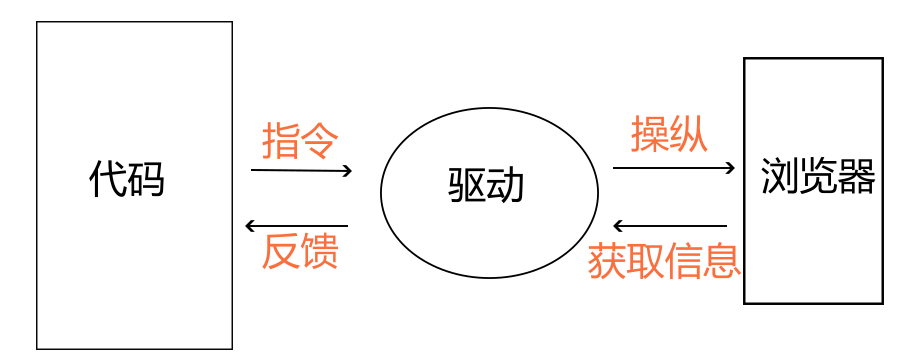
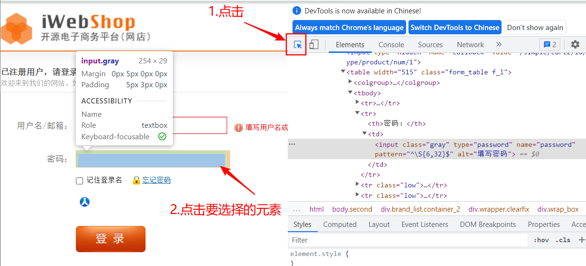
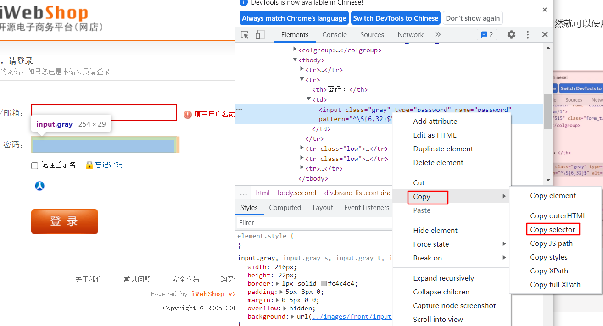
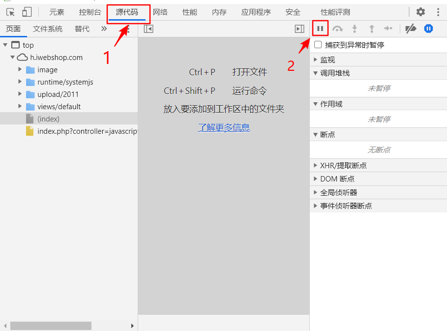
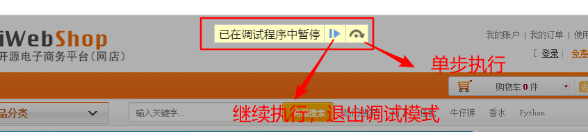
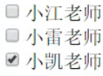
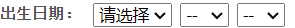
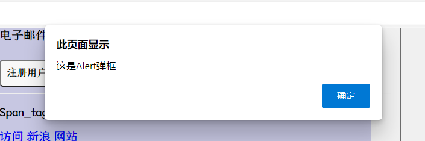
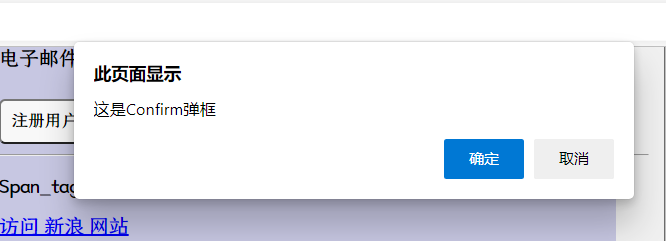
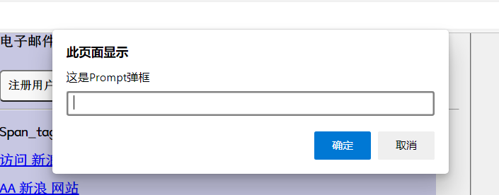

# Selenium web自动化

# 自动化理论

1.  什么项目适合自动化？

    *   软件需求变更不频繁

    *   项目周期比较长（一年以上）

    *   自动化的脚本能够重复利用

2.  自动化测试介入点

    *   回归测试的时候，一般新项目第一次测试都是用手工测试

3.  实施过程

    1.  可行性分析

    2.  框架的选择（selenium,RF）

    3.  需求分析，测试计划和用例设计

    4.  无人值守

    5.  提交报告

    6.  脚本维护

# Selenium安装

## python环境的安装

1.  安装python环境

2.  安装pyCharm

## 客户端库安装

在Windows命令行中输入：

```powershell
pip install selenium==版本号
```

不写版本号默认安装最新版

自动化脚本在Windows和在mac上语法是没有任何区别的，只要在mac上把Python环境搭好，就可以执行

## 浏览器驱动下载

下载对应版本的，下载地址：[https://chromedriver.storage.googleapis.com/index.html](https://chromedriver.storage.googleapis.com/index.html "https://chromedriver.storage.googleapis.com/index.html")

原理：代码发送指令给驱动服务，驱动服务唤起计算机底层控件，根据指令模拟人类操作浏览器



webdriver是一套接口标准，使用标准的HTTP Restful接口，使用json格式传递数据

chromedriver是实现webdriver标准的一套驱动服务

selenium实际上是对各种接口操作的封装

# 简单代码体验

在pyCharm中新建项目，输入以下代码，自动打开浏览器并打开百度网页

```python
from selenium import webdriver

#括号中r表示后面不使用转义字符，单引号中的是浏览器驱动所在的位置
wd = webdriver.Chrome(r'D:\resource\webdriver\chromedriver.exe')

wd.get('https://www.baidu.com')
```

使用的对象：webdriver（驱动）对象

```python
wd = webdriver.Chrome(r'D:\resource\webdriver\chromedriver.exe')
"""
1. 注意 Chrome 中的 C 是大写的
2. r 表示后面的反斜杠不是转义字符
3. 括号中输入chrimedriver.exe的存放路径
"""
```

我们可以把浏览器驱动 所在目录 加入环境变量 Path ， 写代码时，就可以无需指定浏览器驱动路径了，这样利于代码的移植

```python
wd = webdriver.Chrome()

```

因为，Selenium会自动在环境变量 Path 指定的那些目录里查找名为chromedriver.exe 的文件。一定要注意的是， 加入环境变量 Path 的，不是浏览器驱动全路径，比如 D:\resource\webdriver\chromedriver.exe，而是 浏览器驱动所在目录，比如 D:\resource\webdriver

**设置完环境变量后，重启IDE（比如 PyCharm） 新的环境变量才会生效**。

# 选择元素

网页自动化的重点在于如何选择元素，八大元素定位方式id，name，class name，tag name（如div等尖括号中的称为标签），link text，partial link text，xpath，css selector

webdriver方法：

| find\_element  | 返回符合条件的第一个元素， 如果没有符合条件的元素， 抛出 NoSuchElementException 异常 |
| -------------- | ------------------------------------------------------- |
| find\_elements | 返回符合条件的所有元素，是一个列表， 如果没有符合条件的元素， 返回空列表                   |

注意 find\_element 和 find\_elements方法返回的对象也有 find\_element 和find\_elements 方法，它们的区别是 wb 对象使用此方法时是在网页全局查找；element 对象使用此方法时是在已找到的内容内部查找

```python
// 使用By之前先导入
from selenium.webdriver.common.by import By

wd.find_element(By.ID,'id值')
```

除了ID，还有以下方法

| NAME                | 名称                                     |
| ------------------- | -------------------------------------- |
| CLASS\_NAME         | 类名，在HTML中，可以写多个类名的值，但使用此方法选择元素时只能写一个类名 |
| TAG\_NAME           | 标签名，html、p、div、input等在<>中的内容称为HTML标签   |
| LINK\_NAME          | 链接文本，即\<a>\</a>之间的内容                   |
| PARTIAL\_LINK\_NAME | 部分链接文本，\<a>\</a>之间的部分内容                |
| CSS\_SELECTOR       | css选择器                                 |
| XPATH               | XPATH，全称XML Path                       |

## 三种等待方式

有时网页中的元素是动态设置属性的（如百度搜索的返回结果），这时find\_element方法可能会因为执行过快而找不到结果，可以使用以下三种等待方式等待元素加载

**显式等待：**

明确的等待某个元素加载，timeout秒中每隔0.5秒寻找一次元素，找到则返回结果，未找到则最多等待10秒

```python
from selenium.webdriver.support.wait import WebDriverWait

WebDriverWait(driver, timeout, poll_frequency=0.5, ignored_exceptions=None)
```

driver：webdriver对象

timeout：超时时间

poll\_frequency:两次寻找的时间间隔，默认间隔寻找的间隔时间为0.5s

ignored\_exceptions:超时后的抛出的异常信息，默认抛出NoSuchElementException

与until()或者until\_not()方法结合使用：

```python
WebDriverWait(driver,10).until(method，message="")
# 调用该方法提供的驱动程序作为参数，直到返回值为True

WebDriverWait(driver,10).until_not(method，message="")
# 调用该方法提供的驱动程序作为参数，直到返回值为False

```

在等待期间（10s），每隔一定时间（默认0.5秒)，调用until或until\_not里的方法，直到它返回True或False。如果超过设置时间未发生，则抛出异常

**隐式等待：**

不针对某一元素，等待网页全部元素加载完成（浏览器标签左上角不再转圈圈），在设置的时间内没有加载完成，会报超时加载错误。隐性等待的设置是全局性的，在开头设置过之后，整个的程序运行过程中都会有效，不需要每次设置一遍；

缺点是不智能，因为随着ajax技术的广泛应用，页面的元素往往都可以实现局部加载，也就是在整个页面没有加载完的时候，可能我们需要的元素已经加载完成了，那就没有必要再等待整个页面的加载；

```python
# 设置10秒的最大等待时间
wd.implicitly_wait(10)
```

需要注意的是，隐式等待只适用于元素找不到的情况，但是有的情况是元素能找到，只是其中的值要在一段时间后变化，我们需要的是变化后的值，例如选择地址时，市会在选择省后变化，这个变化可能慢于语句执行速度，这时就不能用隐式等待了，而应该用sleep

**强制等待：**

```python
# 导入sleep函数
from time import sleep
# 等待两秒再执行后面的代码
sleep(2)
```

```python
# 关闭浏览器窗口
wd.quit()
```

## Xpath表达式

在DevTools的元素界面使用Ctrl+f快捷键，可以进行xpath和css选择器调试

1）XPath(XML Path Language)是W3C定义的用来在XML文档中选择节点的语言。

2）主流浏览器(Chrome、Firefox，Edge，Safari)也支持XPath语法

3）语法非常像Linux系统中的路径,所以又叫做**路径表达式**

4）**XPath有从当前节点选择父节点的功能**,这是CSS selector所不具备的

### XPath语法结构

1）绝对路径：从根节点（html）开始, 路径分割符是/,类似css中的>符号。如：/html/body/div
2）相对路径：以//开头后面加元素名称, 用法类似于css中的后代选择器。**//表示从当前节点寻找所有的后代元素,不管它在什么位置**。如：//span
3）组合使用：**//div/p/span**
4）通配符：\* 表示所有元素，如//div/\** *，表示匹配div下面所有元素

### 根据属性

1.  使用场景：选择具有某个属性（值）的元素

2.  表示方法：

    //\*\[@属性=“属性值”] 表示选择具有某个属性值的元素,属性值必须加引号（单引号双引号都可以）

    包含某(value)属性：//\*\[contains(@属性,"value")]

    某属性以value开头：//\*\[starts-with(@属性,"value")]

    某属性以value结尾：//\*\[ends-with(@属性,"value")]

    多属性组合使用：//\*\[@属性="属性值"]\[@属性="属性值"]

    and和or组合使用：//\*\[@属性="属性值"or/and@属性="属性值"]

3.  注意事项：在xpath中没有表示id和class的特殊方法,id 、class 也是属性。class值如果有多个，必须全部写（同样用空格隔开），不能只写一个

### 根据子元素-单选

1）表示方法：如//ul\[@id="languagelist"]/li\[1],若不写元素类型可以直接写\*(通配符)

①正数第一个：//\*\[@属性=“属性值”]/元素\[n]或者“\[n]等价于\[position()=n]”

②倒数第一个：//\*\[@属性=“属性值”]/元素\[last()]或者“\[last()]等价于\[position()=last()]”

③倒数第二个：//\*\[@属性=“属性值”]/元素\[last()-1]或者“\[last()-1]等价于\[position()=last()-1]”

2）使用场景：选择属于其父元素的第n个某个类型的子元素

### 根据子元素-多选

1）表示方法：如//ul\[@id="languagelist"]/li\[position()=last()-1]

①**前2个**：//\*\[@属性=“属性值”]/元素\[position()<3]

②**除了最后1个**：//\*\[@属性=“属性值”]/元素\[position()\<last()]

2）使用场景：选择属于**其父元素的第m到n之间**某个类型的子元素

### 根据相邻兄弟元素

根据**同级元素选择其他的同级元素**

表示方法：如//div\[@class="app"]/**following-sibling::div**

①选择**后面的兄弟元素**：//\*/following-sibling::

②选择**前面的兄弟元素**：//\*/preceding-sibling::

### 根据子元素定位父元素

**//p/..** ;选择p的父元素

### 多组xpath

1）表示方法：**\<s1>|\<s2>**;\<s1>和\<s2> 是两组xpath选择器

2）使用场景：用于多组xpath表达式组合来选择元素的情况

3）注意事项：**css和xpath的表达式不能混用**

## css选择器

CSS Selector 语法 天生就是浏览器用来选择元素的，selenium自然就可以使用它用在自动化中，去选择要操作的元素

DevTools快速获得selector路径的方法





通过 CSS Selector 选择单个元素的方法

```python
find_element(By.CSS_SELECTOR, 'css选择参数')
```

选择所有元素的方法

```python
find_elements(By.CSS_SELECTOR, 'css选择参数')
```

常见的css选择参数id、class

### 根据id、class选择

id的css选择参数为#id值

class的css选择参数为.class值，class如果有多个（一般用空格隔开），只能写一个

### 根据tag name选择

tag name就是标签名，将标签名直接作为css选择参数

Chromium内核的浏览器定位短时间动态元素的方法：

进入在DevTools中，选择源代码（source），点击暂停执行脚本可进入调试模式



点击后：



# 操纵元素的方法

找到元素后，返回的是'selenium.webdriver.remote.webelement.WebElement'对象，此对象常用的方法和属性有：

| 方法                     | 作用                        |
| ---------------------- | ------------------------- |
| click()                | 点击元素                      |
| send\_keys('字符串')      | 输入字符串                     |
| clear()                | 清空输入框内容                   |
| submit()               | 提交表单，在表单中的任意一个输入框可用       |
| get\_attribute('元素属性') | 获取元素的属性值，常见有class、id、name |

| get\_attribute('outerHTML') | 获取整个元素对应的HTML内容，如：\<p>段落\</p>                    |
| --------------------------- | ------------------------------------------------ |
| get\_attribute('innerHTML') | 获取某个元素HTML标签之间的内容，与text的区别是不只会返回文本内容，如果有嵌套标签也会返回 |

| is\_selected()                    | 是否被选中                                 |
| --------------------------------- | ------------------------------------- |
| is\_enabled()                     | 是否可用                                  |
| is\_displayed()                   | 是否在界面展示                               |
| value\_of\_css\_property('css属性') | 获取元素的css属性，常见css属性有font（字体），color（颜色） |

| 属性        | 值                                                                                                   |
| --------- | --------------------------------------------------------------------------------------------------- |
| text      | HTML标签之间的**文本**内容，通常是展示在界面上的内容。对于input输入框的元素，要获取里面的输入文本，用text属性是不行的，这时可以使用 `get_attribute('value')` |
| id        | selenium自己给此元素标识的id                                                                                 |
| size      | 元素的宽高                                                                                               |
| rect      | 元素的宽高和坐标                                                                                            |
| tag\_name | 标签名称                                                                                                |

## 常见控件

**radio框**：用click()方法点击


**checkbox框**：用click()方法点击



### select框



```python
# 导入Select类
from selenium.webdriver.support.ui import Select

# 创建Select对象 
select = Select(wd.find_element(By.ID, "ss_single"))

# 通过 Select 对象选中小雷老师
select.select_by_visible_text("小雷老师")

```

| Select对象的方法                   | 作用                                            |
| ----------------------------- | --------------------------------------------- |
| select\_by\_visible\_text()   | 根据选项的 可见文本 ，选择元素                              |
| select\_by\_index()           | 根据选项的 次序 （从0开始），选择元素，注意有的时候第0个可能是无意义选项，如“请选择” |
| select\_by\_value()           | 根据选项的 value属性值 ，选择元素                          |
| deselect\_by\_visible\_text() | 根据选项的可见文本，去除选中元素                              |
| deselect\_by\_index()         | 根据选项的次序，去除选中元素                                |
| deselect\_by\_value()         | 根据选项的value属性值，去除选中元素                          |
| deselect\_all()               | 去除选中所有元素                                      |

## 上传文件

通常，网站页面上传文件的功能，是通过 `type` 属性 为 `file` 的 HTML `input` 元素实现的。

```html
<input type="file" multiple="multiple">
```

使用selenium自动化上传文件，我们只需要定位到该input元素，然后通过 send\_keys 方法传入要上传的文件路径即可

但是，有的网页上传，是没有 file 类型 的 input 元素的。如果是Windows上的自动化，可以采用 Windows 平台专用的方法：在cmd执行

```powershell
pip install pypiwin32
```

确保 pywin32 已经安装，然后参考如下示例代码

```powershell
# 找到点击上传的元素，点击
driver.find_element(By.CSS_SELECTOR, '.dropzone').click()

sleep(2) # 等待上传选择文件对话框打开

# 直接发送键盘消息给 当前应用程序，
# 前提是浏览器必须是当前应用
import win32com.client
shell = win32com.client.Dispatch("WScript.Shell")

# 输入文件路径，最后的'\n'，表示回车确定，也可能时 '\r' 或者 '\r\n'
shell.Sendkeys(r"h:\a2.png" + '\n')
sleep(1)
```

# WebDriver对象

webdriver.Chrome()返回的是'selenium.webdriver.chrome.webdriver.WebDriver'对象（简称WebDriver对象），此对象常用的方法和属性有：

| 方法                               | 作用               |
| ---------------------------------- | ------------------ |
| back()                             | 返回               |
| forward()                          | 前进               |
| refresh()                          | 刷新页面           |
| close()                            | 关闭当前标签页     |
| quit()                             | 退出浏览器         |
| maximize\_window()                 | 浏览器窗口最大化   |
| switch\_to.frame()                 | 切换iframe         |
| switch\_to.window()                | 切换标签页         |
| get\_window\_size()                | 获取窗口大小       |
| set\_window\_size(x,y)             | 改变窗口大小       |
| save\_screenshot('文件名.后缀')    | 截图保存为图片文件 |
| get\_screenshot\_as\_file('1.png') | 截图保存为图片文件 |
| execute\_script('js脚本')          | 执行JavaScript脚本 |
| get\_cookie()                      | 获取cookie         |
| add\_cookie()                      | 添加cookie         |

| 属性                       | 值         |
| ------------------------ | --------- |
| name                     | 浏览器名称     |
| current\_url             | 当前标签页的url |
| window\_handles          | 所有窗口句柄    |
| current\_window\_handles | 当前窗口句柄    |
| tittle                   | 当前标签页标题   |
| page\_source             | 当前标签页源码   |

## iframe

```python
wd.switch_to.frame('frame_reference')
```

其中， frame\_reference 可以是 frame 元素的属性 name 或者 ID，也可以填写frame 所对应的 WebElement 对象。

我们可以根据frame的元素位置或者属性特性，使用find系列的方法，选择到该元素，得到对应的WebElement对象

```python
wd.switch_to.frame(wd.find_element(By.TAG_NAME, "iframe"))
```

如果我们又需要操作 主html（最外部的html称之为主html） 里面的元素，使用如下语句

```python
wd.switch_to.default_content()
```

注意：主HTML中有多个iframe时，如果切换到了其中一个iframe，必须切换回主界面才能切换到另一个iframe；如果iframe中还有一个iframe，必须一层层切换

## 弹出框

出现弹出框时，如果不去点击它，页面的其它元素是不能操作的

**Alert**&#x20;



```python
driver.switch_to.alert.accept()  确定
```

**Confirm**



```python
driver.switch_to.alert.accept()  确定
driver.switch_to.alert.dismiss()  取消

```

**Prompt**



比Confirm弹框多了send\_keys('字符串')方法，注意传入字符串后要点accpet才能生效

## 切换标签页

```python
wd.switch_to.window(handle)
```

handle为窗口句柄，WebDriver对象有window\_handles 属性，这是一个列表对象， 里面包括了当前浏览器里面所有的窗口句柄。所谓句柄，可以认为是对应网页窗口的一个ID

**获得指定窗口句柄的方法**

方法一：依据打开的顺序，一般wd.window\_handles获得的列表中，窗口句柄按打开的顺序排序

方法二：依据窗口的特征用if语句判断

```python
for handle in wd.window_handles:
    # 先切换到该窗口
    wd.switch_to.window(handle)
    # 得到该窗口的标题栏字符串，判断是不是我们要操作的那个窗口
    if 'Bing' in wd.title:
        # 如果是，那么这时候WebDriver对象就是对应的该该窗口，正好，跳出循环，
        break
```

返回原来的窗口

```python
# mainWindow变量保存当前窗口的句柄
mainWindow = wd.current_window_handle

#通过前面保存的老窗口的句柄，自己切换到老窗口
wd.switch_to.window(mainWindow)

```

# 鼠标事件

```python
from selenium.webdriver import ActionChains

element = driver.find_element(By.LINK_TEXT, "设置")
ActionChains(driver).move_to_element(element).perform()

```

ActionChains(driver)返回'selenium.webdriver.common.action\_chains.ActionChains'对象，它常用方法有：

| click(元素)             | 左键点击                           |
| --------------------- | ------------------------------ |
| context\_click(元素)    | 右击                             |
| double\_click(元素)     | 双击                             |
| move\_to\_element(元素) | 鼠标悬停，注意并不会把鼠标光标移动过去，只是有一个悬停的效果 |
| click\_and\_hold(元素)  | 左键点击按住不放                       |

# 键盘事件

```python
from selenium.webdriver.common.keys import Keys

```

| send\_keys(Keys.BACK\_SPACE) | 退格键（BackSpace）         |
| ---------------------------- | ---------------------- |
| send\_keys(Keys.SPACE)       | 空格键(Space)             |
| send\_keys(Keys.TAB)         | 制表键(Tab)               |
| send\_keys(Keys.ESCAPE)      | 退出键（Esc）               |
| send\_keys(Keys.ENTER)       | 回车键（Enter）             |
| send\_keys(Keys.CONTROL,'a') | 全选（Ctrl+A），第二个参数不区分大小写 |
| send\_keys(Keys.CONTROL,'c') |  复制（Ctrl+C）            |
| send\_keys(Keys.CONTROL,'x') |  剪切（Ctrl+X）            |
| send\_keys(Keys.CONTROL,'v') | 粘贴（Ctrl+V）             |
| send\_keys(Keys.F1)          | 键盘F1（F1-F12都可以）        |

# 常见异常

*   元素定位不到

    *   定位错误

    *   没有添加等待

    *   iframe或者句柄（标签页）

    *   元素被遮挡，可通过页面最大化解决

*   元素无法正常交互

    *   页面是否最大化

    *   是否需要悬停

    *   是否需要滚动滚动条

    *   元素定位错误

*   超时

    *   元素有误

    *   窗体最大化超时（selenium中的bug），通过option进行配置解决

*   无法创建session

    *   检查浏览器版本与dirver版本是否匹配

# 测试框架的设计

（高级）自动化测试工程师需要的能力：结合公司实际需求、人员能力等情况来配置自动化测试环境

目前常用：Python+selenium+yaml+pytest+allure+logging+Jenkins+git
