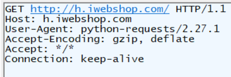

# requests接口自动化

Requests 库 是用来发送HTTP请求，接收HTTP响应的一个Python库。经常被用来 爬取 网站信息。 用它发起HTTP请求到网站，从HTTP响应消息中提取信息。也经常被用来做 网络服务系统的Web API 接口测试。因为Web API 接口的消息基本上都是通过HTTP协议传输的

安装requests

```powershell
 pip install requests
```

# 发送请求

```python
import requests

res = requests.get('http://httpbin.org/get')
print(res, type(res))
# 如果请求成功，res的值为：<Response [200]>
# res的类型为：<class 'requests.models.Response'>
```

http\://httpbin.org/get是一个专门测试HTTP请求（post方法就把资源路径中的get换成post，其它方法同理）的网站。会将请求信息以响应的形式返回。不过由于是外网，可能速度比较慢

常见请求方法有：get、post（向服务器提交资源）、put（修改服务器中的资源）、delete

可以通过 `timeout` 参数设定的秒数时间之后停止等待响应，如果服务器在 `timeout` 秒内没有应答，将会引发一个异常

## 请求参数

*   方法一：通过“？键值对1&键值对2···”形式写在url中

    ```python
    r=requests.get('http://httpbin.org/get?key2=value2&key1=value1')
    ```

*   方法二：通过关键字params传参，参数类型为字典

    ```python
    payload = {'key1': 'value1', 'key2': 'value2'}
    r = requests.get("http://httpbin.org/get", params=payload)

    # 通过打印该 URL，能看到 URL 已被正确编码：
    print(r.url)
    # 返回结果为 http://httpbin.org/get?key2=value2&key1=value1

    ```

    注意字典里值为 `None` 的键都不会被添加到 URL 的查询字符串里。

    你还可以将一个列表作为值传入：

    ```python
    payload = {'key1': 'value1', 'key2': ['value2', 'value3']}
    r = requests.get('http://httpbin.org/get', params=payload)

    print(r.url)
    # 返回结果为 http://httpbin.org/get?key1=value1&key2=value2&key2=value3
    ```

## 设置请求头

不设置任何请求头时，默认的请求头为（可通过fiddler抓包得到）：



通过关键字headers传参，参数类型为字典

```python
u = 'https://api.github.com/some/endpoint'
h = {'user-agent': 'my-app/0.0.1'}

r = requests.get(u, headers=h)
```

注意: 自定义请求头的优先级低于某些特定的信息源，例如：

*   如果在 `.netrc` 中设置了用户认证信息，使用 headers= 设置的授权就不会生效。而如果设置了 `auth=` 参数，`.netrc` 的设置就无效了

*   如果被重定向到别的host，Authorization header 就会被删除

*   代理授权头（Proxy-Authorization headers） 会被 URL 中提供的代理身份覆盖掉

*   在能判断内容长度的情况下，请求头的 Content-Length 会被改写。

Requests 不会基于定制 header 的具体情况改变自己的行为。只不过在最后的请求中，所有的 header 信息都会被传递进去

## post请求

表单数据放在请求体中，通过关键字data传参，参数类型为字典。发送请求的时候，是以urlencoding格式（键=值，&隔开不同键值对）发送的。请求头content-type会自动设置为application/x-www-form-urlencoded

```python
payload = {'key1': 'value1', 'key2': 'value2'}

r = requests.post("http://httpbin.org/post", data=payload)
print(r.text)

# 结果为
"""
{
  ...
  "form": {
    "key2": "value2",
    "key1": "value1"
  },
  ...
}
"""
```

在表单中一个键对应多个值的时候，可以为 `data` 参数传入一个元组：

```python
payload = (('key1', 'value1'), ('key1', 'value2'))
r = requests.post('http://httpbin.org/post', data=payload)
print(r.text)

# 结果为
"""
{
  ...
  "form": {
    "key1": [
      "value1",
      "value2"
    ]
  },
  ...
}
"""
```

### 传递json格式参数

*   方法一：使用关键字json传参，参数类型为字典。

    ```python
    url = 'https://api.github.com/some/endpoint'
    payload = {'some': 'data'}

    r = requests.post(url, json=payload)
    ```

*   导入json包，将字典转换为json格式

    ```python
    import json

    url = 'https://api.github.com/some/endpoint'
    payload = {'some': 'data'}

    r = requests.post(url, data=json.dumps(payload))
    # json.dumps 解码
    # json.loads 编码
    ```

### 传递xml格式参数

传递xml格式的参数时，以字符串形式传递。要注意它的字符编码，data参数默认的编码为latin-1，如果传递的参数不是这种编码，可用.encode()方法设置字符编码。

```python
payload = '''
<?xml version="1.0" encoding="UTF-8"?>
<WorkReport>
    <Overall>良好</Overall>
    <Progress>30%</Progress>
    <Problems>暂无</Problems>
</WorkReport>
'''
r = requests.post("http://httpbin.org/post",
                  data=payload.encode('utf8'))
print(r.text)
```

## 可变URL

当URL的部分需要用动态变量时，可用字符串拼接和格式化字符串两种方式

*   字符串拼接

    ```python
    id_Add = 125

    r = requests.delete('http://api.linjiashop.com/user/address/' + str(id_Add), headers=auth)
    ```

*   格式化字符串

    ```python
    id_Add = 125

    r = requests.delete('http://api.linjiashop.com/user/address/%s' %str(id_Add), headers=auth)

    ```

# 响应对象

### 属性

| 属性           | 描述                                        |
| ------------ | ----------------------------------------- |
| text         | 响应体文本，类型为字符串。注意返回结果为字符串时，看起来像字典，但实际上仍是字符串 |
| status\_code | 响应状态码                                     |
| headers      | 响应头                                       |
| encoding     | 响应体字符编码                                   |
| content      | 以字节方式展示响应体，可以用decode()解码                  |
| raw          | 响应原始内容，必须在请求中设置stream=True                |
| cookies      | 如果响应中包含cookie，返回cookie                    |
| history      | 请求历史，常用于追踪重定向                             |

text会根据响应头中的content-encoding推测字符编码，但有的响应头中没有给出这个信息，就有可能推测错误，这是可以主动指定字符编码

```python
r=requests.get('http://httpbin.org/get?key2=value2&key1=value1')

# 查看使用的编码
print(r.encoding)

# 修改编码
r.encoding='GB2312'

```

Requests 会自动解码 `gzip` 和 `deflate` 传输编码的响应数据

如果你使用的是GET、OPTIONS、POST、PUT、PATCH 或者 DELETE，那么你可以通过参数`allow_redirects`=False 禁用重定向

要想发送你的cookies到服务器，可以使用 `cookies` 参数

```python
u = 'http://httpbin.org/cookies'
c = dict(cookies_are='working')

r = requests.get(u, cookies=c)
r.text
'{"cookies": {"cookies_are": "working"}}'
```

### 方法

| 方法     | 作用                 |
| ------ | ------------------ |
| json() | 对响应体进行json解码，转换为字典 |

请求对象

# 请求函数的参数

requests库中，请求函数包括get()、post()、put()、delete()等等

*   proxies设置代理，类型为字典

```python
p={'http':'http://127.0.0.1:8888', 'https':'https://127.0.0.1:8888'}

r=requests.get(url, proxies=p)
```

# session-cookie

可以通过设置请求头手动发送cookie，requests也提供了更方便的方法储存和发送cookie

# 异常

*   若遇到网络问题（如：DNS 查询失败、拒绝连接等），Requests 会抛出一个 `ConnectionError` 异常

*   若 HTTP 请求返回了不成功的状态码， [Response.raise\_for\_status()](https://docs.python-requests.org/zh_CN/latest/api.html#requests.Response.raise_for_status "Response.raise_for_status()") 会抛出一个 `HTTPError` 异常

*   若请求超时，则抛出一个 `Timeout` 异常

*   若请求超过了设定的最大重定向次数，则会抛出一个 `TooManyRedirects` 异常

所有Requests显式抛出的异常都继承自 `requests.exceptions.RequestException`

