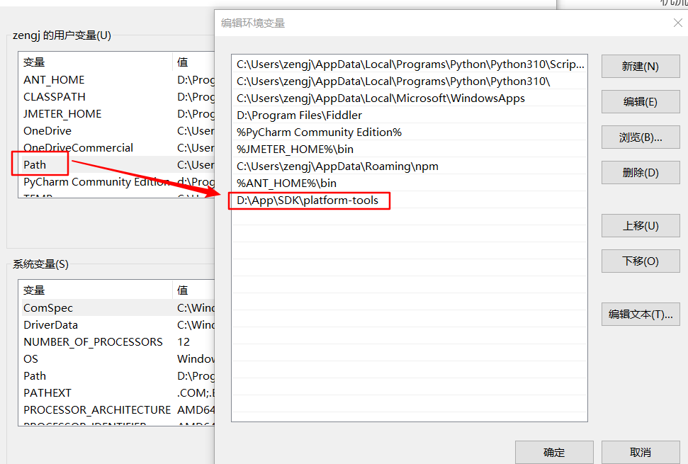
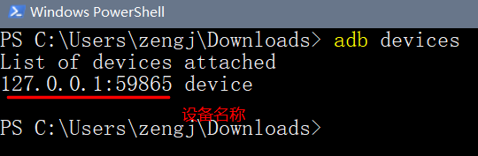
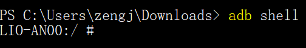
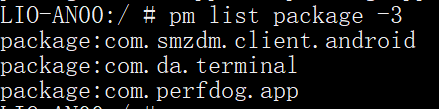
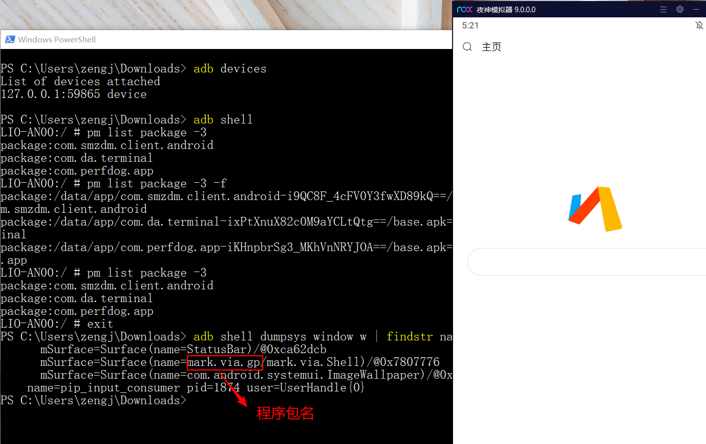
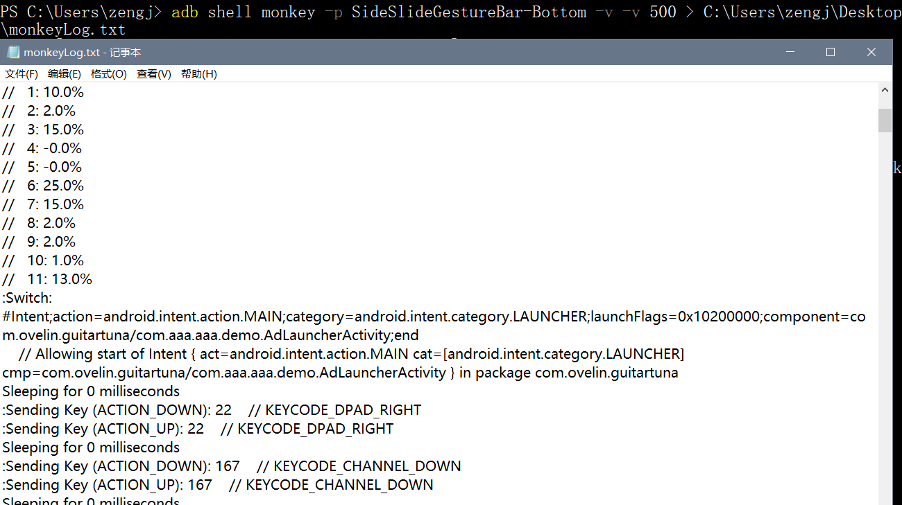

# 安卓压测工具Monkey

Monkey是Android系统的一个命令行工具，可以运行在模拟器、手机设备中。它向系统或软件发送伪随机流（如键盘输入、触摸屏输入、手势输入、鼠标输入等），实现对正在开发的APP应用程序进行压力性能测试

通过monkey程序模拟用户操作，检测程序多久的时间会发生异常，是一种测试软件稳定性、健壮性的快速有效的方法

# 环境配置

Monkey是基于Android的，需要配置SDK环境和JDK环境，由ADB启动

SDK (SoftDevelopment Kit )：软件开发工具包，在Android中，它为开发者提供了库文件以及其它开发所用到的工具。被软件开发工程师用于为特定的软件包、软件设计、硬件平台、操作系统等建立应用软件的开发工具的集合

JDK(Java Development Kit)：Java 语言的软件开发工具包，包括了Java运行环境JRE (JVM等)、Java工具 (javac/java/jdb等) 和Java基础类库

ADB（Android Debug Bridge）：安卓调试桥，是android sdk包里面的一个工具, 可以在电脑上建立一个连接到手机的通道，用ADB可以直接操作管理android设备

**设置SDK环境变量**：

下载SDK后解压，找到SDK里面的adb.exe所在路径，将这个路径添加到环境变量的path中



然后就能在cmd或power shell中执行adb的命令了

# 常用命令（含adb要在windows里输入）

| adb start-server | 启动adb服务 |
| ---------------- | ------- |
| adb kill-server  | 停止adb服务 |

查看可用的安卓设备，下文中的手机均指的是安卓手机

```powershell
adb devices
```



电脑上的Android模拟器可以直接被发现，**手机需要连接USB，并打开开发者模式和USB调试才能被发现**

进入adb shell，进入后可执行大部分Linux指令

```powershell
# 只有单设备时
adb shell

# 多设备时
adb -s 设备名称 shell

```

进入adb shell后，前面的提示符发生改变，并且后续的命令不需要在前面加adb shell



输入exit退出

| adb shell pm list package | 获取手机内已安装程序的程序和服务包名，-3选项可去除系统自带的程序 |
| ------------------------- | --------------------------------- |



| adb shell dumpsys window w \| findstr name= | 获取当前打开的程序的包名 |
| ------------------------------------------- | ------------ |



| adb install 本地apk路径         | 将本地apk包传入手机并安装（单个设备时）     |
| --------------------------- | ------------------------- |
| adb -s 设备名称 install 本地apk路径 | 将本地apk包传入指定手机设备并安装（多个设备时） |

以下命令在多设备时的处理都是加-s选项和设备名称，不再赘述

| adb uninstall 程序包名 | 卸载指定程序 |
| ------------------ | ------ |

| adb push 本地文件路径 手机设备上的目录 | 将本机文件发送到手机 |
| ------------------------ | ---------- |
| adb pull 手机文件路径 本地目录     | 将手机文件发送到本机 |

| adb logcat > 文件名                               | 查看日志并重定向到指定文件 |
| ------------------------------------------------- | -------------------------- |
| logcat \| grep 程序包名（在已连接上的安卓里输入） | 过滤日志                   |

| ---------------- | ------------- |

如果要**指定程序**，可以使用grep过滤：adb shell  "logcat -v time | grep 程序包名" > 文件路径 ，-v time 显示时间。引号必须加

| adb logcat -f /sdcard/log.txt &   | 注意这个log文件是输出到手机上，需要指定合适的路径,&符号表示后台执行 |
| --------------------------------- | ------------------------------------ |
| adblogcat -c                      | 清除缓冲区中的日志信息                          |

adb devices  查看我们电脑连接设备
adb shell   进入我们安卓环境，多个-s指定
adb shell dumpsys window w | findstr "name="  查看当前正在运行的程序包名和activity命令
adb shell logcat | grep 包名 ，过滤指定app日志（在windows使用要在 ''logcat | grep 包名''加英文双引号）
adb shell pm list package -3 查看我们安装第三方软件
adb shell pm path 包名 查看应用安装的路径
adb shell am start 包名 ，启动app
adb shell am force-stop 强制停止程序
adb install -r安装电脑的apk到手机，覆盖安装加-r
adb uninstall 卸载手机上的app
adb push 将电脑文件拷贝到手机
adb pull 将手机文件拷贝到电脑
adb shell ifconfig 查看设备网卡信息


# monkey命令

```powershell
# 运行monkey并将运行日志重定向到本地文件中
adb shell monkey -p 程序包名 -v -v 随机事件次数 > 本地文件路径
# 随机事件次数一般放在最后面
```



## 基础选项

*   \-p <测试的包名列表>

    用此选项指定一个或多个包。指定包之后，monkey将只允许系统启动指定的app。如果不指定包， monkey将允许系统启动设备中的所有app。

    指定一个包：adb shell monkey -p 程序名称 100

    指定多个包：adb shell monkey –p程序名称1 –p程序名称2 100

*   \-v

    用于指定反馈信息级别（信息级别就是日志的详细程度），总共分3个级别，分别对应的选项如下所示：

    Level 0 : adb shell monkey -p com.android.calculator -v 100

    // 默认值，仅提供启动提示、测试完成和最终结果等少量信息

    Level 1 : adb shell monkey -p com.android.calculator -v -v 100

    // 提供较为详细的日志，包括每个发送到Activity的事件信息

    Level 2 : adb shell monkey -p com.android.calculator -v -v -v 100

    // 最详细的日志，包括了测试选中/未选中的Activity信息

*   \-s

    随机数种子，用于指定伪随机数生成器的seed值，如果seed相同，则两次Monkey测试所产生的事件序列也相同的。（重复上次一样的操作）

*   \--throttle <毫秒>

    在事件之间插入固定延迟。通过这个选项可以减缓Monkey的执行速度。如果不指定该选项，Monkey将不会被延迟，事件将尽可能快地被执行完成

## 事件百分比

| 编号 | 选项                   | 作用                                                                             |
| -- | -------------------- | ------------------------------------------------------------------------------ |
| 0  | --pct-touch 百分比      | 调整触摸事件的百分比 (触摸事件是一个发生在屏幕上的某单一位置的一次点击-抬起事件)                                     |
| 1  | --pct-motion 百分比     | 调整动作事件的百分比 (动作事件由屏幕上某处的一个down事件、一系列的伪随机事件和一个up事件组成，即一个滑动操作，但是是直线的，不能拐弯）        |
| 2  | --pct-pinchzoom 百分比  | 调整二指缩放事件的百分比（即智能机上的放大缩小手势操作）                                                   |
| 3  | --pct-trackball 百分比  | 调整轨迹事件的百分比 (轨迹事件由一个或几个随机的移动组成，有时还伴随有点击，轨迹球现在智能手机上已经很少用了，就是类似手柄的方向键一样)          |
| 4  | --pct-rotation 百分比   | 调整屏幕旋转百分比（如横屏、竖屏）                                                              |
| 5  | --pct-permission 百分比 | 运行时权限开关事件百分比                                                                   |
| 6  | --pct-nav 百分比        | 调整“基本”导航事件的百分比 (导航事件由来自方向输入设备的上/下/左/右组成，现在智能机上基本也少了)                           |
| 7  | --pct-majornav 百分比   | 调整“主要”导航事件的百分比 (这些导航事件通常引发图形界面中的动作，如键盘的中间按键、回退按键、菜单按键)                         |
| 8  | --pct-syskeys 百分比    | 调整“系统”按键事件的百分比 ( 这些按键通常被保留，由系统使用，如Home、Back、Start Call、End Call拨号及音量控制键)       |
| 9  | --pct-appswitch 百分比  | 调整启动Activity的百分比。在随机间隔里，Monkey将执行一个startActivity()调用，作为最大程度覆盖包中全部Activity的一种方法 |
| 10 | --pct-flip 百分比       | 调整键盘事件的百分比（如点击输入框，键盘弹起，点击输入框以外区域，键盘收回）                                         |
| 11 | --pct-anyevent 百分比   | 调整其它类型事件的百分比（它包罗了所有其它类型的事件，如：按键、其它不常用的设备按钮、等等）                                 |

## 调试约束选项

| 选项                                   | 作用                                                                                                                              |
| ------------------------------------ | ------------------------------------------------------------------------------------------------------------------------------- |
| --hprof （生成内存快照）                     | 用于在 monkey 事件执行前后生成内存快照文件。通过对比前后的内存快照文件，协助定位内存泄漏问题。快照文件存放于 data/misc目录。由于内存快照文件比较大，所以要小心使用。                                     |
| --ignore-crashes(忽略程序崩溃)             | 用于指定当应用程序崩溃时，monkey 是否停止运行。如果使用此参数，即使应用程序崩溃，monkey 依然会发送事件，直到事件计数完成。是长时间运行 monkey 稳定性测试必备参数。                                    |
| --ignore-timeouts(忽略程序ANR)           | 用于指定当应用程序发生ANR（Application No Responding）错误时，Monkey是否停止运行。如果使用此参数，即使应用程序发生ANR错误，Monkey依然会发送事件，直到事件计数完成。是长时间运行 monkey 稳定性测试必备参数。 |
| --ignore-security-exceptions（忽略许可错误） | 用于指定当应用程序发生许可错误时（如证书许可，网络许可等，常见于启动一个需要许可的 Activity），Monkey是否停止运行。如果使用此参数，即使应用程序发生许可错误，Monkey依然会发送事件，直到事件计数完成。                   |
| --kill-process-after-error（发生错误停止应用） | 用于指定当应用程序发生错误时，是否停止其运行。如果指定此参数，当应用程序发生错误时，将会通知系统停止发生错误的进程。                                                                      |
| --monitor-native-crashes（监视系统代码）     | 用于指定是否监视并报告Android系统中本地代码的崩溃事件。                                                                                                 |

## 日志分析

```纯文本
C:\Users\Administrator>adb shell monkey -p com.android.calculator2 -v –v -v 10
:Monkey: seed=1476026024055 count=10   //伪随机种子为1476026024055，事件总数10
:AllowPackage: com.android.calculator2       //测试包名
:IncludeCategory: android.intent.category.LAUNCHER   //包的类别
:IncludeCategory: android.intent.category.MONKEY
// Selecting main activities from category android.intent.category.LAUNCHER   //选择主activities
//   - NOT USING main activity com.android.vending.AssetBrowserActivity (from package com.android.vending)     //不被测试的包的activity 
//   - NOT USING main activity com.android.contacts.activities.PeopleActivity (from package com.android.contacts)
//   - NOT USING main activity com.android.camera.CameraLauncher (from package com.android.camera2)
//    - NOT USING main activity com.android.calendar.AllInOneActivity (from package com.android.calendar)
// Seeded: 1476026024055  //随机种子
// Event percentages:           //事件百分比，可调
//   0: 15.0%
//   1: 10.0%
//   2: 2.0%
//   3: 15.0%
//   4: -0.0%
//   5: 25.0%
//   6: 15.0%
//   7: 2.0%
//   8: 2.0%
//   9: 1.0%
//   10: 13.0%
:Switch:    
//表示跳转到com.android.calculator2里面的Calculator这一个Activity里
#Intent;action=android.intent.action.MAIN;category=android.intent.category.LAUNCHER;launchFlags=0x10200000;component=com.android.calculator2/.Calculator;end
//允许此Intent跳转（ Intent在android中起着一个媒体中介的作用，它是一个对象，专门提供组件间互相调用的相关信息）
    // Allowing start of Intent { act=android.intent.action.MAIN cat=[android.intent.category.LAUNCHER] cmp=com.android.calculator2/.Calculator } in package com.android.calculator2

Sleeping for 0 milliseconds  //事件间的延迟思考时间为0
// 下列为发送的些操作，如点击按下，点击放开，触摸移动
:Sending Key (ACTION_DOWN): 172    // KEYCODE_GUIDE
:Sending Key (ACTION_UP): 172    // KEYCODE_GUIDE
Sleeping for 0 milliseconds
:Sending Touch (ACTION_DOWN): 0:) (804.0,229.0  //坐标系
:Sending Touch (ACTION_UP): 0:(809.7128,228.16101)  
Sleeping for 0 milliseconds
:Sending Trackball (ACTION_MOVE): 0:(4.0,4.0)
:Sending Trackball (ACTION_MOVE): 0:(-1.0,-3.0)
:Sending Trackball (ACTION_MOVE): 0:(-2.0,-1.0)
:Sending Trackball (ACTION_MOVE): 0:(-2.0,3.0)
:Sending Trackball (ACTION_MOVE): 0:(1.0,-2.0)
Events injected: 10  //注入事件数为10
:Sending rotation degree=0, persist=false  // 发送屏幕翻转度=0，存留=假
:Dropped: keys=0 pointers=0 trackballs=0 flips=0 rotations=0  //被丢弃：键=0，指针=0，轨迹球=0，键盘轻弹=0，屏幕翻转=0，0表示全部成功
## Network stats: elapsed time=58ms (0ms mobile, 0ms wifi, 58ms not connected) // 网络状态：占用时间=58ms（0ms用在手机上， 0ms用在无线网络中，没有连接是 58ms）
// Monkey finished    //monkey测试完毕
从例子中可以看出，该程序在这次测试中没有问题，若程序出现问题终端将打印出异常供开发人员查找错误

```

异常情况

Monkey 测试出现错误后，一般的分析步骤

看Monkey的日志 (注意第一个switch以及异常信息等)

1.  程序无响应的问题: 在日志中搜索 “ANR ”(ApplicationNoResponse )

2.  代码异常：在日志中搜索“Exception”，程序本身可以处理的异常

3.  程序崩溃闪退 ：Crash&#x20;

4.  其他错误： error

5.  OOM（out of memory）内存不足，内存溢出

# 系统bug报告

连接设备后，可导出设备的系统bug报告

adb生成txt文件形式的报告

```powershell
adb bugreport bug报告存放路径
```

bug报告是一个zip压缩包，解压后有个bugreport-xxx.txt文件

java命令生成html形式的报告

```powershell
java -jar chkbugreport-0.5-216.jar文件的路径 bugreport-xxx.txt文件的路径
```
