# 接口测试-Postman

# postman的简介和安装

## 主要特点

1.  简单易用的图形用户界面

2.  可以保存接口请求的历史记录

3.  使用测试集Collections可以更有效的管理组织接口

4.  可以在团队之间同步接口数据（5人以内免费）

## 安装主程序

官网（[https://www.getpostman.com）](https://www.getpostman.com） "https://www.getpostman.com）") 下载安装包，安装并注册免费账户

## 安装 newman 插件

Newman是Postman的命令行集合运行器。它允许您直接从命令行运行和测试Postman集合

1.  安装node.js
    先在cmd中输入npm -v，如能显示版本号，可跳过这一步。如果显示没有这个命令，下载并安装 node.js （[https://nodejs.org/zh-cn/download）](https://nodejs.org/zh-cn/download） "https://nodejs.org/zh-cn/download）")

2.  安装newman
    使用命令npm install -g newman 命令安装newman插件。安装完成后，使用 newman -v 能查看到版本号说明安装成功，否则需要重新安装

3.  安装newman的插件newman-reporter-html
    使用命令 npm install -g newman-reporter-html

# postman入门应用

## 发送http请求

1.  创建collection用以保存所有请求历史


    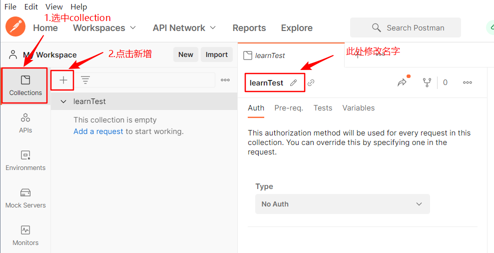

2.  在collection目录下增加一个get请求

    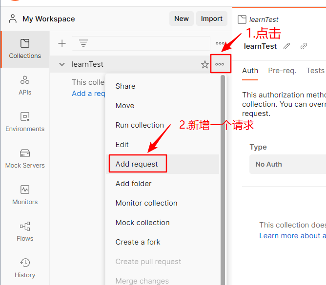

3\. 选择请求方法，填写URL和请求参数

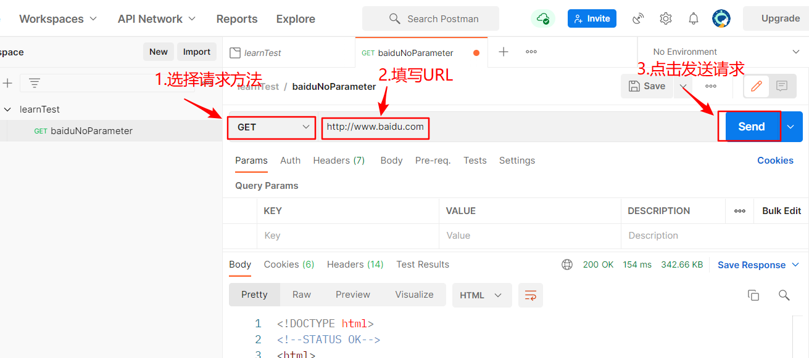

注意：

*   由于UPL中只能出现英文和符号，所以用get方法时如果要输入中文请求参数需要先进行URL编码，可以用在线URL编码网站进行

*   get请求在Params中填写请求参数，post请求在body中填写请求参数，post的请求参数可以填中文

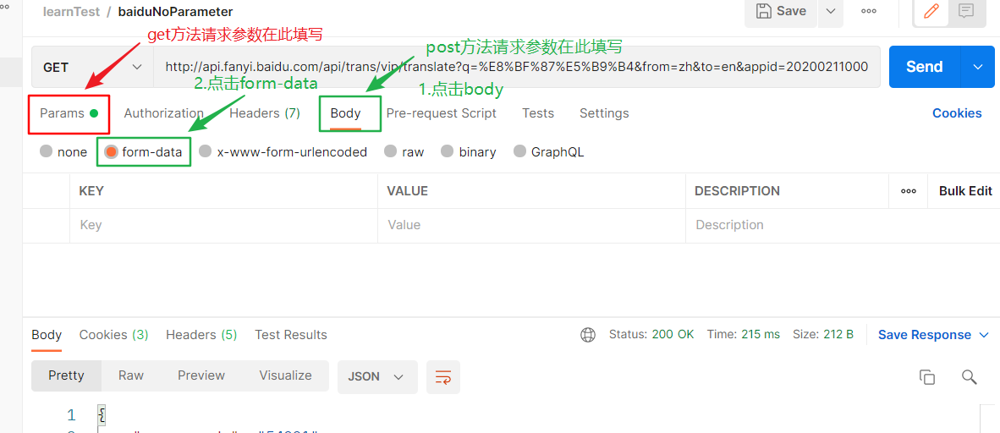

## 参数化运行

参数化：在程序中使用变量代替常量的过程

操作步骤：

1.  创建需要参数化运行的请求，将请求参数替换成变量，格式为：{{变量名}}，要记得保存请求设置

    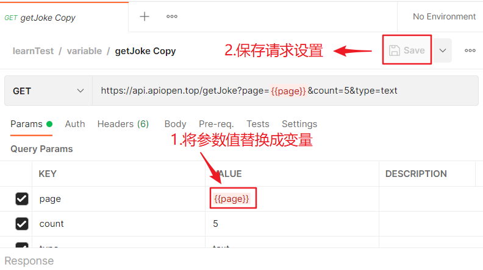

2.  选择需要参数化运行的请求所在的目录（建议将要参数化运行的请求放在一个单独的目录中），点击运行按键。

    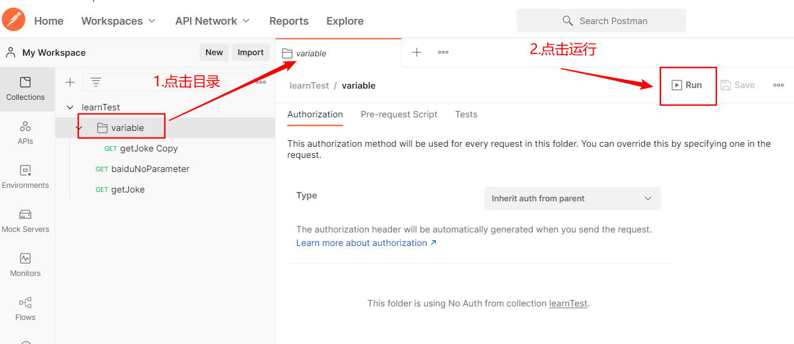

    或点击主界面右下角的Runner

    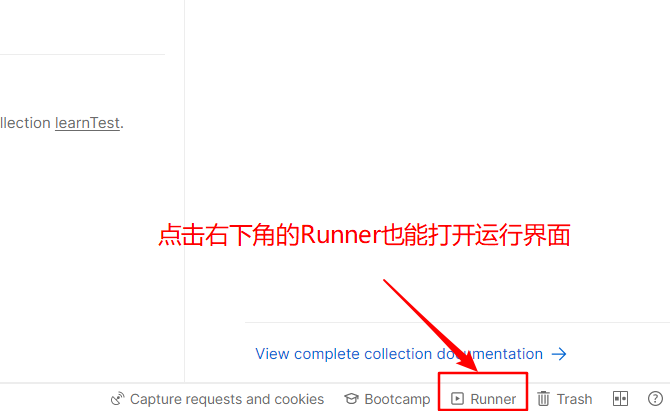

3.  进入运行界面后，选择需要参数化运行的请求，选择数据文件，数据文件的格式如下：

    csv文件

    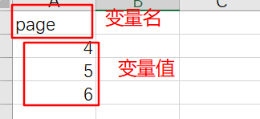

    txt文件

    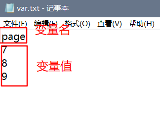

    各选项的意义：

    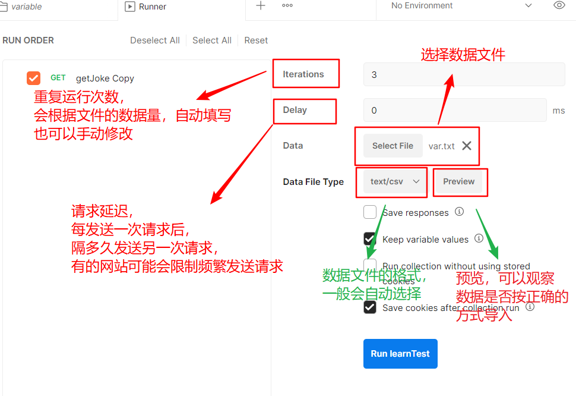

4.  选择好数据后点击蓝色按钮运行

    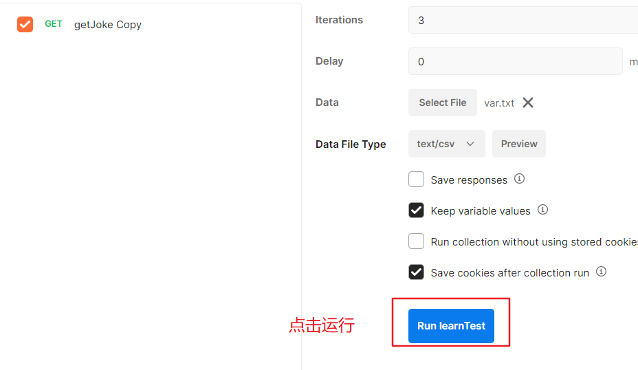

    运行后的界面如下：

    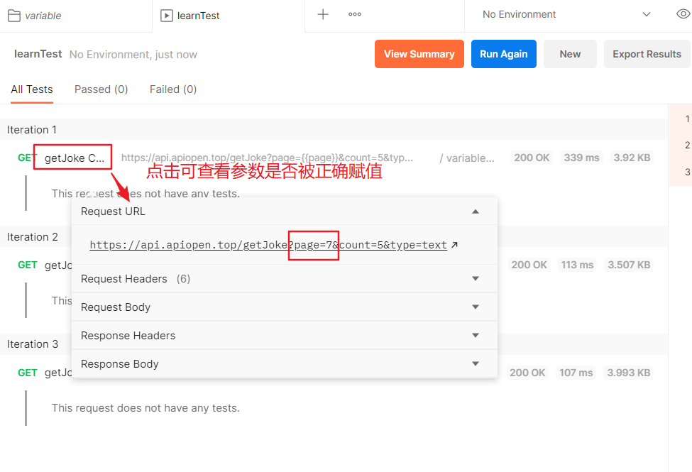

## 添加断言

断言是让程序自动的对结果中的某些内容进行判断

**postman脚本**

支持的语言：JavaScript（包含了一个非常强大的node.js）

应用场景：

1.  预处理信息（pre-request script）

2.  控制请求的运行，比如跳转某一个请求，或循环执行某一个请求

3.  断言（tests模块）

### 内置断言函数

*   判断状态码

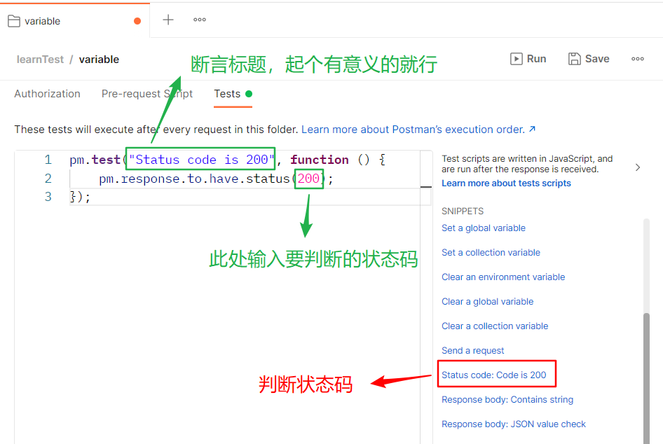

*   判断响应时间是否小于某个数

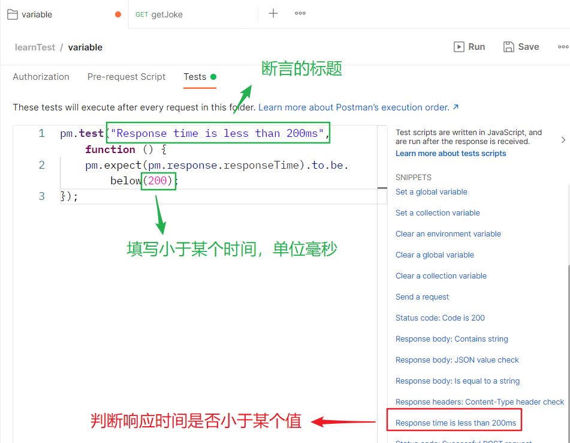

*   判断响应体中是否包含某个字符串

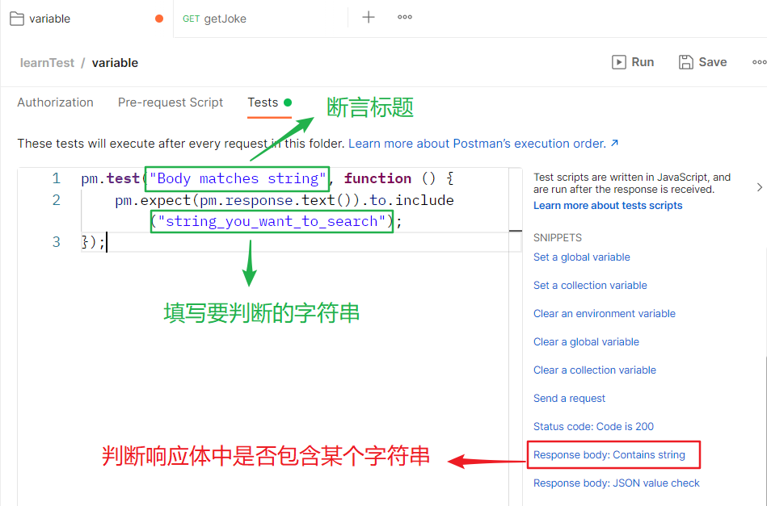

### json值的判断

```javascript
pm.test("Your test name", function () {
    /* pm.response表示响应体内容，json()方法将响应体对象转化为json对象
       定义变量jsonData来接收响应体转化的json对象 */
    var jsonData = pm.response.json();
    /* json对象的使用：
       如果是字典，用对象.键名取出对应的值
       如果是列表，用对象[索引]取出对应的元素 */
    pm.expect(jsonData.键名).to.eql(100);
});
```

例子

```json
// 返回的响应体是json格式，内容如下
{
    "code": 200,
    "message": "成功!",
    "result": [
        {
            "sid": "31582432",
            "text": "xxx",
            "type": "text",
            "thumbnail": null,
            "images": null,
            "comment": "2",
            "uid": "23188466",
            "name": "可爱的你"
        },
        {
            "sid": "31522171",
            "text": "yyy",
            "type": "text",
            "thumbnail": null,
            "images": null,
            "comment": "0",
            "uid": "17604620",
            "name": "蟠桃"
        }
    ]
}
```

*   判断message的值是否是"成功!"

```javascript
pm.test('message的值是："成功!"', function () {
    var jsonData = pm.response.json();
    pm.expect(jsonData.message).to.eql("成功!");
});
```

*   判断第一个uid的值是否是"23188466"

```javascript
pm.test('uid的值是："23188466"', function () {
    var jsonData = pm.response.json();
    // 第一个uid在result的值中，因此先取出result的值，
    // result的值是一个列表，因此用索引[0]取出第一个元素
    // 第一个元素是字典，因此用.uid取出uid的值
    pm.expect(jsonData.result[0].uid).to.eql("23188466");
});
```

## 在单个请求中设置断言

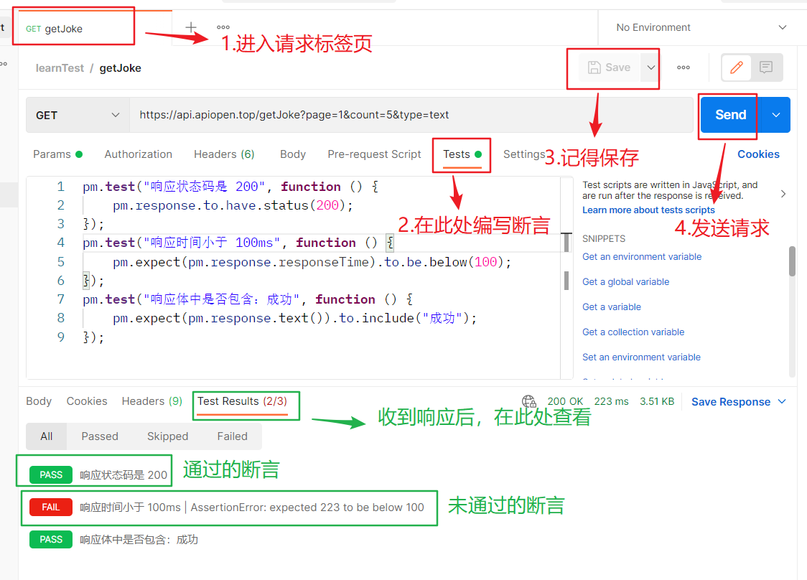

## 在目录中设置断言

对目录下所有请求有效，操作步骤：

1.  目录页面

    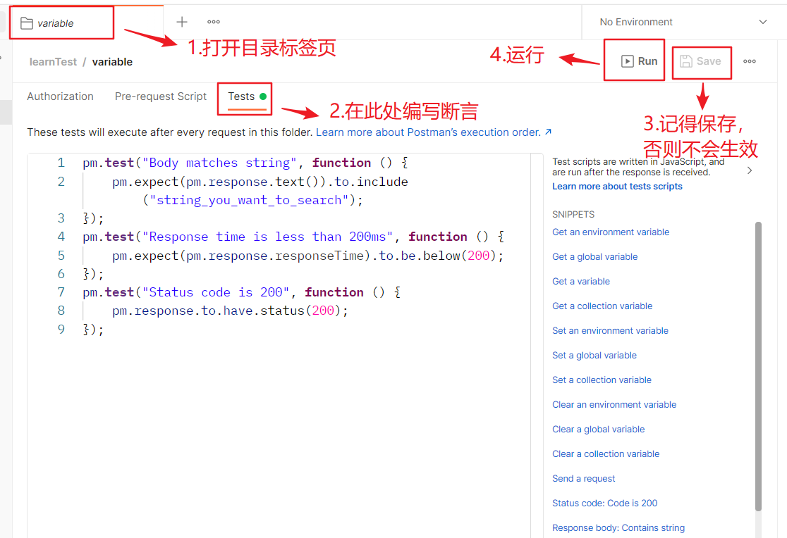

2.  运行页面

    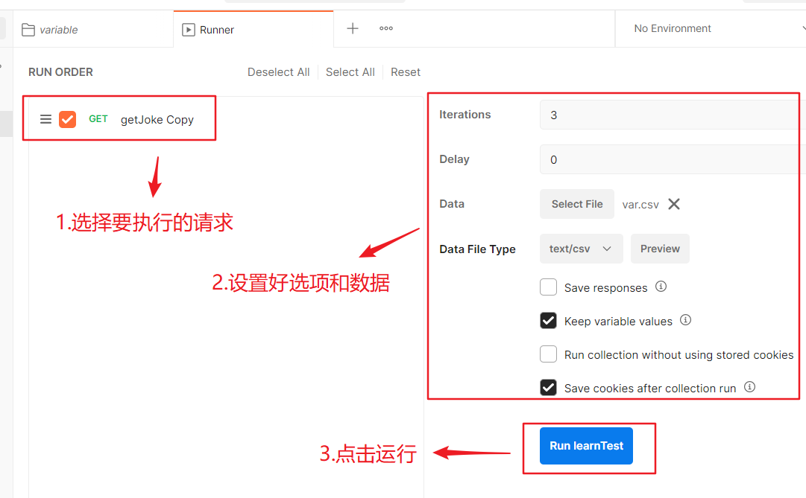

3.  运行结果

    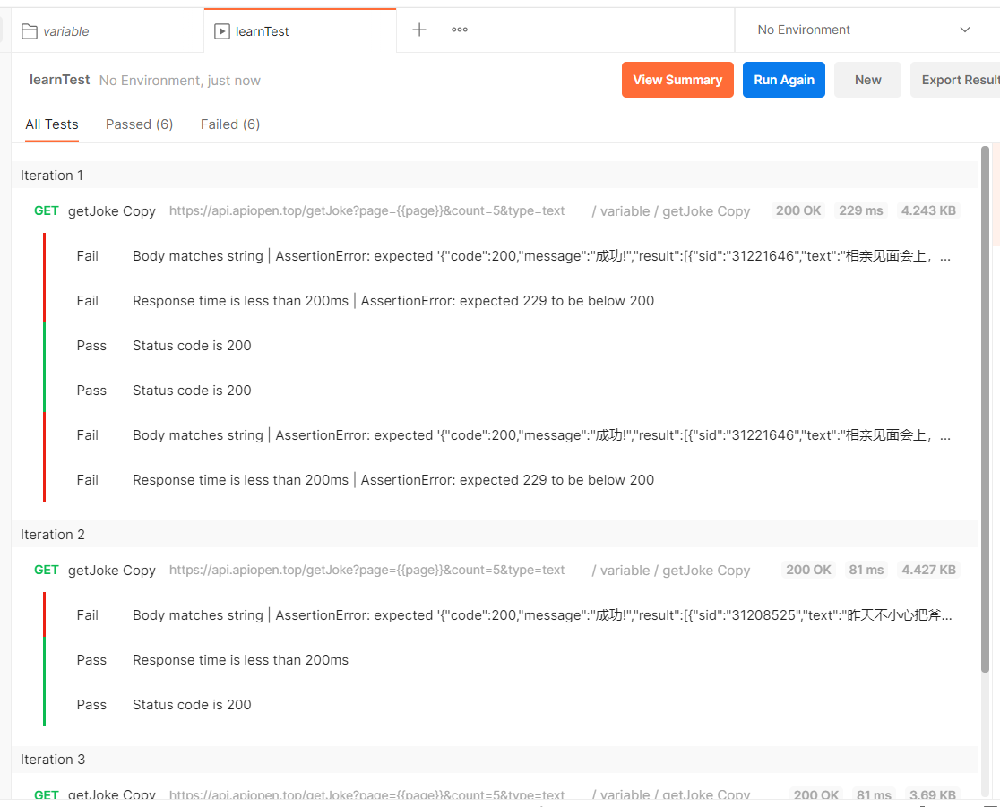

# 接口关联

一个请求需要使用另一个请求返回的某些数据称为接口关联

postman中进行接口关联的方法：在要关联的请求的test中定义全局变量，将变量用于另一个请求

```java
/* 创建一个变量接收返回数据，因为返回数据为json格式的，因此用.json()方法 */
var jsonData = pm.response.json();

/* 提取需要的数据作为全局变量的值 */
pm.globals.set("token", jsonData.data.token);
```

鉴权码的使用：如果是在请求头中发送，需在Authorization中选择API Key，输入请求头和对应的值

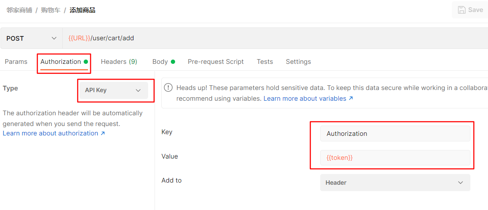

# 变量

## 环境变量

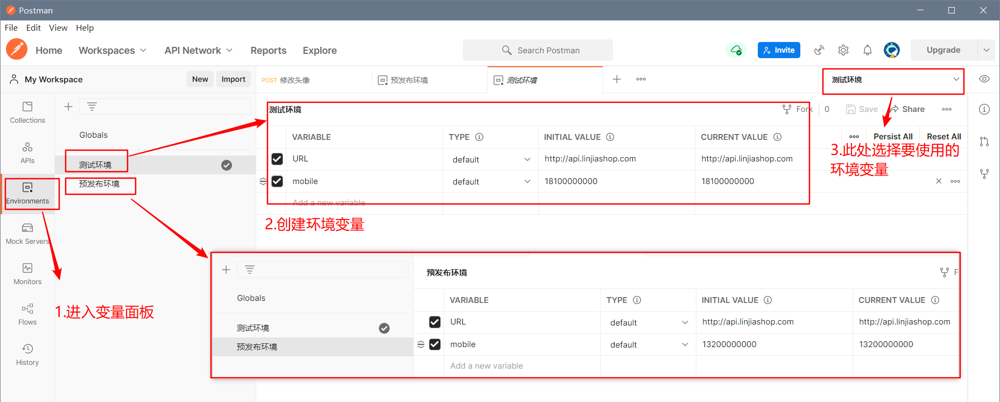

在上图所示的例子中，第3步选择测试环境时，mobile变量的值为18100000000，选择预发布环境时，mobile的值为13200000000

## 全局变量

在所有请求中都能用的变量，可在Pre-request Script或test中用脚本定义，也可在Environment中定义

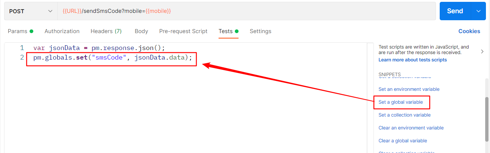

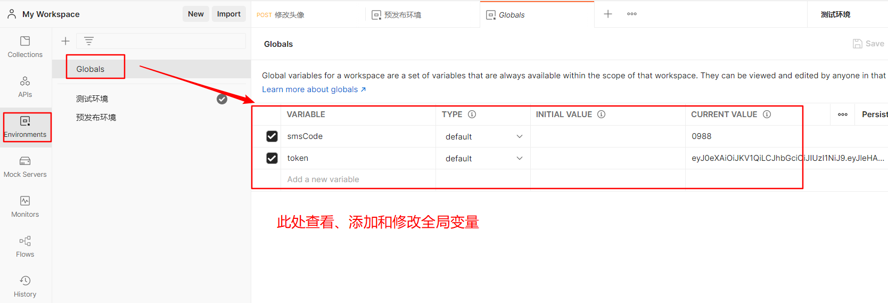

## 集合变量

只在某个集合（Collection）中使用的变量

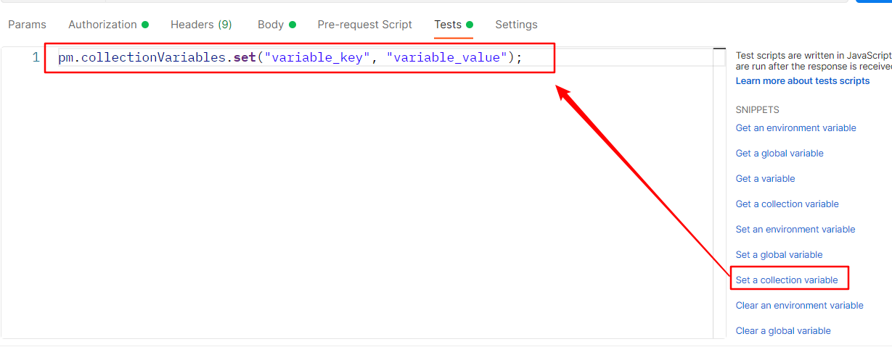

## 动态参数

环境、全局和集合变量的使用方式均为{{变量名}}，但动态参数的使用方式需要加一个\$：{{\$参数名}}

常用：

{{\$timestamp}}  : 生成当前时间的时间戳

{{\$randomInt}}   : 生成0\~1000之间的随机数&#x20;

{{\$guid}}   : 生成随机的GUID的字符串。GUID：全局唯一标识符（Globally Unique Identifier）是一种由算法生成的二进制长度为128位的数字标识符

# 接口测试报告

使用postman导出需要的测试集（json格式），和所需环境，以及测试数据

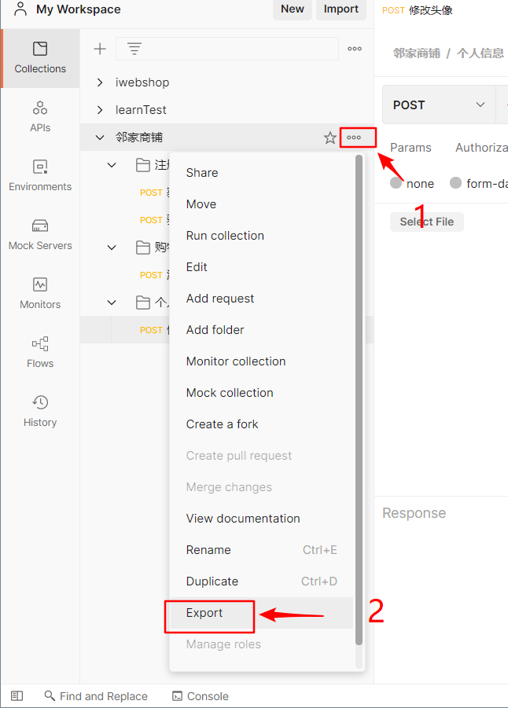

```powershell
newman run 测试集名称 -e 环境名称 -r html --reporter-html-export 要生成的文件名称.html
```

