# 测试理论

# 软件测试

软件包含：程序、数据、文档

**定义**：在规定条件下对软件进行操作，从而发现问题，对软件质量进行评估的过程

**目的**：**以最少的人力、物力和时间找出软件中潜在的各种错误与缺陷**，通过修正各种错误和缺陷提高软件质量，**回避**软件发布后由于潜在的软件缺陷和错误造成的隐患以及带来的**商业风险**

**测试思路**：

1.  从多维度考虑（功能、界面、网络、兼容性、安全、易用性、性能）

2.  从正向和逆向考虑

3.  关注流程的测试

4.  分清优先级

## 原则

1.  所有的测试都应追溯到用户需求

2.  尽早和不断地测试

3.  先主后次、先大后小

4.  测试工作应该由独立的专业的软件测试人员或机构来完成

5.  80%的错误出现在20%的模块中

6.  测试用例是设计出来的，不是写出来的

7.  严格执行测试用例，不可随意变更数据、操作步骤

8.  完全（穷举）测试不可能，测试要终止

9.  发现错误较多的模块，应进行更深入的测试

10. 注意回归测试（修改了旧代码后，要确认没有引入新的问题）

11. 妥善保存一切测试过程文档

12. 绝对不能自己修改由开发人员负责的程序

## 软件产品质量模型

想要测试软件质量，得先了解质量好的产品是怎样的

1.  功能性

2.  可靠性（ a. 尽量不出问题；  b. 出了问题不能影响主体功能；c. 如果影响主体功能，要能尽快修复）

3.  易用性

4.  效率

5.  可维持性（更新）

6.  可移植性（跨越不同系统平台）

## 软件质量模型保证（SQA）

目的：使软件制作的过程对于领导层是可见的

定义：它是一套计划和方法来向领导层保证

五个基本目标

1.  保证有计划地进行

2.  保证遵循了步骤和需求

3.  及时通知给对应人员

4.  高管可以接触到项目内部

5.  软件质量需要测试工作来保证

## 基本流程

1.  需求分析

2.  编写测试用例（测什么 怎么测）

3.  评审测试用例

4.  搭建测试环境

5.  等待开发提交测试包

6.  部署测试包

7.  冒烟测试（对软件主体基本功能进行基本测试）

8.  执行测试用例

9.  bug跟踪处理

10. N轮之后符合需求

11. 测试结束

# 软件开发模型

## 瀑布模型

过程

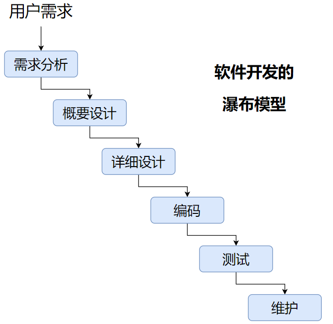

1.  需求分析

    *   分析需求说明书

    *   判断需求的可实现性

2.  概要设计

    *   用到具体的技术点

    *   大致模块划分

3.  详细设计

    *   详细到可以为编码做支持

    *   类和类关系，类的设计

    *   函数设计

    *   各个接口的细节

    *   数据库表的关系，字段关系

4.  编码

    *   依托于详细设计进行编码操作

5.  测试

6.  维护

    *   上线后也是需要持续维护

优点

*   开发的各个阶段比较清晰

*   提供了一个成熟的模板

*   当前一阶段完成后，只需关注后续阶段

缺点

*   依赖于早期的需求调查，不适应需求的变化

*   线性开发，测试介入的时间晚

*   风险往往延至后期才显露，失去及早纠正的机会

## 快速原型模型

在开发真实系统之前，构造一个原型，在该原型的基础上，逐渐完成整个系统的开发工作

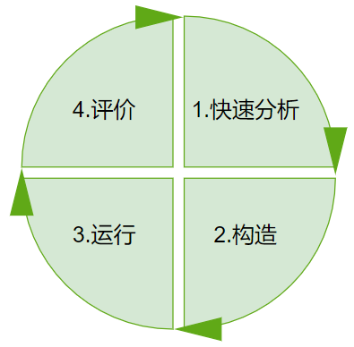

优点

*   支持用户定制

*   减少由于软件需求不明确带来的项目开发风险

*   适合开发小型的灵活性高的系统

缺点

*   不适合大型系统的开发

*   产品依据原型设计，会限制创新

## 螺旋模型

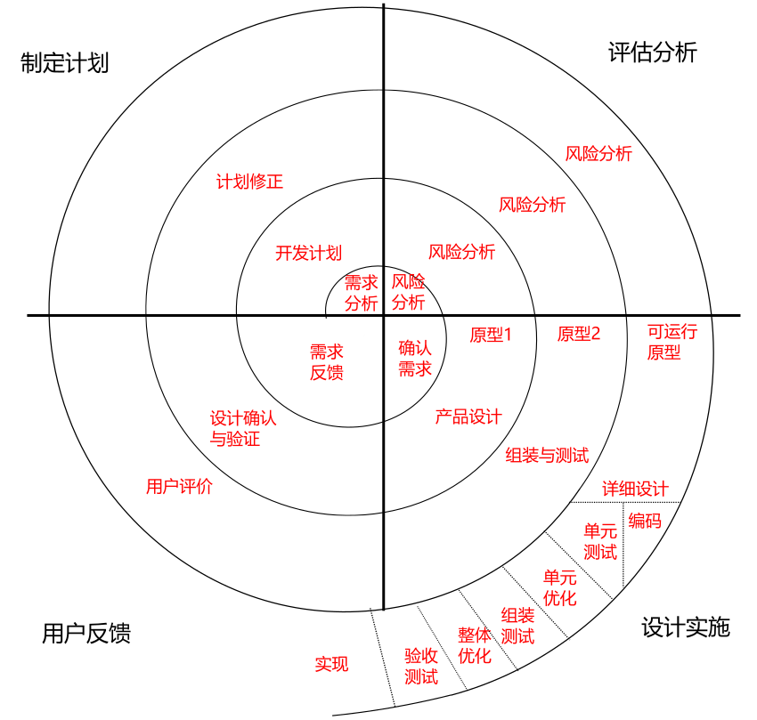

优点

*   引入风险分析

*   设计灵活，可以在项目各个阶段进行变更

缺点

*   风险分析需要专业的知识和人员

## 迭代开发模型

又称渐增模型、增量模型。是将系统分为各个功能模块，先完成其中几个模块，再根据情况（用户反馈，市场需求等）对系统增加一定的模块。这个过程可能要进行好几次，最终形成一个比较完善的系统。

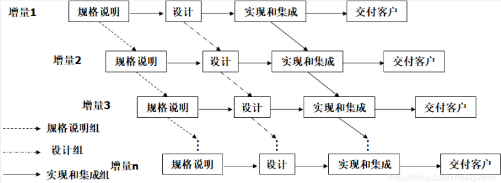

优点

1.  能在较短的时间内向用户提交可完成部分工作的产品


2.  将待开发的软件系统模块化，可以分批次地提交软件产品，使用户可以及时了解软件项目的进展


3.  以组件为单位进行开发降低了软件开发的风险。一个开发周期内的错误不会影响到整个软件系统


4.  开发顺序灵活。开发人员可以对组件的实现顺序进行优先级排序，先完成需求稳定的核心组件。当组件的优先级发生变化时，还能及时地对实现顺序进行调整

缺点

1.  由于各个构件是逐渐并入已有的软件体系结构中的，所以加入构件必须不破坏已构造好的系统部分，这需要软件具备开放式的体系结构


2.  在开发过程中，需求的变化是不可避免的。增量模型的灵活性可以使其适应这种变化的能力大大优于瀑布模型和快速原型模型，但也很容易退化为边做边改模型，从而是软件过程的控制失去整体性


3.  如果增量包之间存在相交的情况且未很好处理，则必须做全盘系统分析，这种模型将功能细化后分别开发的方法较适应于需求经常改变的软件开发过程

## 敏捷开发

以用户的需求进化为核心，采用迭代、循序渐进的方法进行软件开发。

在敏捷开发中，软件项目在构建初期被切分成多个子项目，各个子项目的成果都经过测试，具备可视、可集成和可运行使用的特征。换言之，就是把一个大项目分为多个相互联系，但也可独立运行的小项目，并分别完成，在此过程中软件一直处于可使用状态。

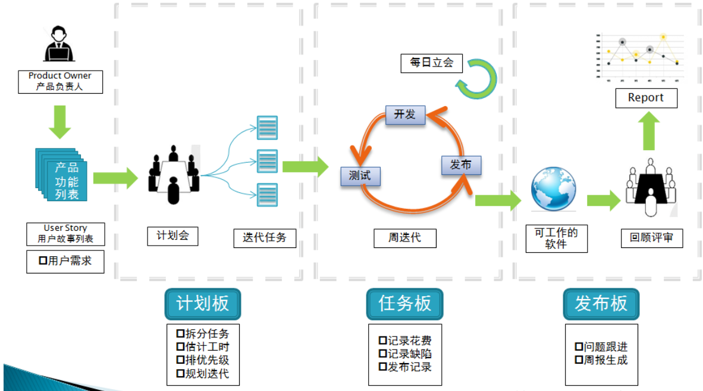

优点：

*   敏捷开发的高适应性，以人为本的特性。

*   更加的灵活并且更加充分的利用了每个开发者的优势，调动了每个人的工作热情。

缺点：

*   由于其项目周期很长，所以很难保证开发的人员不更换，而没有文档就会造成在交接的过程中出现很大的困难

# 测试模型

## V模型

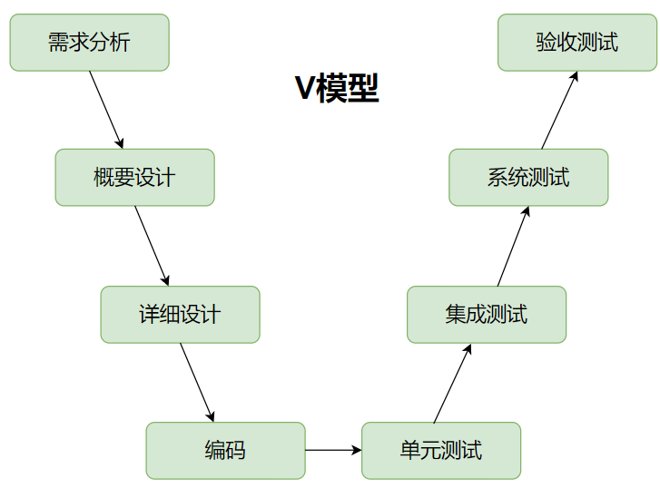

优点

*   包含了底层和高层的测试

缺点

*   和瀑布模型一样灵活性比较低

## W模型

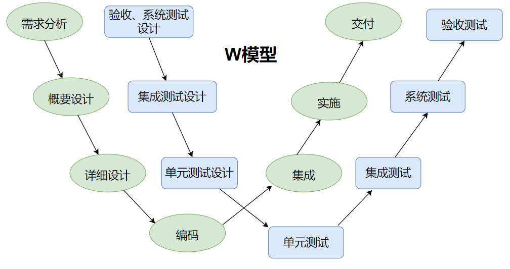

优点

*   强调测试伴随着整个软件开发周期，而且测试的对象不仅仅是程序，需求和概要设计同样要测试；

*   更早地介入测试，可以发现开发初期的缺陷，那么可以用更加低的成本进行缺陷修复

缺点

*   复杂度高，实践起来困难

# 测试方法的分类

## 按测试阶段

*   单元测试

*   集成测试

*   冒烟测试

    *   先试试基本功能有没有

    *   输入框全部填写正确时能否正常提交数据

    *   业务主流程能否跑通

*   系统测试

*   回归测试

    *   修改了旧的代码之后（修复缺陷、优化代码），重新进行测试以确认修改没有引入新的错误或导致其他代码产生错误

    *   **自动回归测试将大幅度降低系统测试、维护升级等阶段的成本**

    *   通过正确的回归测试策略来改进回归测试的效率和有效性

*   验收测试

    *   α测试：由用户在开发环境进行的测试，也可以是公司内部的用户在模拟实际操作环境下进行的测试

    *   β测试：Beta测试是一种验收测试，由软件的最终用户们在一个或多个客房场所进行

    *   两者区别：

        *   测试的场所不同：Alpha测试是指把用户请到开发方的场所来测试，beta测试是指在一个或多个用户的场所进行的测试

        *   Alpha测试的环境是受开发方控制的,用户的数量相对比较少,时间比较集中。beta测试的环境是不受开发方控制的，用户数量相对比较多，时间不集中

        *   alpha测试先于beta测试执行。通用的软件产品需要较大规模的beta测试,测试周期比较长

## 是否覆盖源代码

*   黑盒测试

*   白盒测试

*   灰盒测试：介于黑白之间，如接口测试

## 是否运行

*   静态测试

*   动态测试

## 是否自动化

*   人工

*   自动化（功能测试已完成，版本基本稳定后进行。回归测试时常用）

    实施步骤：

    1.  功能测试已完成，版本基本稳定

    2.  根据项目特性，选择适合项目的自动化工具，并搭建环境

    3.  提取手工测试的测试用例转换为自动化测试的用例

    4.  通过工具、代码实现自动化的构造输入、自动检测输出结果是否符合预期

    5.  生成自动测试报告

    6.  持续改进、脚本优化

# 测试用例（Test Case）

**定义**：为特定的目的而设计的一组**测试输入、执行条件和预期结果**的**文档**

## 八大要素

1.  用例编号（产品名\_测试阶段\_编号）

2.  用例标题

3.  所属项目

4.  用例优先级

5.  预置条件

6.  测试数据

7.  执行步骤

8.  预期结果

## 原则

自己和团队成员

1\.  能看懂

2\.  能执行

## 设计方法

### 等价类划分法

有效等价类：满足需求的测试输入

无效等价类：不满足需求的测试输入

步骤

1.  明确需求

2.  确定有效等价类和无效等价类

3.  编写测试用例

一条测试用例尽可能覆盖尚未覆盖的有效等价类，而一条测试用例最好只涉及一个无效等价类

### 边界值法

根据经验，输入数据时一般在边界值处容易出错，因此是重点测试对象。

### 判定表法

等价类划分法和边界值法都是着重考虑单个输入，如果有多个输入且输入和输入之间有依赖关系，则适合用判定表法

判定表的四部分

1.  条件桩：系统的所有输入项，次序无关紧要

2.  动作桩：结果项

3.  条件项：测试输入值

4.  动作项：（预期）测试输出值

案例：若手机用户欠费，则不允许主叫，但允许被叫；若用户关机，则不允许主被叫

写出判定表

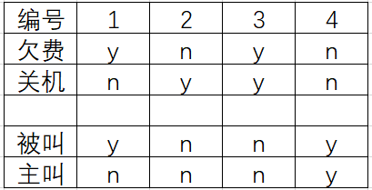

*   “欠费”和“关机”为条件桩，它们具体的值为条件项；“被叫”和“主叫”为动作桩，它们具体的值为条件项

*   编号一行中，每一个编号代表一条测试用例。“欠费”和“关机”的值为测试数据，“被叫”和“主叫”的值为预期结果

#### 因果图法

以图解的方式辅助写判定表的方法，常用于有逻辑关系的输入项

图的含义：

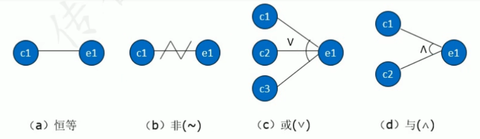

案例：修改昵称时，输入的第一个字符必须是a或b，第二个字符必须是一个数字，如果第一个字符不正确则给出信息L，如果第二个字符不正确，则给出信息M

1.  画出因果图：

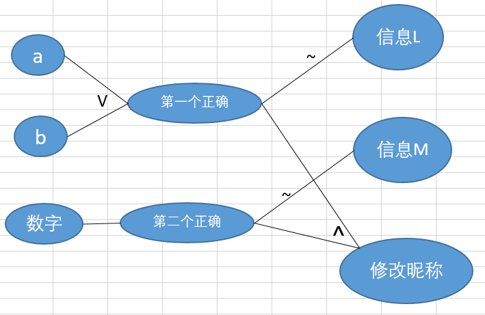

2.根据因果图写出判定表：

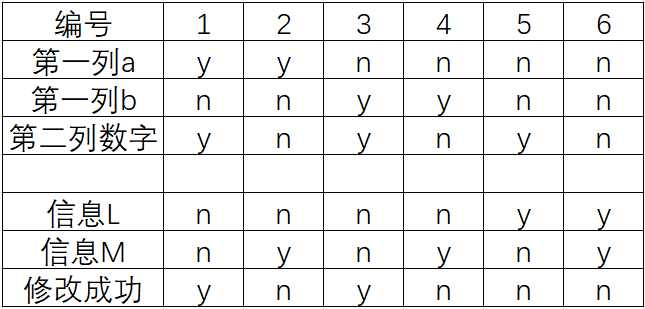

3.根据判定表写测试用例（略）

### 正交法

当可能的输入数据或者输入数据的组合数量很大时，不可能也不应该为每个输入组合都创建测试用例，可以采用这种方法

特点：均匀分散，齐整可比

正交表

是一种特制的表，一般的正交表标记为：$L_n(m^k)$ , 其中 n 表示行数， k是表的列数，m是列的取值个数（取最多那个）

案例：有字体（宋体；楷体；黑体）、样式（粗体；斜体）、颜色（红；绿；蓝）、和字号（10；12；14）四个下拉框，测试它们组合后的效果

画出正交表：

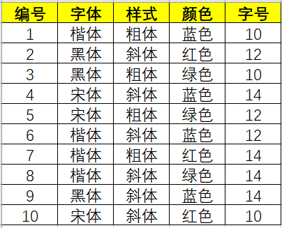

一般用pict程序画，在含pict.exe的目录下打开cmd，输入如下命令：

```powershell
pict.exe 数据文件 > 结果文件
```

数据文件的格式一般为txt，内容格式为：参数,选项1,选项2,···,选项n

命令选项：

```powershell
-o:N  组合数，默认值为2
-d:C  值与值之间的分隔符，默认为逗号（,）
-a:C  别名间的分隔符，默认是管道符（|）
-n:C  无效数值或者是非法数值的前缀，默认值为（~）
-e:file  定义种子文件，作用是可以指定组合方式
-r[:N]  随机生成，N -种子
-c  参数的值完全区分大小写
-s  显示模型统计数据
```

### 状态迁移法

说明

*   找出被测对象的所有状态，然后再分析各个状态之间的转换，据此编写测试用例

*   状态迁移法不关注具体模块的具体功能，只关注状态的转化过程流程是否正确

适用场景

*   涉及到复杂业务场景，而这些场景再需求说明书中往往不能够完全阐述清楚，容易出现遗漏

概念定义

*   图：用线把点连起来叫图

*   树：没有闭环的图

    *   根节点

        *   位于树根部的节点

        *   一颗树只有一个根节点

    *   叶子节点

        *   处于树最末梢的节点

        *   叶子节点是树的尽头

    *   分支节点

        *   处在主干与分支部分的节点

步骤

1.  分析需求，找到所有的状态

2.  绘制状态迁移图

3.  根据图绘制状态迁移树（只需要把闭环的节点的终点有多少个指向它的，就复制几份就行了）

4.  根据树编写测试用例

    *   从根节点到一个叶子节点就是一条路径（所有路径都是从根开始到叶子结束）

    *   一条路径对应一个测试用例

    *   树中有多个叶子节点就对应多少测试用例

例子

*   需求

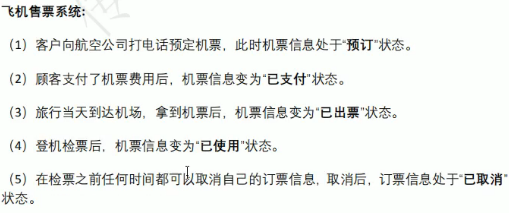

*   图

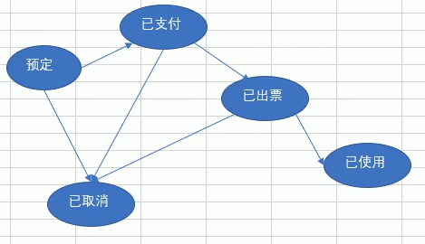

*   树

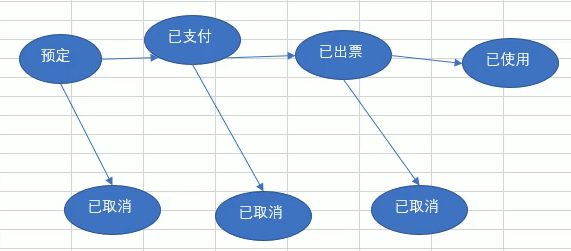

### 场景法

用流程图描述用户的使用场景，然后通过覆盖流程路径来设计测试用例

意义

*   用户角度：用户平时使用的不是单个功能，而是多个功能的组合

*   测试员角度：平时测试的都是单个功能点，容易忽略多个功能组合的测试

步骤

1.  明确需求

2.  画出流程图

3.  编写测试用例

### 错误推测法

使用场景：时间紧急，没时间按部就班

### 总结

*   等价类划分法、边界值法、判定表法、正交法都是针对某一功能点的测试，而状态迁移法和场景法是针对一系列功能点的测试，因此一定要先用前面的方法保证单个功能点没有问题后再使用后两种方法。

*   错误推测法既可以用在单个测试点上也可以用在模块测试和系统测试上。

**有很多输入时减少测试用例的方法**：

当输入较多时（如注册时、填写个人信息时的输入框），可以主要从以下五点考虑，其它不考虑，从而减少测试用例

*   长度（一般采用边界值法）

*   类型（字母、数字、符号等）

*   规则

*   是否必填

*   是否重复

设计其中一点的测试数据时，其它点都要符合，否则无法知道问题出在哪里。也可以运用到算法知识：如果软件缺陷占比极少，设计组合数据（类型组合或规则组合）测试的效率会高很多，成本会低很多

由于提交数据时需要所有输入框都填写正确，因此测试某一输入框之前，必须先保证把所有数据按规则填写时能够成功提交（冒烟测试通过）。在测试某一输入框时，其他输入框都要填写正确，否则不知道问题出在哪个输入框

# 缺陷

**定义**：软件或者程序中存在的各种问题

## 判定标准

*   软件没有达到需求说明书标明的功能

*   软件出现了需求说明书指明不会出现的错误

*   软件功能超出了需求说明书指明的范围

*   软件出现了需求说明书虽未指明，但应该达到的目标

*   软件难以使用，效率低下

## 产生的根源

*   需求变更

*   交流不充分

*   软件的复杂性

*   进度压力

## 缺陷信息

一般包括编号、标题、状态、严重程度、优先级、所属模块、记录者、提交时间、处理人、处理结果描述、处理时间、验证人、结果描述、详细描述、验证结果描述、详细描述、环境说明、必要的附件等

### 状态

*   new：缺陷的初始状态

*   open：开发人员开始修改

*   fixed：开发人员修改完毕

*   closed：回归测试通过，关闭缺陷

*   reopen：回归测试失败，重新打开

*   rejected：开发人员认为不是程序问题，不用修改

*   postpone：开发人员推迟修改

### 严重程度

缺陷会导致软件的问题越大越严重

*   Fatal - 致命缺陷：造成系统或应用程序崩溃、死机、系统挂起，或造成数据丢失，主要功能完全丧失，导致本模块以及相关模块异常等问题

    *   例如商城系统帮助页面在弱网下进去崩溃，整个系统闪退

*   Critical - 严重缺陷：系统的主要功能部分丧失、数据不能保存，系统的次要功能完全丧失。问题局限在本模块，导致模块功能失效或异常退出

    *   例如商城系统取消订单后订单的状态不对

*   Major - 一般缺陷：次要功能没有完全实现但不影响使用。次要模块功能部分失效等

    *   如商品分类的某个分类点击后没有正确跳转

*   Minor - 较小的缺陷：较小错误的软件缺陷，使操作者不方便或遇到麻烦，但它不影响功能性的操作和执行，如错别字、界面不规范等

*   Enhancemental - 建议问题：测试人员提出的改进意见或建议

TAPD中的严重程度


### 优先级

越妨碍测试进行的越先解决；产品已上线时，用户使用率越高的越先解决，对公司影响越大的缺陷越先解决

*   紧急：缺陷导致系统几乎不能完全运行、使用，或严重妨碍测试的执行，需立即修正、尽快修正

*   高：缺陷严重，影响测试，需要优先考虑修正，如不超过24小时修正

*   中：缺陷需要修改，只要正常排队修复就可以

*   低：缺陷可以在开发人员有时间的时候修复

    *   如界面上的错别字

*   无关紧要：建议性问题

    *   需求中未说明的易用性改善，如给多选框增加个全选按键

TAPD中的优先级

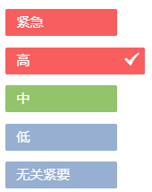

**举例说明严重程度和优先级的区别**：

*   电商系统的注册功能无法正常使用，从严重程度来说是严重（系统的主要功能部分丧失），但此缺陷会导致登录、付款、收货、订单状态、评论等众多功能的测试无法进行，这个功能也是用户经常使用的，因此优先级是紧急

*   帮助功能点击后在弱网环境下容易导致整个系统闪退，严重程度为致命，但我们发现这并不是用户经常使用的功能，所以优先级为中

*   企业的logo错误，虽然不影响功能，严重程度可能是一般或提示，但是关乎企业形象，因此优先级可以设为高。更严重的如国旗、地图错误，优先级也是高，必须在上线前修复。如果已上线则优先级为紧急

## 缺陷报告

**注意事项**

*   尽量确保缺陷可以重现

*   简洁、准确、完整

*   一个缺陷一个报告

*   避免使用人称代词，必要时用“用户”代替

*   避免使用情绪化的语言和强调符号

*   避免使用大量、少数、似乎等模糊的，使用具体的数字代替

*   避免提交不确定的问题，自己至少要重现一次

**书写规范**

*   标题：保持简短、准确，提供缺陷的本质信息，避免使用模糊不清的词语。

*   复现步骤：包含如何使别人能够很容易的复现该缺陷的完整步骤

    *   每个步骤前使用数字编号

    *   尽量使用短语或短句，避免复杂句式

    *   根据实际需要，提供测试的环境信息

*   实际结果：执行复现步骤后软件的现象和产生的行为

*   期望结果：描述应与实际结果的描述方式相同

*   附件

## 缺陷流转过程

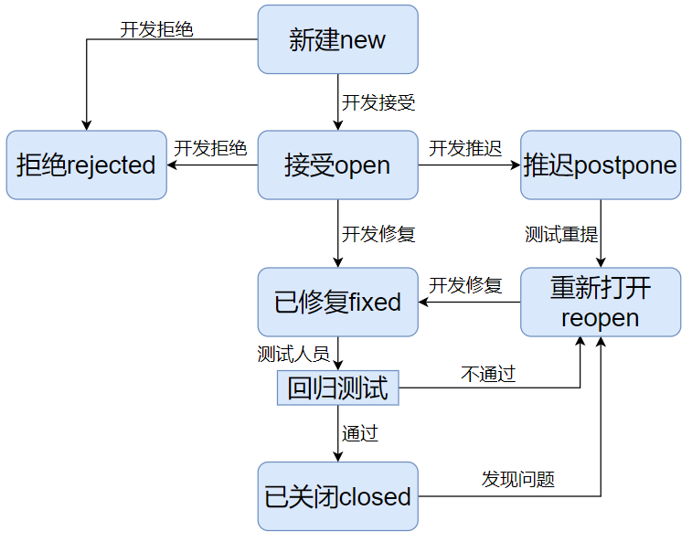

*   新提交的缺陷为新建状态，确认有效后为打开状态，经开发人员修改后，缺陷变为已修复（待验证）状态。此时就需要测试人员对缺陷进行回归测试，验证问题是否修复。

*   如果问题已经修复，则测试人员将该缺陷的状态置为关闭状态（验证通过），同时添加回测说明如“该缺陷已解决”。

*   如果已经关闭的问题再次出现，则测试人员将该缺陷的状态改为重新打开

## 缺陷数据分析

一个项目完成后需要进行缺陷分析

*   软件哪个模块问题最多

*   哪个测试人员测试的缺陷最多

*   各类缺陷数量百分比

*   开发人员是否可以及时修复缺陷

*   开发人员一次正确修复缺陷的百分比是多少

*   软件能否在计划时间内正常发布

# TAPD的使用

Tencent Agile Product Development腾讯敏捷产品研发

1.  进入TAPD

    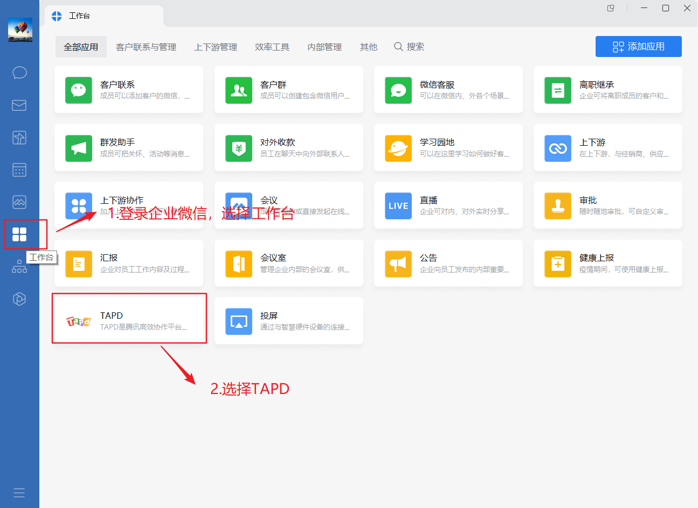

2.  进入缺陷管理界面

    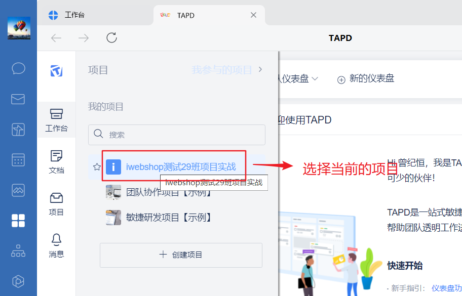

# 禅道的使用

1.  查看 Linux 设备的IP地址

2.  在 windows 下，用 ping 来验证是否可与 Linux 设备连通

3.  打开浏览器，输入 [http://IP地址:81/www](http://IP地址:81/www "http://IP地址:81/www") ，即可进入禅道界面

# 测试环境

Linux下的环境搭建

*   LNMP 表示 Linux + Nginx + MySQL + PHP

    *   Nginx(engine x)是一个高性能的HTTP和反向代理web服务器，同时也提供了IMAP/POP3/SMTP服务

*   LAMP表示Linux + Apache + MySQL + PHP

Windows下的环境搭建

*   WAMP表示Windows + Apache + MySQL + PHP

## BS架构

*   web server

    *   硬件是一个服务器

    *   安装服务器操作系统（Linux、unix、Windows server）

    *   web服务软件（提供并发、http协议支持）

        *   Nginx

        *   apache

    *   数据库

        *   MySQL

        *   orcale

    *   业务功能的开发

        *   java

        *   php

        *   python

        *   .net

# 熟悉项目

开发项目就是开发一个专门解决复杂业务功能的软件

在公司中，通用的技术知识不要随便问（因为很容易自己在网上找到答案），但是与项目业务有关的不懂就要问（因为项目业务是每个公司特有的，除了问没有其他更好的了解方法）

## 步骤

1.  了解项目的业务特性：项目是用来做什么的？

2.  了解项目的角色与用户：项目是给谁用的？

3.  了解项目的组织架构图：项目包括哪些功能模块？

4.  了解项目的技术栈：项目是使用哪些技术实现的？

## 信息来源

*   项目中已经存在的文档：需求说明书，用户使用手册，测试用例等

*   在项目的现有环境（开发环境，测试环境，线上环境等）中体验项目

*   询问项目中的其他成员：测试组员/组长，开发人员，产品经理等

# 项目测试流程

1.  需求评审

2.  编写测试计划和测试方案

3.  编写测试用例以及评审

4.  执行测试与bug跟踪

5.  编写测试报告

## 1.需求评审

**软件需求定义**：客户所需要的软件功能

**需求评审定义**：项目相关人员就软件需求进行确认和评估的相关活动

**目的**：

*   保证需求说明书的完整，准确

*   保证项目团队对需求的理解达成一致

**形式**：需求评审会议

参与人员：一般项目组所有成员都要参加（产品人员、开发人员、测试人员、界面设计人员）

**输出结果**：需求文档（SRS，software requirements specification）

**测试人员在需求评审的职责**

*   确认自己对需求要有清晰的理解，没有疑惑

*   确认需求文档完整，准确，能够指导后期工作

*   对需求中不合理的地方提出自己的修改建议

## 2.测试计划

**核心**

*   明确测试目标与测试范围

*   执行计划的角色与职责

*   任务的进度安排与资源分配

*   风险估计和应急计划

*   测试的准入和准出标准

**一般包含**：项目说明、测试目的、测试对象、测试环境（一般硬件环境不是最终的服务器，而是专门的一台电脑作为测试服务器）、测试策略、测试模块、测试工具、时间和人员分配、质量评估标准、验收标准、里程碑、风险估计、应急计划、用例模板等内容

## 3.编写测试用例

步骤

1.  需求分析

2.  整理测试点

    *   测试中需要关注的具体功能点

    *   作用：拆分需求，做为编写测试用例的辅助

    *   注意：测试点不可能涵盖全部，要选择性价比最高的测试点，如：重要功能先测，常用功能先测，选取数据时选择热门数据

3.  编写测试用例

## 4.执行测试用例

原则

1.  严格按照测试用例书写步骤执行

2.  执行测试用例遇到bug立即记录和提交（防止忘记）

### 项目的验收标准

DI：（defect index）缺陷率，用于衡量软件质量的高低的指标之一。

公式：DI=致命缺陷x10+严重缺陷x3+一般缺陷x1+提示x0.1

DI值越低，软件质量越高

测试执行标准

*   执行前：测试用例覆盖全部需求

*   执行中：测试用例执行率100%

*   执行后：测试用例执行通过率符合要求（根据实际情况由测试经理、产品经理和项目经理决定）

测试缺陷通过标准

*   缺陷严重程度大于等于3级（致命、严重和一般）的均已得到修复

*   缺陷严重程度小于3级（提示和建议）的由测试经理、产品经理和项目经理协商可遗留数量

## 5.编写测试报告

项目测试总体结束或阶段结束的总结报告，一般每个人都要写自己所测模块的，由测试负责人汇总。一般公司有模板，按照模板写

**主要内容**：包含项目概述、测试环境、功能清单、缺陷统计与分析、风险评估、测试总结

# 非功能测试

*   界面、易用性、安全、兼容性、性能、安装卸载

## 界面测试

或称UI测试，测试用户界面功能模块的布局是否合理、整体风格是否一致，各个控件的分布是否符合用户使用习惯

*   一般直接依据产品原型图以及UI效果图，进行对比验证，确认一致

*   如果没有产品原型图，要站在用户角度考虑。一般可通过以下方面考虑

    *   导航

    *   图形

    *   内容

    *   整体风格

## 易用性

用户使用软件时是否感觉方便。易懂、易学、易用、吸引人

关注点

*   项目难易程度，如果项目难一般对易用性的要求会低一些，因为过于注重会增加难度，降低核心功能的性能

*   适用人群，用户的文化、计算机水平等

## 安全测试

什么时候考虑：功能模块涉及用户隐私

### Cookie安全

DevTools中查看cookie

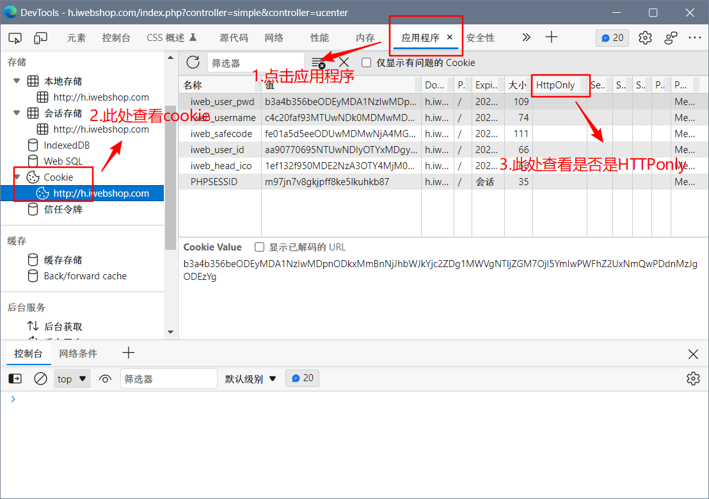

**什么是HttpOnly**

如果cookie中设置了HttpOnly属性，那么通过js脚本将无法读取到cookie信息，这样能有效的防止XSS攻击，窃取cookie内容，这样就增加了cookie的安全性，即便是这样，也不要将重要信息存入cookie。

XSS全称Cross SiteScript，跨站脚本攻击，是Web程序中常见的漏洞，XSS属于被动式且用于客户端的攻击方式，所以容易被忽略其危害性。其原理是攻击者向有XSS漏洞的网站中输入(传入)恶意的HTML代码，当其它用户浏览该网站时，这段HTML代码会自动执行，从而达到攻击的目的。如，盗取用户Cookie、破坏页面结构、重定向到其它网站等。

### sqlmap

Sqlmap是一个开源的渗透测试工具，可以用来自动化的检测，利用SQL注入漏洞，获取数据库服务器的权限。它具有功能强大的检测引擎，针对各种不同类型数据库的渗透测试的功能选项，包括获取数据库中存储的数据，访问操作系统文件甚至可以通过外带数据连接的方式执行操作系统命令。目前支持的数据库有MySQL、Oracle、PostgreSQL、Microsoft SQL Server、Microsoft Access等大多数据库。

下载地址：[https://sqlmap.org/](https://sqlmap.org/ "https://sqlmap.org/")

**下面以DVWA为例，介绍sql的用法**

DVWA是靶场网站，专门用于学习或训练web攻击。

下载地址：[https://github.com/ethicalhack3r/DVWA](https://github.com/ethicalhack3r/DVWA "https://github.com/ethicalhack3r/DVWA")

1.  下载后部署到服务器上，使用账号：admin密码：password进行登录，将安全等级设置为low

    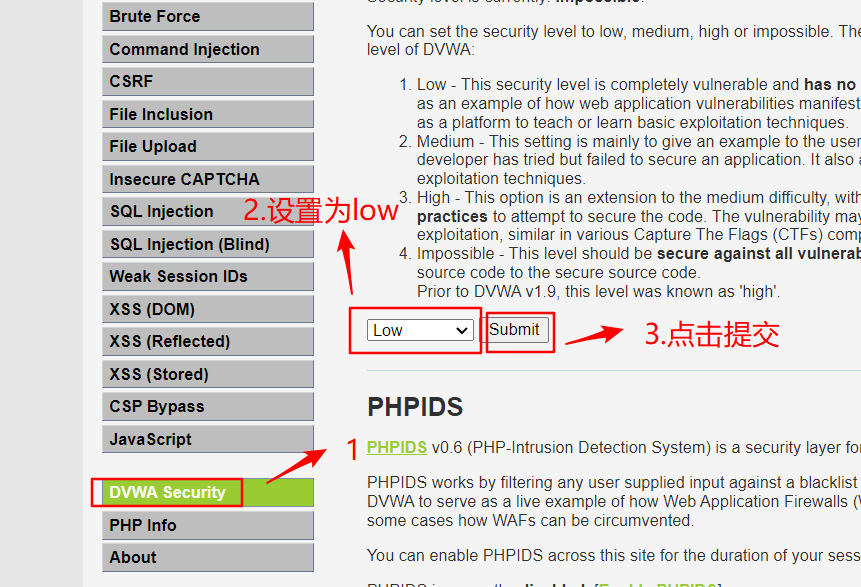

2.  打开DevTools，在SQL Injection中随意输入User ID，点击Submit

    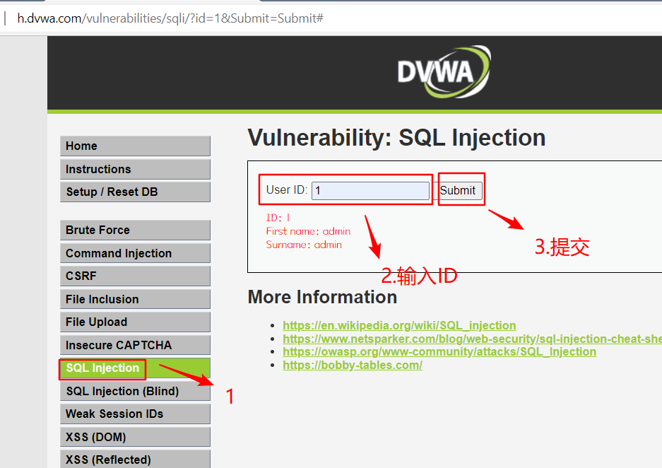

3.  在DevTools中找到发送的请求，复制url和cookie

    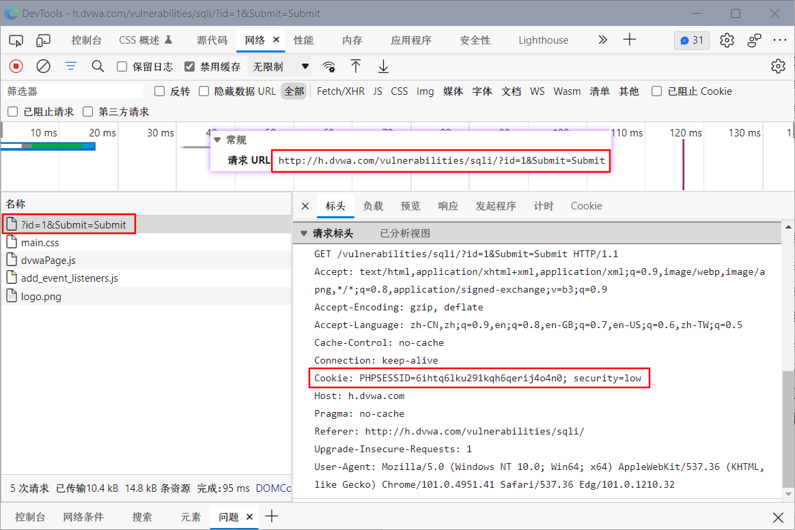

4.  下载sqlmap解压后，在含sqlmap.py的文件夹下打开cmd，使用如下命令

    ```powershell
    python sqlmap.py -u "http://h.dvwa.com/vulnerabilities/sqli/?id=1&Submit=Submit" --cookie="PHPSESSID=6ihtq6lku291kqh6qerij4o4n0; security=low" --dbs
    ```

    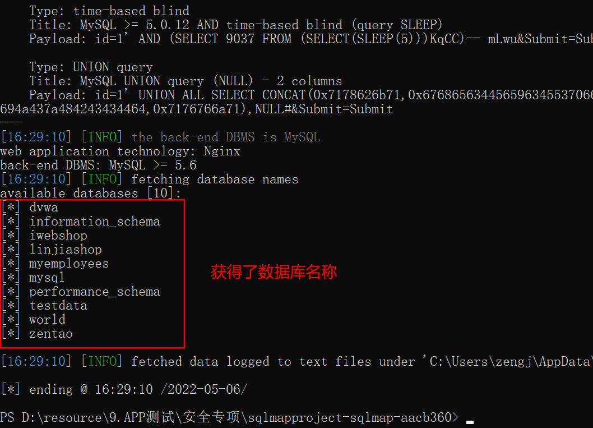

5.  前面的命令和选项都一样，只是最后一个选项不一样，按照步骤，有：

    1.  查看当前使用的数据库 --current-db

    2.  发现使用的是dvwa数据库，接下来对此数据库进行查询 --tables -D "dvwa"

    3.  查出所有表以后，对users表的列名进行查询 --columns -T "users" -D "dvwa"

    4.  users表中的列名已经知道了，可以直接查出所有数据 --dump -C "user\_id,user,password" -T "users" -D "dvwa"（此时已经能或得数据库中任意库中任意表的数据。对于简单的密码加密，sqlmap甚至可以解密）

6.  其他选项

    1、get请求

    ```powershell
    python sqlmap.py -u "urls" --dbms=mysql --batch --level 3 --risk 3

    ```

    \--dbms=mysql 指定数据库为mysql
    \--batch 不用点击，一路自动默认
    \--level 3 level指的是payload的强度，分为5挡，通常使用3级以上会有更多的payload
    \--risk 3 risk指的是风险等级，一般有3挡，主要也是跟攻击的强度有关

    2、post请求

    ```powershell
    python sqlmap.py -u "urls" --data="user=admin&pass=pass"
    ```

### Nmap

Nmap（也就是Network Mapper，最早是Linux下的网络扫描和嗅探工具包）是一个网络连接端扫描软件，用来扫描网上电脑开放的网络连接端。确定哪些服务运行在哪些连接端，并且推断计算机运行哪个操作系统

安装nmap后，在cmd运行以下命令：

```powershell
nmap [选项] 目标IP地址
```

执行结果如下：

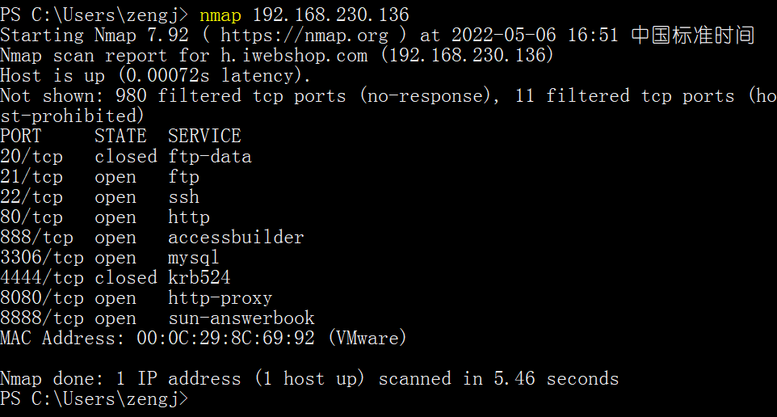

常用选项：

\-sP无ping扫描

TCP三次握手全部完成叫全开扫描，最后一步不做，叫半开扫描。在实际过程中，半开扫描应用的最多，半开扫描不容易被目标电脑日志记录。半开扫描需要加参数-sS，全开扫描需要加参数-sT

Nmap默认扫描的端口常用的是1000个，-p"\*"，扫描全部端口，-p端口号，扫描指定端口

## 兼容性

兼容性指软件对不同平台、不同环境、不同分辨率等的适应能力

一般需求会写明兼容性要求，如果没写则只测主流（目标客户使用最多的前几个）

*   操作系统版本win7、win8、win10、win11

*   浏览器版本IE、chrome、firefox

*   分辨率

    *   16:9 1920x1080 1280x720

    *   4:3 1600x900 1440x1050 1280x960 800x600

    *   16:10 1920x1200

## 性能测试

通过测试工具模拟多种正常、峰值以及异常负载条件来对系统的各项性能指标进行测试

什么时候考虑性能测试

*   对软件的性能有要求

*   用户量大的项目

目的

*   验证软件系统是否能达到预期的性能指标

*   发现软件系统中存在的性能瓶颈，以便优化软件

*   测试稳定性：在一定的负荷下测试一定的时间

## 安装卸载测试

pc程序和APP程序能否被正确安装和卸载，网页没有安装测试

# 功能测试

## 业务流程测试

作用

*   业务流程时软件最核心的部分，是软件的价值所在

*   每个人分工不同，测试的时候会忽略掉一些全局的测试用例

关注点

*   业务流程是否可以走通

*   不关注流程中具体的功能点

执行时机

*   基本功能都完成后，进行业务流程测试

*   软件上线前，再次进行业务流程的回归测试

步骤

*   分析需求，确定业务流程

*   画出流程图

*   编写测试用例

    *   流程图中有几条路径，就有几个测试用例

## 数据库在测试中的作用

*   执行用例过程中，有时需要到数据库验证数据的准确性与完整性

    *   如界面中某些数据的统计测试，由于数据是变化的，需求说明书中不能明确说明这些数据，就需要在数据库中通过聚合函数查询。

        *   预期结果就是通过数据库查询到的数据

        *   实际结果就是界面显示的数据

*   进行bug定位时，有时需要到数据库查看数据的详细信息

    *   当前端与后端数据不相符时，谁和数据库不符，谁就有问题。或者谁修改后没有改动或错误改动数据库，谁就有问题

*   对于前端和后端修改起来都很麻烦或效率不高的数据，有时可以通过直接修改数据库来提高效率

# 公司常见人员分工

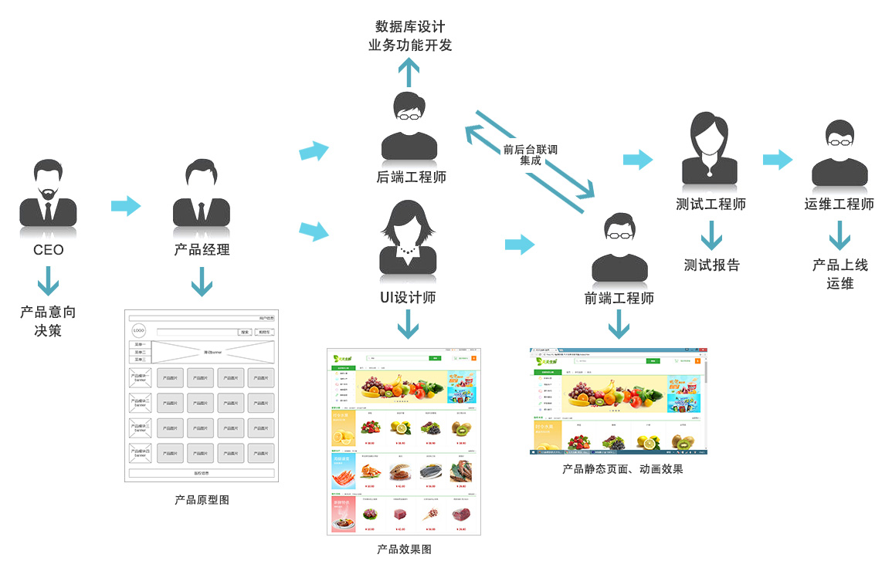

**项目经理**

( Project Manager ) ，从职业角度，是指企业建立以项目经理责任制为核心，对项目实行质量、安全、进度、成本管理的责任保证体系和全面提高项目管理水平设立的重要管理岗位。负责处理所有事务性质的工作。也可称为“执行制作人”（Executive Producer）

**产品经理**

PM（product manager），为终端用户服务，负责产品整个生命周期的人。在公司中针对某一项或是某一类的产品进行规划和管理，主要负责产品的研发、制造、营销、渠道等工作

**运维**

O\&M (Operation and Maintenance)，全称运营维护，主要负责环境部署、产品上线、保障系统长期稳定运行

**系统架构师**

（System Architect）有经验的开发，负责设计架构

**全栈工程师**

（Full Stack engineer）指掌握多种技能，胜任前端与后端，能利用多种技能独立完成产品的人

**前端开发工程师**

是创建WEB页面或APP等前端界面呈现给用户的人

**后端开发工程师**

主要职责是平台设计、接口设计和功能实现

**研发经理**、**测试经理**

# 测试知识

## 常见缩写

QA：（quality assurance）品质保证，主要是事先的质量保证类活动，以预防为主，期望降低错误的发生几率

QC：（quality control）品质控制，主要是事后的质量检验类活动为主，默认错误是允许的，期望发现并选出错误，由测试人员完成

XSS：（Cross Site Scripting）跨站脚本攻击。缩写为CSS，但这会与层叠样式表（Cascading Style Sheets，CSS）的缩写混淆。因此，有人将跨站脚本攻击缩写为XSS。对网站注入HTML脚本，一般为js脚本

mock（模仿、模拟）测试就是在测试过程中，对于某些不容易构造或者不容易获取的对象，用一个虚拟的对象来创建以便测试的测试方法

UAT：（User Acceptance Test）用户验收测试

DevOps（Development和Operations的组合词）是一组过程、方法与系统的统称，用于促进开发（应用程序/软件工程）、技术运营和质量保障（QA）部门之间的沟通、协作与整合。它是一种重视“软件开发人员（Dev）”和“IT运维技术人员（Ops）”之间沟通合作的文化、运动或惯例。透过自动化“软件交付”和“架构变更”的流程，来使得构建、测试、发布软件能够更加地快捷、频繁和可靠

## 手机号编码规则

CC + MAC + H0 H1 H2 H3 + ABCD

其中：一个字母代表一个数字 ，共11位

CC是国家码，中国使用86。&#x20;

MAC为网络识别号，放在国内就是表示是哪家运营商的，

*   中国移动的有134、135、136、137、138、139、150、151、152、158、159、157、182、187、188等

*   中国联通的有130、131、132、155、156、182、185、186等

*   中国电信的有133、153、180、189等

H0 H1 H2 H3：HLR识别码，由运营商统一分配。H0 H1 H2由运营商统一分配到各省，H3由各省分配到本地网。所以决定了手机号码的归属地。

ABCD：用户号，由各HLR自行分配。

注意：手机号输入框不易限制太死，因为现在没有的手机后以后可能会有

## 身份证号规则

公民身份号码是特征组合码，由十七位数字本体码和一位校验码组成。排列顺序从左至右依次为：六位数字地址码，八位数字出生日期码，三位数字顺序码和一位数字校验码

## 邮箱格式

注册名@网站地址

其中注册名只能以字母、数字和下划线组成。网站地址至少要有一个.分隔，也可以多个

## 门户网站

公司放置自家产品的网站

## 开发、测试和生产环境

开发环境：开发环境是程序猿们专门用于开发的服务器，配置可以比较随意， 为了开发调试方便，一般打开全部错误报告。

测试环境：一般是克隆一份生产环境的配置，一个程序在测试环境工作不正常，那么肯定不能把它发布到生产机上。

生产环境：是指正式提供对外服务的，一般会关掉错误报告，打开错误日志

