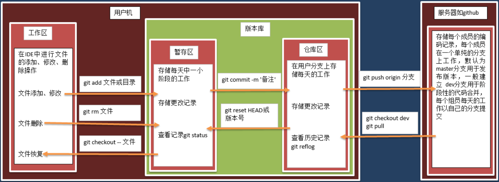
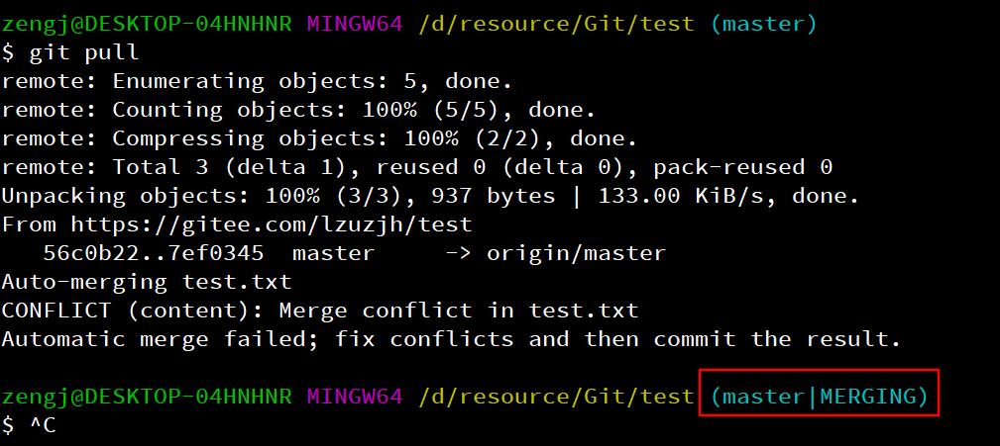
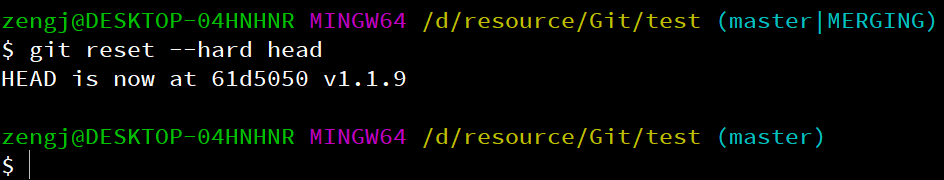

# 版本管理Git

# 原理

Git是分布式版本控制系统，即不仅有一个中心的服务器控制最新版本代码，而且每个开发者自己还有个本地仓库，在开发过程中都是先将代码提交到本地仓库再推送到中心服务器上的，这样的好处就是每个人都依赖于中心服务器来实现交互，但又不会被中心服务器限制，就算中心服务器挂了，也能很容易的找到最新版本的代码，而且自己的工作依然可以顺利进行，提交到本地仓库，当中心服务器修复之后，再将自己仓库的东西推送到中心服务器

与只相对的是中心化版本控制系统SVN，SVN是subversion的缩写，是一个开放源代码的版本控制系统，通过采用分支管理系统的高效管理，简而言之就是用于多个人共同开发同一个项目，实现共享资源，实现最终集中式的管理

**git分区原理图：**



执行git init命令，就会创建并初始化git仓库，在当前目录下会产生一个.git的隐藏文件夹，这个.git文件夹就是你的本地仓库。或者直接克隆一个服务器仓库到本地作为git仓库，也是一样会有.git文件夹

.git目录中，config文件，是项目的配置文件，里面有中心服务器的信息和分支信息，HEAD文件指向当前的分支，index文件是暂存区的相关信息，logs目录中是相关操作产生的日志，objects目录里面存储的就是所有的数据，也就是快照，refs目录里是存储指向数据提交对象的指针

Git 仓库区的提交记录保存的是你的目录下所有文件的快照，Git 的提交记录会可能地轻量，因此每次进行提交时，它并不会盲目地复制整个目录。条件允许的情况下，它会将当前版本与仓库中的上一个版本进行对比，并把所有的差异打包到一起作为一个提交记录。

Git 还保存了提交的历史记录。可以把提交记录看作是项目的快照。提交记录非常轻量，可以快速地在这些提交记录之间切换。

# 常用命令

无本地文件，从服务器下载所有仓库文件到本地

```powershell
git clone 服务器项目URL地址
```

配置用户名称和用户邮箱

```powershell
git config user.name “username”

git config user.email “email@test.com”
```

新文件需要使用如下命令，添加到暂存区

```powershell
//添加单个文件
git add filename

//添加目录下全部文件
git add .
```

为暂存区的文件添加版本信息并添加到本地仓库

```powershell
git commit -m "版本信息描述"
```

将本地仓库中的文件推到服务器

```powershell
git push 
```

查看本地仓库文件状态

```powershell
git status
```

已经在本地仓库的文件，修改文件内容后，会直接存在暂存区，只需要再次提交版本信息，然后推到服务器

```powershell
git commit -am "版本信息描述"
git push
```

从服务器拉取文件

```powershell
git pull
```

查看版本信息

```powershell
git log
```

如果本地已有文件，但服务器上没有对应的仓库，可以通过如下步骤将本地文件上传到服务器仓库：

1.  在所要上传的文件夹下，将里面的文件添加到本地仓库

    ```powershell
    git init
    git add .
    git commit -m '描述'
    ```

2.  在服务器上创建与本地文件夹同名的仓库

3.  将本地仓库与服务器仓库关联

    ```powershell
    git remote add origin 服务器项目URL地址
    ```

4.  将本地仓库推送到服务器

    ```powershell
    git push
    ```

删除与服务器仓库的关联

```powershell
git remote rm origin
```

# 代码冲突

情况一：同一份文件，远程改动了，本地未做改动

此时push会报错，需要先pull，再push，即可解决冲突

情况二：同一份文件，本地和远程均有改动。出现此种情况的原因有两种，一是改本地之前没有pull，二是多人编辑同一份文件，有人先push了，通过明确分工解决

此时push会报错，如果pull，会出现代码冲突，如下图：



此时可以先进行代码回退：`git reset --hard head`



手动解决冲突后，再add、commit和push

情况三：不同文件，远程改动了某一文件，本地未做改动，本地改动了另一文件，远程未做改动

情况四：同一文件，本地改动了，远程未改动，使用pull不会将本地覆盖

综上所述，解决代码冲突的好办法为：

1.  明确分工，一份文件只能让一个人编辑

2.  push本地代码前，先pull，修改之前也可以pull，但除非要用到别人的代码，否则没必要

# 分支管理

Git 的分支也非常轻量。它们只是简单地指向某个提交纪录，因此建议早建分支！多用分支！

这是因为即使创建再多的分支也不会造成储存或内存上的开销，并且按逻辑分解工作到不同的分支要比维护那些特别臃肿的分支简单多了。

使用分支意味着你可以从开发主线上分离开来，然后在不影响主线的同时继续工作

创建分支命令：

```powershell
git branch 分支名
```

切换分支命令:

```powershell
git checkout 分支名

# 在Git 2.23版本中，可以使用switch命令切换分支
git switch 分支名
```

当你切换分支的时候，Git 会用该分支的最后提交的快照替换你的工作目录的内容， 所以多个分支不需要多个目录

创建一个新的分支同时切换到新创建的分支：

```powershell
git checkout -b 分支名
```

将当前所在分支与指定分支合并:

```powershell
git merge 分支名
```

你可以多次合并到统一分支， 也可以选择在合并之后直接删除被并入的分支

删除分支命令：

```powershell
git branch -d 分支名
```

第二种合并分支的方法是 `git rebase`，此命令实际上就是取出一系列的提交记录，“复制”它们，然后在另外一个地方逐个的放下去。

rebase 的优势就是可以创造更线性的提交历史。如果只允许使用 Rebase 的话，代码库的提交历史将会变得异常清晰。

我使用相对引用最多的就是移动分支。可以直接使用 `-f` 选项让分支指向另一个提交。例如:

`git branch -f main HEAD~3`

上面的命令会将 main 分支强制指向 HEAD 的第 3 级父提交。
