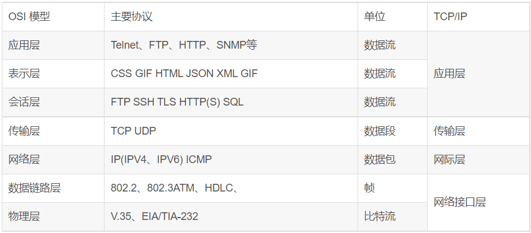
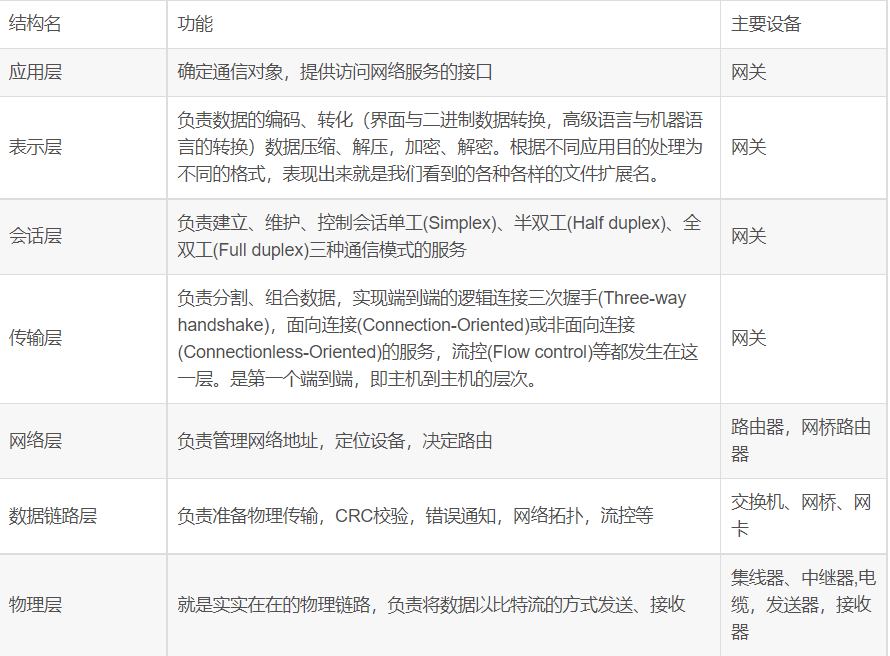
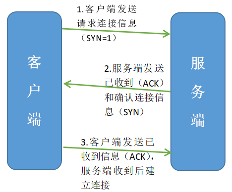
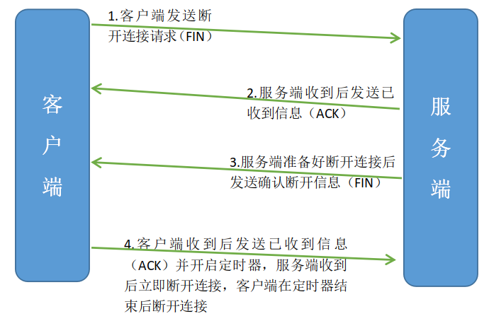
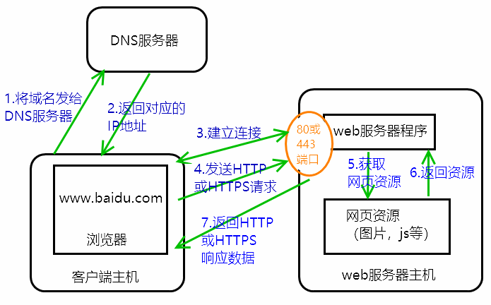

# 网络基础

# 网络的七层架构

OSI模型（Open System Interconnection Reference Model）:物、数、网、传、会、表、应

TCP/IP模型：数、网、传、应

比特（Bit）：一位二进制数所包含的信息叫做一比特

字节（Byte）：8比特=1字节

## 常见协议

### 应用层

HTTP协议（Hyper Text Transfer Protocol）超文本传输协议，设计之初的目的是传输网页数据的，现在允许传输任意类型的数据。它规定了浏览器和网站服务器通信数据的格式。**传输 HTTP 协议格式的数据是基于 TCP 传输协议的，发送数据之前需要先建立连接。**

HTTPS（Hyper Text Transfer Protocol over SecureSocket Layer）是HTTP(超文本传输协议)的安全加密版，通过传输加密和身份认证保证了传输过程的安全性，区别如下：

1.  https协议需要到CA申请证书，一般免费证书较少，因而需要一定费用

2.  http是超文本传输协议，信息是明文传输，https则是具有安全性的ssl/tls加密传输协议

3.  http和https使用的是完全不同的连接方式，用的端口也不一样，前者是80，后者是443

4.  http的连接很简单，是无状态的；HTTPS协议是由SSL/TLS+HTTP协议构建的可进行加密传输、身份认证的网络协议，比http协议安全

FTP（File Transfer Protocol）文件传输协议

SMTP（Simple Mail Transfer Protocol ）电子邮件传输协议

SSH  （Secure Shell）安全外壳协议，是较可靠，专为远程登录会话和其他网络服务提供安全性的协议。利用 SSH 协议可以有效防止远程管理过程中的信息泄露问题。

### 传输层

TCP（Transmission Control Protocol）传输控制协议，面向连接，稳定，可靠

UDP（User Datagram Protocol）用户数据包协议，以广播形式发送数据，不可靠，但传输效率比TCP高

### 网络层

IP（Internet Protocol）

ICMP（Internet Control Message Protocol）是TCP/IP协议簇的一个子协议，用于在IP主机、路由器之间传递控制消息。控制消息是指网络通不通、主机是否可达、路由是否可用等网络本身的消息

ARP（Address Resolution Protocol）地址解析协议，是根据IP地址获取物理地址的一个TCP/IP协议

# IP地址

是标识网络设备的唯一地址，所有能上网的设备都有IP地址

IP地址不能重复，如有重复（称为IP冲突），其中一个会被踢掉（一般是后进的那个）

## IPv4和IPv6

IPv4由32位二进制数组成（为了方便人类阅读，显示为4段十进制的数），理论上有2^32（约42.9亿）个不同地址，使用即将枯竭

一般IPv4最后一段为0和255的地址为特殊用途地址，一般设备不会被分配到。一般：0为路由器地址，255为广播地址

IPv6由128位二进制的数组成（为了方便人类阅读，显示为6段十六进制的数），理论上有2^128（约3\*10^38）个不同地址，目前未普及使用

**私有IP**

私有IP属于非注册地址，专门为组织机构内部使用。RFC1918定义了私有IP地址范围：

A: 10.0.0.0\~10.255.255.255 即10.0.0.0/8

B:172.16.0.0\~172.31.255.255即172.16.0.0/12

C:192.168.0.0\~192.168.255.255 即192.168.0.0/16

这些地址是不会被Internet分配的，它们在Internet上也不会被[路由](https://baike.baidu.com/item/路由 "路由")，虽然它们不能直接和Internet网连接，但通过技术手段仍旧可以和 Internet通讯（NAT技术）。我们可以根据需要来选择适当的地址类，在内部局域网中将这些地址像公用IP地址一样地使用。在Internet上，有些不需要与 Internet通讯的设备，如打印机、可管理[集线器](https://baike.baidu.com/item/集线器 "集线器")等也可以使用这些地址，以节省IP地址资源

## 域名

域名是IP地址的别名，常见开头www的含义是world wide web，翻译为万维网，直译为世界范围的网络

web：（蜘蛛）网，网状物

website：网站

# 局域网

网络按作用范围可分为

*   广域网WAN(Wide Area Network)的作用范围通常为几十到几千公里。有时也称为远程网(Long haul network)

*   城域网MAN(Metropolitan Area Network)的作用范围在广域网和局域网之间

*   局域网LAN(Local Area Network)作用范围局限在较小的区域(如1km左右)&#x20;

    *   以太网：常用的有线局域网技术标准

    *   WLAN（Wireless Local Area Network）：无线局域网

        WiFi：无线局域网的一种技术标准

## 检查网络

*   ping 127.0.0.1

    自检网卡。127.0.0.1称为本地回环IP地址，对应域名为localhost。也可以ping自己的真实的IP地址来自检网卡

*   ping 路由器地址（默认网关地址即为本机对应的路由器地址）

    检查与路由器的通信是否正常

*   ping 公网域名或IP（如baidu.com）

    检查与公网是否连通

如何查看网络设备是否在同一子网下

IP地址与子网掩码进行"与"运算，结果相同就是在同一子网下。在同一子网下意味着相互之间的通信不经过路由器

# 端口

数据传输的通道，不同的应用程序的通信用不同的端口号区分

端口号共有65536个，来源：给端口号规定的范围为：

从0000 0000 0000 0000至1111 1111 1111 1111（二进制16位）

共有（2^16+1）=65536个

## 知名端口号

范围从 0 至 1023 ，如

| 端口号 | 服务/协议  |
| --- | ------ |
| 21  | FTP    |
| 22  | SSH    |
| 25  | SMTP   |
| 80  | HTTP   |
| 443 | htttps |

## 动态端口号

范围从1024至65535

应用程序通信时自动设置的端口号

MySQL服务默认端口3306

# TCP协议

TCP（Transmission Control Protocol）传输控制协议，是一种面向连接的，可靠的，基于字节流的传输层通信协议

## TCP通信步骤

1.  创建连接

2.  传输数据

3.  关闭链接

链接的三次“握手”

客户端发送请求连接的信息（SYN=1）→服务端收到后发送已收到（ACK）和确认连接信息（SYN）→客户端收到后发送已收到信息（ACK），服务端收到信息后建立连接

断开连接的四次“挥手”

客户端发送断开连接请求（FIN）→服务端收到后发送已收到信息（ACK）→服务端准备好断开连接后发送确认断开信息（FIN）→客户端收到后发送已收到信息（ACK）并开启定时器（时间为客户端和服务端之间的最大通信时间，即从“客户端发送信息”到“服务端返回的信息到达客户端”最长花了多久），服务端收到后立即断开连接，客户端在定时器结束后断开连接

问：为什么连接时是三次，而断开是四次

答：因为服务器一般都处于等待连接状态，连接时客户端发送连接请求后，服务器可以同时发送收到和确认连接信息；而在断开连接时，服务器在收到断开连接请求后需要先确认是否能断开连接，所以先发送收到信息给客户端，等检查完成确认能断开连接后，再发送确认断开连接信息给客户端。

## 特点

1.  面向连接

    *   通信双方必须先建立好连接才能进行数据的传输，数据传输完成后，双方必须断开此连接，以释放系统资源

2.  可靠性

    *   采用应答机制

    *   超时重传

    *   错误校验

    *   流量控制和阻塞管理

## 总结

TCP是一个稳定、可靠的传输协议，常用于对数据进行准确无误的传输，如文件下载、浏览器上网等

## UDP与TCP的区别

|      | UDP            | TCP         |
| ---- | -------------- | ----------- |
| 连接   | 无连接            | 面向连接        |
| 速度   | 无需建立连接，速度较快    | 需要建立连接，速度较慢 |
| 目的主机 | 一对一，一对多        | 仅能一对一       |
| 带宽   | UDP报头较短，消耗带宽更少 | 消耗更多的带宽     |
| 可靠性  | 低              | 高           |
| 顺序   | 无序             | 有序          |

DHCP协议，一个局域网的网络协议，使用UDP协议工作，用于给局域网内部的设备分配IP地址，给用户或者内部网络管理员作为对所有计算机作中央管理的手段

# HTTP协议

DNS（Domain Name System）服务器：域名解析服务器

浏览器与web（网络）服务器通信的步骤

1.  将输入的域名发送给DNS服务器解析

2.  DNS服务器将解析得到的IP地址发送给浏览器

3.  浏览器与此IP地址通过TCP协议建立连接

4.  浏览器通过上一步建立的连接发出HTTP或HTTPS请求给web服务器

5.  web服务器程序根据请求在服务器主机中寻找对应的网页资源

6.  服务器主机将找到的资源返回给web服务器程序

7.  web服务器程序返回HTTP或HTTPS响应数据给浏览器

## 开发者工具DevTools

打开方式F12 ，或右键→检查

parse：解析，理解

## HTML

&#x20;Hyper Text Markup Language，即超文本标记语言，是网页源代码使用的语言

标记语言，是一种将文本以及文本相关的其他信息结合起来，展现出关于文档结构和数据处理细节的电脑文字编码

## HTTP常见请求报文

*   GET从服务器获取数据，参数是放在URL上

    格式

    *   请求行

        GET 资源路径 HTTP/版本号

    *   请求头

    *   空行

*   POST提交数据给服务器，参数是放在请求体里

    格式

    *   请求行

        POST 资源路径 HTTP/版本号

    *   请求头

    *   空行

    *   请求体（也可为空，但很少见）

## HTTP响应报文

格式

*   响应行/状态行

    HTTP/版本号 状态码 状态描述

*   响应头

*   空行

*   响应体

常见状态码

| 状态码 | 说明                        |
| --- | ------------------------- |
| 200 | 请求成功                      |
| 307 | 重定向                       |
| 400 | 错误的请求，请求地址或者参数有误          |
| 403 | 拒绝执行请求。一般是没有权限、请求频繁等原因造成的 |
| 404 | 请求资源在服务器不存在               |
| 500 | 服务器内部源代码出现错误              |

状态码分类

1XX－信息类(Information),表示收到Web浏览器请求，正在进一步的处理中

2XX－成功类（Successful）,表示用户请求被正确接收，理解和处理例如：200 OK&#x20;

3XX-重定向类(Redirection),表示请求没有成功，客户必须采取进一步的动作。

4XX-客户端错误(Client Error)，表示客户端提交的请求有错误 例如：404 NOT Found，意味着请求中所引用的文档不存在。

5XX-服务器错误(Server Error)表示服务器不能完成对请求的处理：如 500

## URL

URL（Uniform Resoure Locator）统一资源定位符，通俗理解就是网络资源地址，简称网址

URL的组成

1.  协议部分

2.  域名或IP地址:端口号（默认为80或443）

3.  资源路径

4.  查询参数【可选】：传递给资源路径对应的数据

浏览器默认使用的端口号为80（HTTP）或443（HTTPS），在域名或IP地址最后使用“:端口号”可指定端口，但一般不是默认端口就访问不了，除非网页的开发者主动设置了其他端口。

URL 的编码格式采用的是 ASCII 码，因此非ASCII码中的字符要经过编码才能放入URL中。&和空格也必须经过URL编码

## 常见请求头

（key大小写不敏感）

Host:    请求的目标域名  &#x20;

Referer:  表示当前请求是从哪个资源发起的；或者是请求的上一步的地址。常用于访问统计和防盗链

User-Agent:  客户端信息

Cookie： 储存在用户本地终端上的数据，记录了会话信息，可用于保存用户登录状态，进行身份认证等

Authorization：token鉴权码

Accept:  客户端期望接受的数据类型

Accept-Encoding: 客户端期望接受数据的压缩格式

Accept-Language: 客户端可以接受的语言

Connection  : 如果值是keep-alive就是需可以支持TCP长连接

Content-Type  : 标明请求体里的数据类型 (application/x-www-form-urlencoded ,application/json,  multipart/form-data)

Content-Length : 请求体内数据长度(字节)

## 常见响应头

（key大小写不敏感）

Date    : 服务器返回数据的时间

Cache-Control : 缓存方式

Last-Modified  : 服务器资源最后一次修改的时间

Content-Type  : 标明响应体里的数据类型 (text/html , application/json)&#x20;

Content-Length: 响应体数据实际长度(字节)

Location：重定向地址

# PHP

&#x20; Hypertext Preprocessor，即“超文本预处理器”，是在服务器端执行的脚本语言，尤其适用于Web开发并可嵌入HTML中。PHP语法学习了C语言，吸纳Java和Perl多个语言的特色发展出自己的特色语法，并根据它们的长项持续改进提升自己，例如java的面向对象编程，该语言当初创建的主要目标是让开发人员快速编写出优质的web网站。

PHP是一个开源软件项目

## 预处理器

&#x20; 在真正的编译开始之前由编译器调用的独立程序。预处理器可以删除注释、包含其他文件以及执行宏（宏macro是一段重复文字的简短描写）替代。

## 脚本语言

&#x20; 脚本语言是一种解释性的语言，例如Python、javascript等等，它不像 c\c++ 等可以编译成二进制代码，以可执行文件的形式存在，脚本语言不需要编译，一般都是以文本形式存在，类似于一种命令，可以直接用，由解释器来负责解释。

# 服务器架构

## 分布式架构

多个服务器都有完整的项目代码。不同用户通过LBS（负载均衡）来决定访问哪个服务器。

分布式架构的项目可以用金丝雀测试（灰度测试）：先在一部分服务器更新新版本，观察用户使用情况和反馈，没问题的话在逐渐将其他服务器都更新到新版本；如果新版本有问题，也不至于影响到所有用户。一般用于影响比较重大的项目版本

## 微服务

多个服务器只有项目的部分代码，每个服务器负责一个或几个功能
